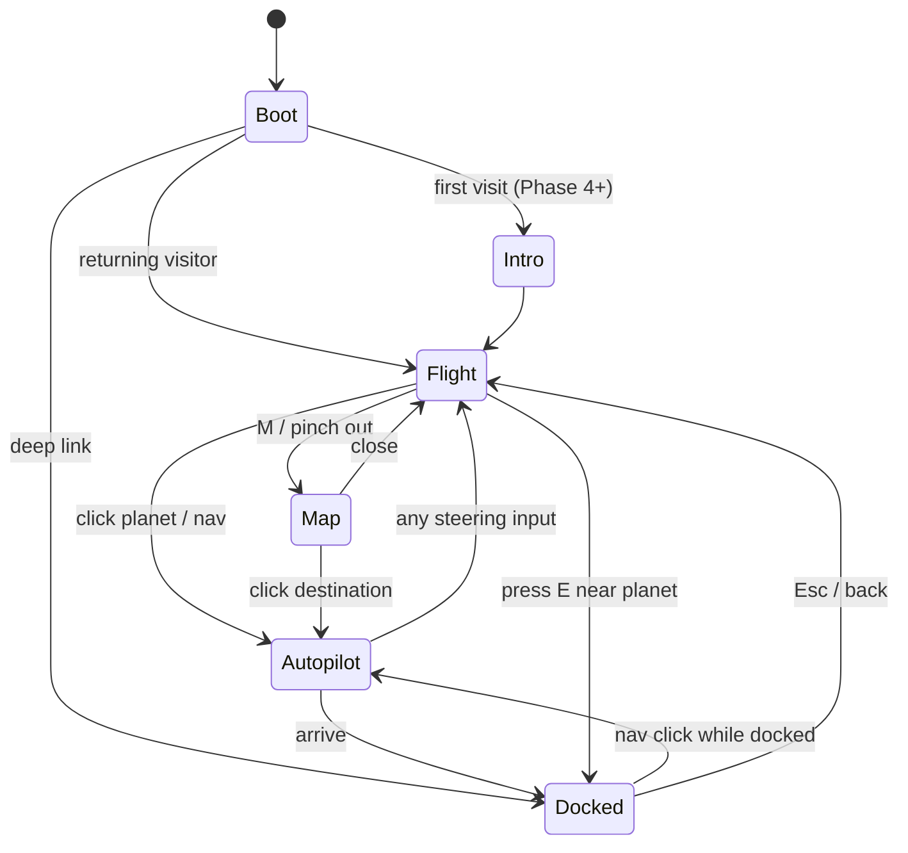

# allenkh.com — Space Portfolio: Master Plan (v2)

> **Status:** approved by Allen on 2026-09-20; supersedes Draft v1. This file is the source of truth: when a decision changes, change it here first. Facts marked **(verify)** were not confirmable during planning and get checked at the step that depends on them.

## Context

Allen wants a three.js animated personal website at **allenkh.com**: a space-travel universe where **solar systems are passions and planets are projects**, with the look of Mini Motorways (muted pastels, flat shading, tidy overhead map, tiny roads and towns) and the cozy piloting feel of [Tiny Skies](https://tinyskies.vercel.app/), "a little more detailed". The repo (github.com/MeagerPotato/Personal-Website, local `C:\Projects\Personal-Website`) is empty apart from the Draft v1 plan.

This plan consolidates everything so far: the 20-question interview, Allen's follow-up answers, research on Allen's resume and GitHub, two architecture reviews (web platform, 3D engine), and a three-way adversarial evaluation of the page shell that Allen asked for ("use whatever is the best option; alternatives should be considered"). Intended outcome: an approved master plan, then implementation starting at Phase 0, shipping a small polished v0.1 fast and growing the universe in public.

## 1. Decisions (locked)

| # | Topic | Decision |
|---|---|---|
| 1 | Navigation | Pilot the rocket freely; clicking any planet or nav item **autopilots** there. |
| 2 | Structure | Galaxy → solar systems (passions) → planets (projects) → moons (sub-projects). |
| 3 | At a planet | Dock → info panel now; landable flagship worlds in a later phase. |
| 4 | Audience | Recruiters/admissions + devs/creative community + friends. |
| 5 | Mini Motorways DNA | Palette & flat shading, overhead map view, **literal roads & tiny towns**, minimal UI. |
| 6 | Camera | Chase cam + pull-out to overhead star map. Steering on a flat plane. |
| 7 | Backdrop | Dark space, pastel planets. |
| 8 | Detail | Planet surfaces, ambient life, the rocket, atmosphere & lighting (phased). |
| 9 | Claude's scope | All code, all site copy (Allen edits for voice), all Astra handoff packets. |
| 10 | Astra | **OpenAI Codex agent ("Astra 6")** with scarce usage. Allen hands off files/prompts manually. |
| 11 | Astra's role | 3–4 prepared, self-contained design passes, **designing directly in code** (no separate mockups). Supersedes v1's "mockups + style guide" deliverables. |
| 12 | Allen's role | Co-developer and product owner. |
| 13 | 3D stack | Vanilla three.js + TypeScript. No react-three-fiber. |
| 14 | Hosting | **Cloudflare Workers static assets** (confirmed; see §5.9). |
| 15 | Mobile | First-class: touch joystick, tap-to-autopilot, real performance budget. |
| 16 | Fast path | HUD nav + plain mode. |
| 17 | Extras | Launch intro, exploration progress, mini-game. Live/social layer: probably never; don't preclude it. |
| 18 | Audio | Music + SFX, muted by default. |
| 19 | Destinations | Home planet (About), Resume station, Contact satellite, Blog ("Captain's Log", working name). |
| 20 | Timeline | Ship a small polished slice fast, then grow in public. Gated by exit criteria, not dates. |
| 21 | Page shell | **Astro 7, used thinly, plus our own micro-router** (§5.1; chosen after adversarial evaluation). |
| 22 | v0.1 content | Home system (About/Resume/Contact) + **Code system only**. Model Rocketry and Berkeley arrive in Phase 3. |
| 23 | Fish trilogy | Canadian-Fish-Demo and Fish-Onboarding orbit the FishAI planet as **moons**. |
| 24 | Astra timing | Visual identity pass (A1) happens **before v0.1 goes public**. |
| 25 | Identity | Display name **"Allen"**. Tone: **playful framing, technical substance.** |
| 26 | DNS | allenkh.com is registered at Cloudflare (nameservers verified); apex serves nothing yet. **The project sites already on the domain must never be disturbed: `days2meet.allenkh.com` and `fishai.allenkh.com`, both live on Vercel** (the second was found on 2026-09-20 while reading FishAI's README; assume there may be more and check DNS before any DNS-adjacent step). |
| 27 | Personal touches | Rocket name/look, home planet idea, easter eggs: deferred by Allen, again at the Phase 2 kickoff (2026-09-20): "I'll come back to it in a later phase". v0.1 ships a tasteful generic rocket and home planet; checkpoint in §9. |
| 28 | Privacy | No phone number anywhere in the repo or site. The public contact address is `allen@allenkh.com` (named by Allen, 2026-09-20), held in `src/config/site.ts`; no other email address may appear anywhere. `tests/privacy.test.ts` scans the repository for both. |

## 2. Who does what

| | Responsibilities |
|---|---|
| **Allen** | Product owner and co-developer. Raw material for copy, voice edits. Cloudflare dashboard steps (§6 Phase 0 step 8). Playtests on a real phone. PR review. Pastes packets into Astra. CAD exports. Final say on personal touches. |
| **Claude** | All engineering, tests, CI, docs. A **presentable first-pass visual design** (the site must look good even before Astra touches it). Procedural assets. All copy drafts. Astra packets, then integration and nit-fixing of Astra's PRs. Verification. |
| **Astra (Codex)** | Only what it does better and only inside the **design surface** (§5.6): `src/universe/design/**`, `src/styles/**`, `public/models/**`. |

**Planned Astra passes** (one packet = one Codex session = one PR on `astra/NN-…`):

| Pass | When | Scope |
|---|---|---|
| **A1 Visual identity** | End of Phase 2, before launch | Palette (dark space + pastel families), typography, spacing/radii, panel/HUD/hint-card/plain-mode styling. Files: `design/tokens.ts`, `src/styles/**`. |
| **A2 Scene art direction** | Phase 3, once map mode + multi-system exist | Materials, shading bands, biome colour bands, starfield/backdrop, post-processing parameters, map-mode look (flatness, lane styling). |
| **A3 UX & motion** | Phase 4 | Easing, durations, transitions, micro-interactions, mobile ergonomics. Punch list + direct fixes. |
| **A4 Hero assets** (optional) | When Allen's rocket/home-planet concept is ready | glTF models following the palette-texture convention, judged in `/lab`. |

**Packet contents** (`docs/handoffs/NN-title.md`, template in Phase 0): goal and non-goals; edit allow-list plus at most 5 files to read; committed baseline screenshots (desktop + 360 px, both modes); token dump; acceptance checklist (contrast, 44 px touch targets, 360 px width, reduced motion, `npm run verify` green); exact commands; the rule *"no logic edits — write `ASTRA-REQUEST:` in the PR for anything outside the allow-list"*; stop condition. Before each handoff Claude confirms `main` is green, every knob Astra needs already exists as a token, and a `/lab` scene exists. Afterwards Claude fixes lint nits itself rather than bouncing the PR. `docs/DESIGN.md` is the standing brief every packet links to, so packets stay short.

## 3. Experience design

**Universe mapping.** Galaxy = site. Solar system = passion (its sun carries the name and colour family, and is dockable: `/systems/<slug>/`). Planet = project. Moon = sub-project. **Home system** at the galaxy centre: home planet (About), Resume station and Contact satellite orbiting it. Hidden planets = easter eggs.

**Flying.** Flat-plane steering: thrust, turn, brake, boost. Arcade physics, no fail states, you cannot crash (planets cushion and slide you around). A gentle orbit-assist eases you into orbit when coasting and is always escapable. Desktop: WASD/arrows, Shift boost, `E`/click to orbit, `M`/scroll-out for map, `Esc` to leave a panel; hold-mouse-to-steer-toward-cursor is built behind a flag and decided at the Phase 1 playtest. Mobile: floating joystick (left thumb), boost (right thumb), tap a planet to autopilot, pinch-out for map. Soft world bounds: a growing pull home, a hint, an arrow to the nearest sun; no walls, no teleports. First-visit hint cards in the Tiny Skies style.

**Autopilot.** A virtual pilot driving the same flight model (path → motion profile → pure pursuit, the same structure as a VEX auton). Any steering input cancels with continuous velocity. Later it routes along motorway lanes.

**Camera.** One rig, four states, blended in pose space: **Chase** (lag, look-ahead, speed-widened FOV, never rolls), **Orbit** (planet framed in the area not covered by the panel), **Map** (near-orthographic overhead; planets flatten to discs; drag to pan; click to travel), **Cinematic** (autopilot/intro; skippable).

**Arriving.** Enter sphere of influence → quiet prompt → dock → orbit camera → panel slides in (side panel desktop, bottom sheet mobile) → URL is the project's URL; Back undocks. From a HUD/nav click the panel opens **immediately** while the flight plays (recruiter fast path); from an in-world click it opens on arrival.

**HUD.** Wordmark (fly home), nav (About / Projects / Resume / Contact, later Log), sound toggle, plain-mode toggle, minimap/compass, contextual prompt, discovery counter. Mobile collapses nav to one button.

**One URL per thing, two ways to view it.** Every route is a real pre-rendered HTML page with the full content. **Universe mode** boots the 3D world on top and the page's `<main>` *becomes the panel*. **Plain mode** never starts the canvas, never downloads three.js, ships zero framework JavaScript, and lays the same content out as a fast typographic site with a "Launch the universe" button. Content is written once.

**Signature ideas.** *Space motorways:* rounded, colour-coded lanes between related planets (from each project's `related` field, so the traffic network is a graph of how Allen's work connects), tiny instanced cargo traffic, autopilot merges onto them. *Tiny towns:* small procedural settlements on project planets, visible from orbit, later the playable space of landable worlds. *Launch intro:* the loading screen is a launchpad on the home planet; skippable, skipped for deep links and returning visitors.

## 4. Content plan

### 4.1 v0.1 inventory

| Destination | Kind | Route | Source |
|---|---|---|---|
| Home planet | About | `/about/` | Resume + Allen's notes |
| Resume station | Resume | `/resume/` | Resume PDF → `resume.yaml` (Allen says it is slightly outdated → `TODO(copy)` until refreshed) |
| Comms satellite | Contact | `/contact/` | Public email (TBD), GitHub, LinkedIn |
| Code sun | System page | `/systems/code/` | Short "why I build software" blurb |
| **FishAI** | Planet (flagship candidate) | `/projects/fishai/` | github.com/MeagerPotato/FishAI |
| ↳ Canadian Fish Demo | Moon | `/projects/canadian-fish-demo/` | Repo (read at copy time) |
| ↳ Fish Onboarding | Moon | `/projects/fish-onboarding/` | Repo (read at copy time) |
| **Days2Meet** | Planet | `/projects/days2meet/` | github.com/MeagerPotato/days2meet, live at days2meet.allenkh.com |
| Projects index | (no 3D body in v0.1 → Code sun) | `/projects/` | Generated |

Related lane for later: Days2Meet ↔ Berkeley (built for Berkeley clubs).

### 4.2 Verified facts for the write-ups (from the repos; re-check at copy time)

- **FishAI.** Three bot lines plus a measurement lab for the 6-player hidden-information team card game Canadian Fish / Literature: *Bass* (frozen, git-tagged), *Monet* (current), *ATHENA* (in progress: GRU + multi-head network trained with PPO, Rust vectorized environment with PyO3 bindings). Core idea: a **constraint solver over deal-time variables** — since every post-deal card movement is public, the only hidden quantity per card is who it was dealt to — propagated to a fixpoint; bots see only a public seat view, enforced by a test. Determinization search was measured in the lab but did not ship in Monet v1.0. README-reported result: Monet v1.0 beats the SESTINA v1.0 reference in **58.38% of 14,400 games** across 12 seeds, up from 27.08% for Bass v2.0; the diagnosed gap was proof speed (9.30 events to prove a set vs 2.92), not declare accuracy. Stack: TypeScript, React 19, Vite, Vitest (86 test files), Supabase Edge Functions, Rust, PyTorch, LaTeX (12 papers). ~536 commits in its first 30 days.
- **Days2Meet.** A better when2meet with no accounts. Differentiators: a **dates-only mode** ("which weekend in October?") alongside the classic time grid; real mobile painting (press-and-hold to paint so swipes still scroll); an Event Planner role (password, no email) that can move dates, change granularity, close responses, export CSV; editing dates **remaps existing answers** with a live "N marks will be dropped" preview; ranked best windows; sane time zones; no 5-second polling. Stack: Next.js 15, React 19, Tailwind 4, Supabase Postgres. Strongest story: deliberate security (RLS enabled with zero policies so only the server's service role can touch data, HMAC-signed cookies, scrypt, sign-in throttling, CSV formula-injection guard, a documented pre-launch audit, `pg_cron` retention).
- **Resume highlights** for About/Resume: UC Berkeley, B.S. Aerospace Engineering (expected 2030). Raytheon systems engineering intern. AFRL Scholars intern (staged-recovery rocket through 11 design iterations, dual-event recovery, fragile payload). YC Startup School attendee; 5th of 1,000+ at a hackathon with *RunItBack* (one photo → interactive 3D environment for dementia reminiscence therapy, built in 12 hours). CyberPatriot national 2nd place and Cisco Networking Challenge 1st. VEX Robotics co-founder/programmer (odometry, sensor fusion, motion profiling, Monte Carlo localization in C++). Troy Preparedness Club founder (Congressional Certificate of Recognition). American Rocketry Challenge team founder/captain.
- **LinkedIn** could not be read (blocked in Claude's browser pane). Allen can paste updates or use LinkedIn's *Save to PDF*.

### 4.3 Later systems

- **Model Rocketry (Phase 3).** Allen supplies CAD and details after scaffolding. Intake checklist per rocket: name, date, purpose (competition / certification / internship), key specs (length, diameter, mass, motor class, apogee), what was novel, outcome, photos/video, flight data if any, CAD export. **CAD pipeline** `scripts/cad-to-glb` **(verify with a real file)**: STEP preferred (assembly structure lets each part take its own palette colour), per-part STL/OBJ acceptable → tessellate → `@gltf-transform/cli` (weld, simplify, palette, meshopt) → `public/models/*.glb`, each ≤ 5 MiB, rendered with the shared flat `toonPalette` material.
- **Berkeley (Phase 3).** "Everything I do at Berkeley": clubs, courses, research, teams. Grows over four years by design.
- **Candidates spotted in GitHub/resume, not in scope until Allen says so:** holdem-odds-engine, dashboard, health-tracker, RunItBack, a Robotics system (VEX; repo `98601A_HighStakes`), Cybersecurity (CyberPatriot), Community (Preparedness Club), Experience (internships).

### 4.4 Copy rules

Claude drafts, Allen edits for voice. Jokes live in headings and microcopy; claims and numbers are precise and come from the repos. Placeholder text is always `TODO(copy)` and **fails the build on `main`**. A site colophon credits the tools (three.js, Astro, Cloudflare, Claude, Codex), in the spirit of Tiny Skies' credits line; how individual project pages describe AI-assisted development is Allen's call at copy time (§9).

## 5. Architecture

### 5.1 Page shell: Astro 7, used thinly, plus our own micro-router

**Why (adversarial evaluation, 2026-09-20).** Three architects each built the strongest honest case for a rival, scored it against the baseline on the same weighted criteria, and **all three declined to recommend their own option**:

| Option | Score vs Astro | Why it lost |
|---|---|---|
| SvelteKit (adapter-static) | 69.5 vs 80.75 | Best router, but hydration is mandatory: plain mode is no longer zero-JS, every page ships its content twice, the content system must be hand-assembled from pre-1.0 packages, the CSP splits in two, and SvelteKit 3 (breaking) lands within months. |
| React family (React Router 8 best; Next.js static export, TanStack Start lower) | 6.7 vs 8.2 (of 10) | ~100 kB runtime on every page, per-page inline hydration scripts defeat a `_headers` CSP, no built-in image/feeds pipeline. Next's static export also disables its panel-with-URL pattern (intercepting routes), has no built-in image optimisation (the common third-party optimiser documents WebP only), and has an open client-navigation bug in static exports that still reproduces on Windows builds. |
| No framework (Vite + bespoke prerender) | 81.75 vs 83.75 | Viable and durable, but hand-builds the one conventional part of the site (~1,100 extra lines plus its own docs) that a framework's accumulated edge-case handling does best. Kept as the **costed exit plan**. |

The common reason: the defining requirement — one URL whose plain mode ships zero framework JS, content written once, strict CSP on static hosting — is something hydration frameworks cannot meet natively. (Also relevant: the Astro team joined Cloudflare in January 2026.)

**"Thin Astro" rules** (so that leaving later costs 2–3 agent-days, not a rewrite):
- **Use:** `glob()` content collections with zod; markup-only `.astro` files; `astro:assets` `<Picture>`; built-in Markdown + Shiki; official sitemap and RSS integrations; five-line endpoint wrappers.
- **Keep framework-neutral:** schemas as plain zod in `src/site/` (Astro's `image()` injected); validation, manifest and view-model builders as pure functions; all client code; content as plain Markdown (embeds later as custom elements, not MDX).
- **Avoid:** `<ClientRouter/>` (known Safari WebGL-context-loss issue when it swaps the body), islands, scoped `<style>` blocks (one global CSS set), per-page scripts, middleware/actions/adapters/Fonts API, remark/rehype plugin chains, and any `astro:*` import outside `pages/ layouts/ components/` (lint-enforced).
- **Configure:** `output:'static'`, `trailingSlash:'always'`, `build.format:'directory'`, `build.inlineStylesheets:'never'`, `compressHTML:true`; exact version pins; take Astro majors at most once a year.
- **Exit insurance:** contract tests run against `dist/` (so the same suite validates any replacement shell). Key invariant, the **swap contract**: **every page is byte-identical outside `<main>` and `[data-page-head]`**, and has exactly one `<h1>`. One documented exception: `aria-current` on the main nav links, which a no-JS visitor needs and which the router re-derives after every soft navigation with the same pure function the layout uses (`src/site/nav.ts`). The plain-only 404 is exempt: the router never swaps it in (a 404 response falls back to a hard navigation). Enforced by `verify-dist` check 7.
- **Plan B triggers:** switch the shell to SvelteKit only if the Phase 2 router spike fails on WebKit or the router grows past ~500 lines; exit to the bespoke build only if an Astro major costs more than a day or emitted-HTML drift breaks the swap contract. Engine and Markdown content are portable either way.
- **HUD framework:** none in v0.1 (static HTML + small vanilla controllers). If the HUD exceeds 3–4 interdependent widgets, mount a small UI library (React, which Allen knows, or Preact) **from inside the universe-only shell**, so plain mode stays zero-JS.

### 5.2 Two modes and the load chain

`src/shell/mode.inline.js` (first in `<head>`, unit-tested as shipped) sets `html[data-mode]` before first paint → `boot.ts` (tiny, always loads) → `import('./universe-shell')` (router, panel, prefetch) → `import('../universe/main')` (engine). Base CSS *is* plain mode, so no attribute (no JS) means plain.

Mode precedence: plain-only page (404) → no WebGL2 (tested via `'WebGL2RenderingContext' in window`, not by creating a context) → `?plain` (held in sessionStorage) → `?universe` → saved preference → `prefers-reduced-motion` (plain, with an invitation) → universe. Mode switches are always full navigations; canonical URLs never carry the query. **Watchdog:** engine boot error, or no first frame within 8 s **of frame time**, flips to plain with a notice; the content is already in the DOM. The clock only advances while the browser delivers animation frames (`src/shell/watchdog.ts`), so a background tab or minimised window is never mistaken for a broken engine (found in Phase 0 testing).

### 5.3 Micro-router (`src/shell/router.ts`)

- **Invariant: soft navigation is only an optimisation of hard navigation.** Both must end in the same DOM and engine state; any failure (`!res.ok`, non-HTML, network error, version skew) → `location.assign(url)`.
- **The router owns `history`; the engine never touches it.** The engine emits intents and reconciles to the route. The canvas is never detached: only the children of `<main>` and nodes marked `data-page-head` are swapped.
- **URL = committed destination, never ship position** (pose lives in sessionStorage). `/` means flying/map/intro with the panel collapsed. Dock intents `pushState` **at gesture time** (title set at once from `universe.json`). A new navigation before arrival uses `replaceState`, aborts the previous fetch, bumps a `navId` so stale swaps are dropped, and retargets the autopilot → rapid clicks collapse to one history entry. Cancel/undock calls `history.back()` when our own push created the entry, else pushes `/`. `popstate` runs the same reconcile.
- **Spec borrowed from SvelteKit's documented router behaviour:** latest-navigation-wins; commit order fetch → history → swap → scroll → focus → announce; panel scroll saved per history entry; hover/tap/sphere-of-influence prefetch into a small LRU that respects `saveData`.
- **Accessibility:** on panel open, focus `h1[tabindex=-1]`; one `role=status` announcer ("Flying to X", "Docked at X"); never steal focus on initial load; undock returns focus to the trigger; flight keys ignored while focus is inside `<main>`.
- **Also handled:** link-interception rules (left click, no modifiers, same origin, no `target`/`download`/file extension/`data-router-ignore`, not a same-page hash), bfcache (`pageshow.persisted` → re-check mode, `router.sync()`), version skew (`<meta name="build">` = commit SHA), container-query panel layout, `@media print` forces the plain layout (the resume prints cleanly), no `document.startViewTransition` in universe mode.

**As built, router core (2026-09-20, ahead of the engine work).** Built early on purpose: the router is the most bespoke part of the shell and plan B (§5.1) hinges on it, so it is better to learn now than after the engine depends on it. Three files in `src/shell/`: `navigation.ts` (pure rules: which clicks to take over, which responses to trust, the prefetch cache), `swap.ts` (the DOM work the swap contract allows), `router.ts` (history, races, scroll, focus; about 320 lines, against the 500-line plan B tripwire). What is in: click interception, fetch with fallback to a normal page load on any doubt (failed fetch, non-HTML, redirect off-site, a different `<meta name="build">`, a plain-only page, a `<head>` whose shared nodes differ), latest-navigation-wins with aborted fetches so rapid clicks make one history entry, Back/Forward with per-entry scroll restoration that survives a reload, cross-page anchors, a link to the current URL replacing its entry like a browser does, prefetch on hover intent (80 ms), touch and keyboard focus with Save-Data and 2G respected, the bfcache mode re-check, focus moved to the `<h1>` (which carries `tabindex="-1"` in the markup so that focusing changes no attribute), and `dispose()` when the engine falls back to plain. `onNavigate` is the seam the engine work plugs into. **The head swap replaces the runs between shared elements, whitespace included**, because the first version produced a DOM that differed from a fresh load by the position of whitespace text nodes; shared elements (the stylesheet) are never moved. Router scrolling is `behavior: "instant"`: the stylesheet asks for smooth scrolling, and gliding through a page that was just replaced is motion without meaning. **Verified in Chromium under `wrangler dev`: after soft-navigating through all seven page types in one document, each page's DOM was byte-identical to a fresh load of the same URL**; the canvas element survived every navigation; a broken link arrived at the real plain-only 404 by a normal load. Not in yet: dock intents and `navId`-driven autopilot retargeting (E8-E10), the panel, the status announcer (there is nothing to announce until flights exist), and **Playwright on WebKit and a mobile viewport**, which is what decides plan B.

**As built, the panel (2026-09-20).** `src/shell/panel.ts` plus section 2 of the stylesheet. In universe mode the document never scrolls: the masthead is the HUD's top bar (only its controls take clicks), the footer shrinks to a "Plain version" corner, and `<main>` sits inside `.panel`, a 480 px side panel on wide screens and a bottom sheet (58% of the height, expandable to full) below 768 px. **The panel's state is a function of the URL**: every page but the home page is a destination with an open panel, and Close (or Esc) means leaving, through the new `router.leave()`: `history.back()` when our own push created the entry (history entries now carry a depth), otherwise a push to `/`. So closing FishAI after coming from the projects list returns to the list, like a stack of cards, and a project URL with a hidden panel cannot exist. The home page is the open sky; its welcome text waits behind an "About this site" button, and the page marks itself with `data-home` so that CSS starts it closed before any script runs (no flash). The router now saves and restores the PANEL's scroll position, calls `onNavigate` before it moves focus (a heading inside a panel that is still closed cannot take focus), and leaves focus alone while the panel is closed (the panel hands it to its own button). The type scale inside the panel is pinned to its narrow end through `textNarrow` tokens, because the fluid scale follows the window, not the column. **Found on the way: `swapBlocker` counted the shared `<head>` nodes of the LIVE document, so one browser extension injecting a `<style>` would have turned every soft navigation into a full page load.** The head is now matched by markup, in order, and foreign nodes are never counted, moved or removed. Re-verified in Chromium on the production build: 7 of 7 page types byte-identical to a fresh load after soft navigation, one document, one canvas; Back, Forward, Close and the bottom sheet at 360 px behave; no horizontal overflow.

### 5.4 Content model and build-time data

Collections (`src/content.config.ts` wraps plain-zod schemas from `src/site/schemas.ts`; Appendix C): `systems`, `projects` (**moons are projects with a `parent`**: one schema, one URL shape, promotion to planet = deleting a line), `log`, `pages` (about/resume/contact), `resume.yaml`. Images co-located with each project; alt text required.

`src/universe/data/build.ts` `buildUniverse()` is a **pure, Vitest-tested** function: asserts every reference exists, exactly one of `system`/`parent`, moon depth 1, lanes deduped, drafts excluded. `src/universe/data/layout.ts` runs **at build time**: phyllotaxis system slots with slug-seeded jitter, orbit index from (date, slug), PRNG seeded **per entity id** so adding a project never moves anything else; from Phase 3 a committed `galaxy.lock.json` pins slugs to slots. Output: static endpoint `src/pages/universe.json.ts` (no prose; plain mode never downloads it; the engine stays free of `astro:content`). `Math.random`, `Date.now`, `document`, `window` are lint-banned under `data/` and `sim/`.

**As built in W1 (2026-09-20).** The manifest is `{ version, systems[], bodies[], lanes[] }`. Body ids are namespaced (`system/code`, `project/fishai`, `page/about`) and every body carries its `href`, so the router maps URL to destination with one lookup. The **home system has no sun**: the home planet (About) sits at its centre, and the Resume station and Contact satellite keep reserved rings, so publishing one never moves the other. Docking radii are computed once, in the manifest, so layout and engine cannot disagree. The stability guarantee, stated honestly: systems never move (their slot is the explicit `order`, which must never be renumbered), angles are seeded by id and never change, and adding a newer project or a new system moves nothing; a back-dated project or a new moon widens the rings from that planet outwards until `galaxy.lock.json` pins even that. Two tripwires fail the build: a system reaching past 380 u, and two systems closer than their radii plus 150 u. `TODO(copy)` is enforced on `dist/` (what ships), not on source, so drafts and not-yet-rendered pages may hold it. Pages have no draft flag. The `resume` and `log` collections arrive with W2 and Phase 5.

**As built in W2 (2026-09-20).** Routes: `/`, `/about/`, `/resume/`, `/contact/`, `/projects/`, `/projects/<id>/` (planets and moons alike), `/systems/<id>/`, plus the plain-only 404. `.astro` files hold markup only; everything with a decision in it is a tested plain function in `src/site/`: `view-models.ts` (project tree, cards, breadcrumbs, dates, links), `resume.ts`, `nav.ts`, `seo.ts`. **Lists of projects are ordered flagship first, then newest** (a page is read top-down); orbits stay oldest-innermost. The `resume` collection is `src/content/resume.yaml`, one entry per section, with dates kept as written on paper ("Summer 2025") rather than forced into months; a missing or empty section fails the build. `/resume/` is its own print stylesheet away from paper: light colour scheme, one ink, no navigation, two pages. Images go through `components/Shot.astro`: AVIF with a **WebP** `` fallback at 480/800/1200 px (a PNG fallback of a screenshot came out five times heavier than its source, for browsers that cannot run this site's CSS anyway). Project cards carry a CSS toy planet coloured by `data-biome`, and system pages take their sun's colour family through `data-theme`, both from tokens. Measured: heaviest plain page 9.4 KiB gzipped (HTML + CSS + JS) against a 30 KiB budget; no horizontal overflow at 360 px on any page type.

**As built in W7, first half (2026-09-20).** Every page names a link-preview image and `verify-dist` checks that it is absolute, on this site, and present in `dist/`. Project pages use their cover, cropped from the top to 1200×630 as a JPEG (33–71 KiB). Every other page uses **`/og/default.png`: a small solar system drawn as SVG from the design tokens** (`src/site/og.ts`, pure and tested) and rasterised at build time with `sharp`, so a palette change restyles the card for free. It carries **no text on purpose**: SVG text depends on the fonts a machine has, and the build must be identical on Windows, CI and Workers Builds; the title and description travel as meta tags anyway. Structured data is one `application/ld+json` block per page (a data block, so the CSP and the one-inline-script rule do not apply): `WebSite` + `Person` on the home page, `ProfilePage` on About, `SoftwareSourceCode` or `CreativeWork` plus `BreadcrumbList` on projects, `BreadcrumbList` on systems; "<" is escaped so no string can close the element. The person is described as "Allen" with GitHub and LinkedIn as `sameAs`, and no contact details. `sharp` became a direct dependency (it was already installed through Astro). **Still to do in W7:** the analytics beacon, which needs the Web Analytics token from the Cloudflare runbook.

### 5.5 Engine (`src/universe/`, vanilla TS + three r186, WebGLRenderer)

- **Layering (lint-enforced):** web layer → `api.ts` only. `main.ts` → `state, ui, fx, camera, ship, world` → `core, sim, design`. **`sim/` is pure math with zero imports** (no three, no DOM) and runs headless in Vitest; `world/ ship/ camera/` are views that step the sim and copy results into Object3Ds. Logic owns parameter contracts (`FlightParams`), `design/tuning.ts` fills values with `satisfies`, so a design edit gets a type error instead of silently breaking logic.
- **Loop:** fixed 60 Hz simulation with render interpolation (identical feel on a 30 fps phone and a 144 Hz laptop; deterministic → golden tests and an intent-replay recorder). Delta clamped, max 5 steps per frame.
- **Lifecycle:** systems implement optional `fixedUpdate/frameUpdate/resize/setQuality` and mandatory `dispose()`; `core/scope.ts` tracks every GPU resource; creator disposes. Commands go down as method calls; ~15 discrete facts go up on a typed event bus; per-frame data is pulled.
- **Public API (`api.ts`):** `createUniverse({mount, overlay, manifest, start?, quality?, reducedMotion?}) → Universe` with `state`, `activeDestination`, `goTo(id, {mode:'fly'|'instant'}) → Promise<'arrived'|'cancelled'>`, `undock()`, `setMapOpen()`, `setPanelInset({right?, bottom?})`, `setPaused()`, `setQuality()`, `on(event, fn)`, `dispose()`. Events: `ready, statechange, soi, docked, undocked, autopilot, quality, firstinput, fatal`. The engine creates (and may replace) its own `<canvas>`.
- **Key decisions:** orbit assist is **vector-field orbit following** (UAV loiter style), not inverse-square gravity (which slingshots and feels grabby); on capture the ship switches to a kinematic orbit parented to the planet. Planets orbit slowly; everything asks the pure `bodyPosition(id, t)`; nothing caches world positions. **No three.js lights:** one small `toonFlat` ShaderMaterial with a per-system sun-position uniform, 2–3 shading bands, tinted (not black) shadows. **`NoToneMapping` + sRGB** so a fully lit facet equals its token hex and 3D matches CSS. Bloom threshold 1.0 so only HDR emissives (sun, flame, beacons) bloom and pastels never wash out. Labels are pooled DOM `<button>`s (free a11y, clicks, CSS theming) with greedy declutter. Framing around the panel uses `camera.setViewOffset` (spheres stay round). Map mode is the same PerspectiveCamera at 12° FOV, not an OrthographicCamera (no pop). Quality tier is chosen **before** renderer creation (anti-aliasing is a context flag); never auto-promote; AIMD dynamic resolution. **Context loss → dispose and rebuild the engine on a fresh canvas from a snapshot, reusing the deep-link boot path.** GLTFLoader is a lazy chunk; meshopt not Draco; no KTX2; v0.1 is 100% procedural (zero asset requests before first frame). Starting constants: Appendix A.

**As built, Phase 1 steps 1 to 7 (2026-09-20).** Where the code departs from Appendix A, the code is right and this is why. (1) **Flight is integrated exactly**, not with semi-implicit Euler: in the ship's frame the model is two linear equations, so each step applies their closed-form solution. Same cost; top speed is exactly A/k_f and no drag value can make it blow up. One consequence worth knowing at the playtest: in a steady turn the ship slides at atan(turn rate / lateral grip), about 27 degrees at cruise, and on screen it drifts to the OUTSIDE of the turn with its nose pointing in, like a car in a power slide. `lateralGrip` is the knob. (2) **The camera's springs are told how fast their targets move** (`sim/spring.ts`), which makes the trail behind the ship exactly 2v/omega at any frame time. Without that the trail depends on the frame time and uneven frames show as judder; a test now holds the ship still in camera space to a thousandth of a unit under wildly uneven frames. (3) Two additions to the chase camera after looking at it: **`maxTrail`** eases the trail into a limit of 5.5 u, and **`fovDolly`** moves the camera in by half of what the speed-widened lens takes away. With the appendix values alone the ship shrank to 40% of its size under boost, a speck; now it keeps about 60%. (4) **The asset store is procedural-only for now.** `acquire()` is synchronous and returns a container plus sockets, which is the part that lets a `.glb` replace a generated model later without touching logic; the `gltf` kind itself arrives with the first real model (Phase 3), when there is something to test it with. Models live in the design surface (`design/models/`), built from a pure `MeshBuilder` so a test can measure them. (5) The engine loop always runs, reduced motion or not: the flag calms what is ambient (twinkle, drift, flicker, bob, the lens widening) and never the flying itself.

**As built, the world (Phase 1 step 10 and Phase 2 E1 together, 2026-09-21).** The content layer was finished before the engine needed it, so there is no `devManifest`: the world is built from the real `/universe.json`, which the shell fetches next to the engine chunk and hands to `createUniverse({ manifest })`. A manifest the engine cannot read (a newer version after a deploy, or an error page) makes it refuse to start, and the shell goes plain. `sim/orbits.ts` flattens the orbits into arrays and gives every position and velocity as a pure function of time, parents before children; views ask for the exact time of their frame, so nothing is interpolated. `sim/planet.ts` is the generator (icosphere, fbm sampled on the sphere, flat seas, terraced land, one colour per facet from the biome's five bands); it is a JavaScript generator that pauses after each of the 20 icosahedron faces, and `core/jobs.ts` runs such jobs inside a per-frame budget. Two levels of detail per planet, not three: the everyday mesh (detail 8) and a close-up (detail 14) that is built when the ship comes within 8 radii and freed 10 s after it leaves. **The galaxy-wide instanced FAR mesh is deferred until the body count needs it** (8 bodies are 19 draw calls; it matters at 50). `decorMoons` are not drawn yet (no content uses them). Suns reuse the generator with no relief, so their colour patches come from the same noise. The ship is lit by the sun of the system it is in, fading to the distant key light between systems, so its shading never pops. A visitor starts by a RULE, not a coordinate (`sim/spawn.ts`): 118 u from home, facing it, on the side away from the nearest system and swung round 17 degrees, so the first view is home with that system's sun beside it, whatever the layout becomes (17 and not more, because a phone held upright sees only 20 degrees to each side). **The chase camera was re-aimed after seeing planets in it:** everything flies on one plane, so every planet sits on the camera's horizon line; with the appendix values that line was 15% from the top, under the HUD, with the lower three quarters of the screen empty. The camera now sits 4.4 u up and looks 14 u ahead, which puts the horizon a third of the way down and the ship at about 70%.

**As built, orbit assist, collisions and bounds (2026-09-21).** Appendix A describes the assist as an ACCELERATION toward a desired velocity. That was written before the flight model existed, and the model that was built is a car more than a spacecraft: a strong sideways grip makes the ship go where its nose points. Pushing such a ship sideways only fights its own grip (14 u/s² of push against a grip of 4/s is 3.5 u/s of drift), so the assist became what the appendix already calls the autopilot: **a virtual pilot flying the ordinary flight model**, with stick and throttle, along the same vector field (along the ring, leaning toward it by 1.2·clamp(e / 0.6·r_orb)). It feeds forward the turn rate of the ring and the slip angle of a turning ship, so it settles 0.15 u from the ring, inside the 0.5 u that docking will need. The real pilot always wins: thrust fades it (the appendix's 1 − 0.85·thrust), the stick replaces its steering, the brake switches it off, fast ships are left alone. The pace on a ring is 14 u/s but never more than 0.55 rad/s, so small moons are circled calmly. Where spheres of influence overlap (the station's reaches the home planet's ring), the strongest claim wins and the body that has the ship keeps it until another pulls 0.15 harder. **Not crashing is mostly steering too:** a ship flying at a surface is swung round it, by time to impact (nothing at 1.5 s, everything at 0.5 s), so at any speed it sweeps past outside the cushion and keeps its speed; the damped cushion (R to R+4) and the hard shell (R+1, restitution 0.2) are for pilots who steer into a planet on purpose. **The edge of the world is computed, not fixed at 3,650 u:** the outermost system plus 500 u, with a pull home of 0.08 u/s² per unit beyond it, which stalls a boosting ship about 800 u out. All of it is one pure function, `flyStep` (`sim/surroundings.ts`), which far from everything is `stepFlight` bit for bit. Docking (E3) is this same virtual pilot with full authority.

**As built, context loss (Phase 1 step 12, done before step 11 because the quality tiers need the same machinery, 2026-09-21).** `api.ts` owns the engine's life. On `webglcontextlost` it takes a `Snapshot` (simulation step count plus the ship's state: everything else follows from the step count), disposes the engine with its canvas, and boots a new one from the snapshot as soon as the tab is visible. The web layer notices nothing: `ready` and `firstinput` fire once per universe, not once per engine. More than three losses in a minute, or a context that cannot be had again, is `fatal` and the shell goes plain. Checked in the browser with `WEBGL_lose_context`: the ship carries on from where it was, one canvas, one set of touch controls. The dispose audit is permanent: in a dev build `Engine.dispose()` warns if any geometry or texture is left, and four rebuilds in a row leave none. Real-device check (iOS Safari after 60 s in the background) is on Allen's playtest list.

**As built, quality tiers and post-processing (Phase 1 step 11, 2026-09-21).** Three deliberate departures from the appendix, all for the download budget and for phones. **(1) No `postprocessing` library.** Tree-shaken it is about 60 KiB gzip, a third of the engine's whole budget, for a bloom, a vignette and SMAA's lookup textures. `fx/PostFX.ts` plus `design/shaders/post.ts` is our own 3 KiB, so it is bundled with the engine instead of being a lazy chunk (a lazy chunk would also have made the first frames pop from jagged to smooth). **(2) Bloom by invitation, not by brightness.** Keying bloom on values above 1 needs a floating-point picture (an extension, twice the bandwidth, and the iOS question the plan already worried about). Instead the picture's alpha channel is a guest list: glowing things write how much they bloom into it, everything else writes 0, see-through things leave it alone. The whole pipeline is then 8 bits per channel, sRGB-encoded by the GPU, which every WebGL2 device can do, and "only emissives bloom" holds by construction. The blur is the 13-tap downsample and tent upsample from Call of Duty: Advanced Warfare, the same family the library uses. **(3) MSAA instead of SMAA** on MEDIUM and HIGH (2 and 4 samples on the post-processing target): flat facets have only geometric edges, which is what MSAA is for, and it needs no lookup textures. LOW goes straight to the canvas with the canvas's own anti-aliasing and is held to 30 fps on touch devices. One trap found on the way: three.js always gives the canvas an alpha channel, so on LOW the shaders write alpha 1 (a shared `uBloomMask` switch), or the page shines through. **Tier changes reuse the context-loss path:** whether a canvas is anti-aliased is fixed when its context is created, so the probe's one demotion (warm-up 1.5 s, probe 2 s, below 42 fps, not display-capped) takes a snapshot and boots a new engine one tier down; the shell remembers the tier for a week (`shell/quality-memory.ts`), so a visit is probed once and not on every hard navigation, and a laptop that was busy that one time gets another chance; within a visit nothing ever promotes. After the probe the governor (`core/quality/governor.ts`, pure, unit-tested) runs the appendix's dynamic resolution, and treats a rock-steady 33 ms with little work of our own as a 30 Hz display rather than a slow GPU. Two things a CPU throttled 45x taught it: an average leaves out the slowest tenth of its frames (a hitch is not a slow GPU), but no frame is ignored for being long, or a device that manages 4 fps is never helped at all; and mesh generation (`core/jobs.ts`) now gets a quarter of the last frame's time, between 4 and 16 ms, instead of a flat 4 ms, which at 4 fps would have taken minutes to build the world. `?q=` forces a tier. **Still to be judged on real phones (Allen's playtest):** whether MEDIUM should keep 2x MSAA, and the 30 fps cap on LOW.

**As built, the lab and the architecture guide (Phase 1 step 13, 2026-09-21).** `/lab/` exists under `npm run dev` only. Its page is `src/pages/_lab.astro`: the underscore keeps it out of file-based routing and so out of every build, and a five-line integration in `astro.config.ts` injects the route for the dev server alone. It is started by the same `boot.ts` as every page, behind `import.meta.env.DEV`, so "no per-page scripts" still holds, and it reaches the engine through `api.ts` (`createLab`) like everything else in the web layer. `verify-dist` now also fails a build that contains the lab's scene or its stylesheet. The lab shows one subject on a turntable (planet, moon, sun, rocket with flame, station, satellite) with the real sky, light, tiers and post-processing, and sliders for the tuning blocks that shape what it shows. `docs/ARCHITECTURE.md` is the guide the plan asked for: two modes, Markdown to pixels, the layers, the life of a frame and of a visit, conventions, where state lives, how it is tested, and the tools for looking inside; the copy-paste recipes stay in `AGENTS.md`.

**As built, the state machine and docking (Phase 2, E2 and E3, 2026-09-21).** The appendix describes a dock request as the assist with more authority and an acceleration cap; as built, the assist is a virtual pilot, so an approach is simply that pilot with the controls to itself (`sim/docking.ts`), hurrying in proportion to how far off the ring it still is (the worst of 60 seeded starts round five kinds of body docks in 4.8 s; the plan asked for 6). Within half a unit of the ring the ship stops being flown and is carried: a kinematic orbit in the body's own frame, which cannot drift (ten minutes round a moon of a moving planet: under a millionth of a unit). What is left over at the hand-over (off the ring, nose off the tangent, the wrong pace) settles on critically damped springs that start with the ship's own velocities, so position, velocity, heading and spin are all continuous; headings stay unwrapped through it. **Only fresh steering leaves**: a pilot who asks to dock with the throttle still held down means "dock", so held controls only count once they have been let go of. Braking ends an approach and does nothing to a docked ship. An approach that cannot finish is captured where it is after 12 s. **Who follows whom:** the plan has the engine emit intents and wait for the router. As built both sides act and both are idempotent: docking from inside the world docks at once and reports `statechange`/`docked`, leaving reports `undocked` with `by: 'pilot'` (the web layer should follow) or `by: 'asked'` (it already knows), and `goTo`/`undock` for where the ship already is are never errors. Nothing can deadlock waiting for the other side, and the dev harness needs no router. `state/Navigator.ts` owns all of it and delivers events with the frame, never mid-step; the dock is a field of the snapshot, so a lost context while docked comes back docked (checked in the browser). Until E6 brings the autopilot, `goTo(id)` for a body out of reach cuts there; until E10 the router does not follow the ship.

**As built, the orbit camera, live blending and the panel inset (Phase 2, E4, 2026-09-21).** As planned, with four things worth knowing. **(1) A pose is what the camera looks AT** (focus, distance, turn, lens), and modes blend in that form, so halfway between the chase view and the orbit view is a sensible view of something between the ship and the planet, never the inside of a planet. Blends are live (both cameras keep following while one runs), reversible halfway without a jump (the easing is symmetric, so turning back is the same blend the other way), and a third mode cutting in starts from the picture as it is. A camera that comes back after a while away is told so and starts fresh instead of swooping in from where it last looked. **(2) The fit is a sphere, not a box:** 1.15 docking-ring radii must fit inside the smaller half-angle of the FREE rectangle, so the circling ship stays in the picture from any side and on any screen (checked by projecting a ball through the real camera for a 1280×800 window with a 496 px column and a 390×844 phone with a 490 px sheet). **(3) The inset slides the window, not the camera** (`setViewOffset`), eased by a critically damped spring and cut on the first layout of a page, after a rebuild and under reduced motion; the panel may never claim more than 80% of the view. The same inset goes to the stylesheet as two custom properties, because the first phone check showed the dock prompt hiding under the bottom sheet: the engine's overlay now keeps to the free part of the viewport as well, and hides while the sheet is pulled all the way up. **(4) Reduced motion cuts** between the chase and the orbit view; flying is motion the visitor asked for, a camera sweeping round a planet is a flourish. The director that chooses the view is a few lines in `main.ts`, after the galaxy, because the camera must see this frame's planets as well as this frame's ship. A bug worth remembering: three's `slerpQuaternions(a, b, t)` overwrites its target with `a` first, so mixing a pose in place silently returned the OLD turn for the whole blend; `mixPose` now goes through a scratch quaternion and a test writes over both of its inputs.

**As built, deep links, pose memory, and the route and the ship following each other (Phase 2, E9 and E10, 2026-09-21).** `createUniverse` takes `start: { at, snapshot }`. **`at`** is the body whose page is open; the ship is placed in orbit round it before the first simulation step, so a deep link never passes through `flight`, nothing flies, and the camera cuts (the plan's "deep link reaches Docked without passing through Flight", now a test). **`snapshot`** is what `Universe.snapshot()` returned earlier in this tab: the shell saves it to sessionStorage on `pagehide` and when the tab goes hidden, and the engine checks every field of what comes back. So a reload in open sky resumes where the ship was, and a hard navigation (the router's fallback for anything unusual) lands in the same world at the same time: soft navigation really is only an optimisation of hard navigation, engine state included. When snapshot and URL disagree the URL wins (a snapshot docked at A under the URL of B starts in orbit round B; under `/` it flies free from where it was). **Following** is `shell/follow.ts`, forty lines with no state about the ship: a route with a body means `goTo`, any other route means `undock`; `docked` opens the body's page unless the page showing is already shown from that body; `undocked by pilot` leaves the page. Three decisions worth knowing: **(1) In-world docking pushes the URL on arrival, not at the gesture** (the plan said gesture time): the page is prefetched when the ship comes within reach (`soi`), so it opens within a frame of the capture anyway, and an approach the pilot abandons never touches history. **(2) `router.leave` is Back only when Back is the open sky** (each pushed entry remembers the path it was pushed from). Before, Close meant Back, which was fine while pages were only reached from the sky; now that a page can follow another page, Close or flying away must never OPEN the page before this one, so it pushes `/` instead. **(3) The projects index is shown from the sun of the first system** (`alsoAt` in the manifest, built from `projectsHref`), as §4.1 planned; a body's own page always wins, and docking at that sun still opens the system's own page. Until the autopilot (E6) a `goTo` beyond reach cuts.



("Plain" is not an engine state: in plain mode the engine never loads.)

### 5.6 Design surface (Astra's territory)

`src/universe/design/`: `tokens.ts` (palette, biome bands, type scale, spacing, radii, easing, durations; pure data, no imports, mirrored to CSS custom properties by `tokensToCss()` so 3D and DOM always match), `materials.ts`, `shaders/`, `assets.ts` (**asset manifest**: logical id → `{kind:'procedural', generator}` or `{kind:'gltf', url}`; `acquire()` is synchronous and swaps placeholder → model when loaded, so swapping art never touches logic), `tuning.ts`. Plus `src/styles/**` and `public/models/**`. glTF conventions: `.glb` only, meshopt, ≤ 5 MiB, kebab-case names, +Z forward, +Y up, 1 unit = 1 u, named sockets, one shared palette texture (NearestFilter, no mipmaps). A dev-only **`/lab`** page shows any asset/material/biome in isolation with lil-gui (its `save()` output pastes straight into `tuning.ts`); a test asserts `/lab` is absent from `dist`.

### 5.7 Repo layout

```
src/
  content/            systems/  projects/<slug>/index.md (+images)  log/  pages/  resume.yaml
  content.config.ts   thin Astro wrapper around src/site/schemas.ts
  site/               framework-neutral build logic: schemas.ts, routes.ts (all hrefs), seo.ts
  pages/ layouts/ components/    markup-only .astro (only place astro:* imports are allowed)
  shell/              mode.inline.js, boot.ts, universe-shell.ts, router.ts, panel.ts, prefetch.ts, hud.ts
  universe/           api.ts main.ts manifest.ts  data/ sim/ core/ state/ world/ ship/ camera/ fx/ ui/ lab/  design/
  styles/             one global CSS set
  config/site.ts      site constants (name, socials, analytics token)
config/headers.template     → dist/_headers at postbuild
scripts/              check-assets.mjs  postbuild.mjs  verify-dist.mjs  (Phase 3: cad-to-glb)
tests/                dist-contract tests; e2e/ (Playwright, from Phase 2)
public/               models/ audio/ fonts/ (self-hosted)
docs/                 PLAN.md ARCHITECTURE.md DESIGN.md handoffs/ runbooks/cloudflare-setup.md
AGENTS.md  CLAUDE.md (contains only @AGENTS.md)  wrangler.jsonc  astro.config.ts  .node-version
```

### 5.8 Toolchain pins (verified 2026-09-20) — "newer than your training data"

Node 24 (`.node-version` is `24`, so CI, Workers Builds (default 24.18.0) and local (24.19.0) each take their latest 24.x; `engines: >=24.16 <25`). `astro ^7.3.3` (Vite 8; Rust compiler only — invalid HTML is a build error; new default Markdown processor "Sätteri" → **no Markdown plugins in v0.1**; content config at `src/content.config.ts`; `entry.id` not `slug`; `render(entry)`; Zod 4 via `astro/zod`). `three ~0.186.0` + `@types/three ~0.186.0` (types are not bundled; **pinned because `postprocessing` 6.39.x peers `three <0.187`**). **`typescript ~6.0.3`** (TS 7 is unsupported by `@astrojs/check` and typescript-eslint). ESLint 10 flat config + `eslint-plugin-astro ^3.2` + `eslint-plugin-jsx-a11y-x`. Prettier 3.9 + astro plugin. Vitest 5 + happy-dom. `wrangler ^4.135`. lil-gui (dev only). This list goes into `AGENTS.md` because both agents' training data predates much of it.

### 5.9 Hosting and delivery (Cloudflare Workers static assets)

**Workers vs Pages, answering Allen's "unless there's a negative implication":** none that affects this project. Cloudflare's docs say to start new projects on Workers; static asset requests are free and unlimited; git-push deploys, per-commit and per-branch preview URLs, and PR comments are supported; `_headers` and `_redirects` work. The real gaps are (a) domains outside Cloudflare — n/a, allenkh.com is on Cloudflare; (b) coarser branch-deploy controls; (c) `_headers` do not apply to Worker-code responses — n/a until a Worker script exists; (d) `.glb` is not in Cloudflare's default compression list → we compress inside the file with meshopt. Limits: 20,000 files, 25 MiB per file (we enforce 5 MiB), 3,000 build minutes/month, 1 concurrent build.

- `wrangler.jsonc`, headers/CSP template, scripts: Appendix B. CSP inline-script hashes are **computed from `dist` at postbuild**, never maintained by hand. HSTS **without** `includeSubDomains` (it would bind days2meet). Preview hostnames get `X-Robots-Tag: noindex`.
- Custom domain is added as a **Custom Domain on the Worker, never a wildcard Route** (a wildcard could capture days2meet). `www` → apex via Redirect Rule.
- Cloudflare Web Analytics (free, cookie-less), manual beacon injected only when `location.hostname === 'allenkh.com'`; it tracks soft navigations by itself.
- `npm run preview` = `wrangler dev`, the only local server that applies `_headers`, the 404 page and slash rules.

### 5.10 Working together

`main` always deployable; short-lived branches `claude/…`, `astra/NN-…`, `allen/…` (≤ 40 lowercase chars: the preview alias must fit a DNS label) → PR → CI `verify` + Cloudflare preview URL → squash merge. Branch protection on `main`: required `verify` check, linear history, no force pushes, applies to admins too (agents run on Allen's token); Allen can relax this any time. **`AGENTS.md`** (Codex reads it natively; `CLAUDE.md` imports it): purpose and invariants; the §5.8 list; commands (`npm run verify` before every commit); repo map and ownership table; a **Never** list (per-page scripts, `history.*` outside the router, hex colours outside `tokens.ts`, `Math.random` in `data/`/`sim/`, `.gltf` or files > 5 MiB, DNS/zone changes, local `wrangler deploy`, unmentioned new dependencies); copy-paste recipes (add a project / moon / system / token / asset / log post); the Astra protocol.

## 6. Roadmap

| Phase | Ships | Exit criteria |
|---|---|---|
| **0 Foundations** | Repo, toolchain, CI, conventions docs, deploy pipeline, "under construction" starfield on allenkh.com built as a miniature of the real architecture | Push to `main` updates allenkh.com; PRs get preview URLs; plain mode transfers zero three.js bytes; days2meet untouched |
| **1 Flight slice** | Engine loop, starfield + space dust, procedural rocket, keyboard + touch flight, chase cam, one procedural system, soft collisions/bounds, quality tiers, context-loss rebuild, `/lab`, `ARCHITECTURE.md` | **Flying feels good on a laptop and a real phone** (playtest gate) |
| **2 Content slice = v0.1** | Content layer, pages + plain mode, router + panel, HUD, docking, orbit cam, autopilot, labels, deep links, copy, SEO, analytics, Playwright, **Astra A1** | A recruiter reaches resume/projects in < 10 s on any device; an explorer can fly, dock, and go Back. **Go public.** |
| **3 The galaxy** | Model Rocketry + Berkeley systems, `galaxy.lock.json`, map mode, minimap, motorways + traffic + route planner, per-system theming, CAD → GLB pipeline, **Astra A2** | Whole body of work is in; map mode reads like Mini Motorways |
| **4 Life & delight** | Ambient life, tiny towns, launch intro, audio, exploration progress + hidden planets + reward, Allen's personal touches, **Astra A3** (A4 optional) | The universe feels alive when idle |
| **5 Captain's Log** | Blog: Markdown posts, RSS, a station in the universe, plain-mode index | First post published |
| **6 Landable worlds + mini-game** | Surface flight on flagship planets, landmarks that reveal content, a time-trial or asteroid run | One flagship planet fully landable |
| *Someday* | Live/social layer via Worker + D1 | Not precluded; nothing more |

### Phase 0 steps — (A) agent can do, (H) needs Allen

1. (A) Baseline the do-not-disturb constraint: record `nslookup` and `curl.exe -sI` output for `days2meet.allenkh.com` in PR #1.
2. (A) `git init -b main`; `.gitattributes` (`* text=auto eol=lf`, binaries marked), `.gitignore`, `.editorconfig`, `.npmrc` (`engine-strict=true`), `.node-version`; commit this plan as `docs/PLAN.md`; add remote; push `main`. **No Git LFS** (undocumented on Workers Builds; risk of deploying pointer files) — `scripts/check-assets.mjs` enforces 5 MiB, kebab-case, and rejects LFS pointers.
3. (A) On `claude/phase-0-scaffold`, scaffold by hand (`create astro` prompts in a non-empty directory); install per Appendix B; add scripts `dev, build, preview, check, lint, format, format:check, test, verify`.
4. (A) Configs: `astro.config.ts`, `tsconfig.json` (astro strictest, `exactOptionalPropertyTypes:false`), `eslint.config.js` with the boundary rules, `.prettierrc.mjs` (ignores `src/content/**` so copy edits never fail formatting), `vitest.config.ts` (plain `vitest/config`, proving engine logic has no Astro dependency), `wrangler.jsonc`, `config/headers.template` + `scripts/postbuild.mjs`, `.github/workflows/ci.yml` (one job `verify`).
5. (A) Placeholder site as a miniature of the real thing: `Base.astro`, `Head.astro`, `index.astro`, `404.astro` (plain-only), `mode.inline.js` (+ unit test), `boot.ts`, a starfield in `src/universe/main.ts`, tokens mirrored via `tokensToCss()`.
6. (A) Docs: `AGENTS.md`, `CLAUDE.md`, `docs/handoffs/TEMPLATE.md`, `docs/runbooks/cloudflare-setup.md`, PR template, `docs/DESIGN.md` skeleton.
7. (A) `npm run verify` → PR #1 → green → squash-merge → repo settings (squash only, delete branch on merge) → branch protection via `gh api` (Appendix B).
8. (H, ~10 min, following the runbook) Cloudflare dashboard: Workers & Pages → Import repository (GitHub App for this repo only); Worker name `allenkh-com`; build `npm run build`, deploy `npx wrangler deploy`, non-production deploy `npx wrangler versions upload`; enable non-production branch builds; add `allenkh.com` as a **Custom Domain**; `www` proxied placeholder record + Redirect Rule to apex; Rocket Loader and Email Obfuscation off; add the site in Web Analytics (manual snippet; automatic injection off).
9. (A) Follow-up PR: `workers_dev:false`, analytics token; run the Phase 0 checks (§7).

### Phase 1 steps (≈ one PR each; trivial ones may be batched)

1. `core/{loop,events,scope}.ts` + tests (identical end state at 30/60/144 Hz; 5 s stall clamps).
2. `core/{Engine,viewport}.ts`, `main.ts`, `api.ts` stub (engine-owned canvas, ResizeObserver, DPR and megapixel caps, visibility pause, HMR dispose; 20 hot reloads with no context warning; read three's real bundle size).
3. `design/{tokens,tuning,materials}.ts`, `shaders/toonFlat` (eyedropper on a lit facet equals token hex within 2/255; confirm `flat varying` compiles **(verify)**).
4. `world/{Starfield,SpaceDust,Backdrop}.ts` (8k stars at 60 fps; no gradient banding).
5. `sim/{types,flight}.ts` + tests; `core/input/{intents,KeyboardInput,InputSystem}.ts`.
6. `core/AssetStore.ts`, `design/assets.ts`, procedural rocket, `ship/{Rocket,ShipSystem,EngineFlame}.ts` (no judder at 144 Hz).
7. `sim/spring.ts` + test; `camera/{CameraRig,ChaseCam}.ts` (smooth under 6× CPU throttle; portrait FOV rule).
8. `core/debug/{TweakPanel,PerfHud,IntentRecorder}.ts` (production build contains no lil-gui).
9. `core/input/{TouchJoystick,PointerSteer}.ts` (real phone: multi-touch, no page scroll/zoom, safe areas).
10. World: `sim/{rng,noise,orbits,assist}.ts` + tests, `core/jobs.ts` (time-sliced generation), planet generator, `world/{Planet,Sun,OrbitRings,SolarSystem,FarBodies,devManifest}.ts`, soft collision + bounds (generation never > 8 ms in a frame; GPU memory flat after 5 min).
11. `core/quality/{tiers,detect,DynamicResolution}.ts` + tests; `fx/PostFX.ts` as a lazy chunk (`?q=` forces a tier; phone holds 30+ fps for 10 min).
12. Context-loss rebuild (`core/snapshot.ts`) + dispose audit (iOS Safari recovers after 60 s backgrounded).
13. `lab/LabScene.ts`, `docs/ARCHITECTURE.md` (layers, life of a frame, unit and sign conventions, recipes).
14. **Playtest + tuning-only PR** (laptop + two phones; decides pointer-steer). Phase 1 exit gate.

### Phase 2 steps

**Web (W)** — W1 Content layer: schemas, collections, seed content with `TODO(copy)`, `data/{build,layout}.ts` + tests, `universe.json.ts`, `site/routes.ts`. W2 Pages + plain mode: layouts with `data-page-head`, all v0.1 routes, resume from YAML + print CSS, `<Picture>`, dist-contract test. W3 Shell boot: mode precedence tests, `universe-shell.ts`, watchdog, mode toggles. W4 Router + panel (spec from SvelteKit's router behaviour; Vitest + **Playwright on Chromium, WebKit and a mobile viewport**, including "canvas identity and GL context survive 50 soft navigations"). W5 HUD + hint cards + prompt. W6 Copy (Allen edits). W7 SEO + analytics (sitemap, robots, 1200 px JPEG OG images, JSON-LD `Person`, beacon). W8 **Astra A1** packet → PR → integrate → launch checklist.

**Engine (E)** — E1 `manifest.ts`, `world/Galaxy.ts` (after W1). E2 `state/appMachine.ts` + tests. E3 `sim/docking.ts` + tests, `ship/DockingSystem.ts`, `ui/Prompt.ts` (capture from any angle/speed; no drift after 10 min docked). E4 `camera/OrbitCam.ts`, live blend, `setPanelInset` (planet centred in the free area and round, with a 480 px side panel and a 55% bottom sheet). E5 `core/picking.ts` + tests. E6 `sim/{path,profile,autopilot}.ts` + tests, `ship/AutopilotSystem.ts`, `camera/FollowCam.ts` (click while facing away / beside the sun / mid-boost; cancel has no velocity jump). E7 `ui/Labels.ts`, `sim/declutter.ts` + tests (50 labels < 1 ms/frame on a phone). E8 Complete `api.ts` + dev harness page (**before W4**). E9 `state/boot.ts` deep-link boot + instant `goTo`. E10 Router support, reduced-motion profile, budget pass (W4 + E9 + E10 land together).

## 7. Verification

**Always:** `npm run verify` (format check → lint → `astro check` → Vitest → build → `verify-dist`: internal links resolve, `/lab` absent, asset rules, inline-script count ≤ 6, three.js unreachable without a dynamic import, gzip weight budgets of 30 KiB per plain page and 180 KiB of lazy JS; measured in Phase 0: 5.2 KiB and 129 KiB) locally before every commit and in CI on every PR.

**Phase 0:** `npm run preview` shows zero CSP console errors. `curl.exe -sI` shows the CSP on `/`, `immutable` on `/_astro/*`, a 404 status with the custom body on `/nope`. `?plain` loads no three.js chunk and stays plain across navigations. JavaScript disabled → full content readable. Reduced motion emulated → invitation appears. A PR shows the `verify` check and Cloudflare's comment; the preview URL sends `X-Robots-Tag` and loads no beacon. After merge, `<meta name="build">` equals the commit SHA. `www` and `http` → 301; `/index.html` → 307. **days2meet and fishai snapshots match the baseline.** securityheaders.com grade A. Lighthouse mobile, plain mode: Performance ≥ 95, Accessibility/Best Practices/SEO 100, LCP < 1.5 s, CLS < 0.02.

**Phase 1:** the per-step checks above, plus the playtest gate on real devices. Most valuable unit tests: terminal speed within 1% of A/k_f and a seeded 10k-step fuzz stays finite and in bounds; full radial thrust from the orbit ring escapes within 3 s and a dock request converges within 6 s around a moving planet; over 200 seeded start/target pairs the autopilot respects curvature and acceleration limits, avoids the sun disc, arrives, and an injected steer keeps velocity continuous; adding a system or project leaves every existing position deep-equal; a deep link reaches Docked without passing through Flight.

**Phase 2:** curl every route for content without JS. Deep link boots docked with no fetch and no focus steal. Back/forward matrix (dock A → HUD to B → Back ×2 → Forward ×2; steering cancel; three rapid clicks produce one history entry; Back during a flight). Modifier/middle-click, PDF, mailto and hash links behave natively. Head sync correct after soft navigation. Keyboard-only pass and an NVDA pass; axe: 0 serious issues in both modes. bfcache test. Version-skew drill (deploy mid-session). Exactly one analytics POST per soft navigation. LinkedIn Post Inspector and opengraph.xyz show correct cards. iPhone Safari: 20 soft navigations with no context loss; background and rotate.

## 8. Risks

| Risk | Mitigation |
|---|---|
| **Scope** (Allen selected every feature) | Phases with exit criteria; nothing from a later phase starts early; v0.1 is deliberately small. |
| **Flight feel** is the heart of the site and subjective | Spike first, deterministic sim, live tuning GUI, real-device playtest as the Phase 1 gate. |
| **Bespoke router** | Hard-navigation invariant, spec borrowed from a production router, Vitest + Playwright incl. WebKit, plan B triggers (§5.1). |
| **Mobile performance** | Pixels are the budget: DPR + megapixel caps, tiers chosen before context creation, AIMD resolution, no lights, instancing, real-phone testing from Phase 1. |
| **Three contributors colliding** | Design surface, lint-enforced boundaries, `satisfies` contracts, small PRs, previews, `AGENTS.md`. |
| **Astra's scarce usage** | Claude ships a presentable baseline; 3–4 packets, each self-contained and pre-checked. |
| **Tooling newer than the agents' training data** | §5.8 list in `AGENTS.md`; exact pins; docs MCP servers; `npm run verify` as the arbiter. |
| **Astro churn** (5→6→7 in ~18 months) | Thin usage, exact pins, majors at most yearly, dist-contract tests, costed exit plan. |
| **Collateral damage to days2meet or fishai** | Baseline snapshot of both, Custom Domain not Route, no `includeSubDomains`, re-check after every DNS-adjacent step. |
| **Content bottleneck** | v0.1 needs only what Claude can already draft from the repos and resume. |

**Resolved in Phase 0:** the a11y config key is `astro.configs['jsx-a11y-recommended']`; `_headers` rules do apply to 404 responses (checked under `wrangler dev`); `wrangler dev` must be restarted after every rebuild (its asset manifest goes stale); the lockfile generated on Windows carries the Linux binaries CI needs.

**Verify-as-we-go:** Astro `reference()` existence checks (we assert anyway); `.node-version` handling on Workers Builds (the file says `24`; fallback is a `NODE_VERSION` build variable); Cloudflare's check name and the exact PR preview-URL behaviour (the feature's beta limitations were not fully readable); whether Rocket Loader/Email Obfuscation rewrite Worker-served HTML; `flat varying` under three's GLSL3; iOS half-float render targets (fallback: LOW tier); SMAA cost on mid-range phones; DOM label cost; OpenRocket/STEP conversion path.

## 9. Open items (non-blocking) and checkpoints

- **Phase 2 kickoff checkpoint: answered 2026-09-20.** LinkedIn arrived as a PDF export; the refreshed resume has not arrived yet, so the site follows the old one, with LinkedIn's newer numbers where the two differ; the public contact address is `allen@allenkh.com` (decision 28); rocket and home planet stay deferred (decision 27). **Revisit the personal touches at the Phase 4 kickoff.** Suggestion to consider then: the pilotable ship could be one of Allen's real rockets, built from the CAD files.
- **Resume and About: points to confirm with Allen** (the copy currently follows the resume unless noted): (1) the summer of 2024: the resume says AFRL Scholars intern with a staged-recovery rocket through 11 iterations, LinkedIn says workshop/museum assistant at Explora Science Center and Kirtland AFB with a "personal rocketry project"; which framing is right, and may the site say "AFRL Scholars"? (2) the preparedness initiative: LinkedIn says founded 2022 under "Fullerton CERT, Volunteer", the resume says Troy Preparedness Club from July 2023; (3) VEX: start May 2023 (LinkedIn, used) or July 2023 (resume); 14 teams and 90+ students, budgets of about $15K growing to about $80K, and about $12K raised (LinkedIn, used) against 7 teams, ~60 students and $11K (resume); (4) Raytheon title: "Systems Engineering Intern" (resume, used) or "Engineer Intern" (LinkedIn); (5) SAT and GPA are left off the site on purpose; (6) TypeScript was added to the skills list, since both shipped projects are written in it; (7) whether the resume page should carry Allen's full name: decision 25 says the site says "Allen", but a printed resume headed only "Allen" is unusual; (8) anything new at Berkeley.
- **Copy time (W6):** how to frame FishAI's results (resolved 2026-09-20: SESTINA v1.0 is a third-party bot that runs in FishLab, someone else's engine; FishAI's README is the source for every number); how project pages describe AI-assisted development; display name for the Code system; whether to host a resume PDF (a version without the phone number).
- **Phase 3 intake:** rocketry checklist and CAD exports (§4.3); Berkeley activities list; which rockets become planets.
- **Phase 2 playtest item:** inter-system distance (1,000 u slot constant) before `galaxy.lock.json` freezes positions in Phase 3.

## 10. First actions after approval

1. Commit this plan to the repo as `docs/PLAN.md` (v2), replacing Draft v1, as part of Phase 0 step 2.
2. Update Claude's project memory: Astra is OpenAI Codex with scarce usage and pasted-packet handoffs; this plan is the source of truth.
3. Execute Phase 0 steps 1–7, then hand Allen the Cloudflare runbook for step 8.

---

## Appendix A — Engine starting constants (all live in `design/tuning.ts`)

- **Scale.** 1 u ≈ 1 m at toy scale; XZ plane, Y up; heading ψ counter-clockwise from above, forward = (sin ψ, cos ψ) (matches glTF +Z forward). Rocket 2 u. Planet radii S 5 / M 8 / L 12; moons 1.2–2.5; sun 20. Docking orbit r_orb = R + max(6, 0.9R); sphere of influence 1.8·r_orb (exit at 1.15×). Planet orbits start at 60 u, spaced ≈ r_orb,k + r_orb,k+1 + 8; system radius ≤ 380 u. Systems on phyllotaxis slots p_k = 1000·√k at k·137.5° with slug-seeded jitter ≤ 100 u; home = slot 0; world bound 3,650 u; float32 is fine (no floating origin).
- **Flight** (60 Hz, semi-implicit Euler). `a = f(A·thrust·(boost?B:1) − k_f·v_f − k_b·brake·v_f) − l·k_s·v_s + a_assist + a_bound`; `ω' = (turn·ω_max(|v|) − ω)/τ`. A = 34 u/s², k_f = 0.8/s (top speed 42.5 u/s), B = 1.9 (~81 u/s), k_b = 2.5/s, k_s = 4/s (lateral grip), ω_max = lerp(2.6 → 1.5 rad/s over |v| 0 → 80), τ = 0.12 s. No reverse; unlimited boost. Visual only, on a child node: bank −0.6 rad·(ω/2.6)·smoothstep(0,15,|v|); pitch +5° boost / −4° brake; bob 0.25 u at 0.4 Hz. The camera never rolls.
- **Orbit assist.** `e = d − r_orb`; `v_des = v_orb·normalize(t̂ − 1.2·clamp(e/(0.6·r_orb), −1, 1)·r̂) + v_planet`; `a_assist = w·k_a·(v_des − v)` capped at 14 u/s² (41% of thrust: always escapable); `w = 0.35·(1 − smoothstep(1.2·r_orb, r_soi, d))·(1 − 0.85·thrust)·(1 − smoothstep(30, 55, |v_rel|))`; v_orb 14 u/s, k_a 2.5/s; t̂ follows current angular momentum. Dock request: w = 1, cap 40 u/s², thrust ignored; when |e| < 0.5 u switch to a kinematic orbit parented to the planet, easing to 0.35 rad/s. Collision cushion from R to R+4; hard-project to R+1; restitution 0.2.
- **Autopilot.** Hermite path to the tangent point of the target's orbit ring; keep-out discs (sun R+25, planets r_orb+4) → via-points + centripetal Catmull-Rom (≤ 2 passes); sampled every 4 u. Trapezoid profile, forward + backward pass: v ≤ √(a_lat/κ), a_lat 40, accel 50, decel 40 u/s²; cruise 70 u/s in-system; legs > 600 u: 280 u/s at 120 u/s² (1,500 u ≈ 8 s); v_end = v_orb; v_ref low-passed τ = 0.25 s. Pure pursuit: L = clamp(0.5|v|, 10, 90); yawRate = |v|·2 sin α / L; accel = a_ref + k_f·v + 2.0·(v_ref − v). Predict the moving target at ETA; hand off to docking at d < 1.3·r_orb; cancel on input above the dead zone (joystick > 0.25).
- **Camera.** Pose = {focus, quaternion, distance, fov, near, far, viewOffset}; blends: chase↔orbit 1.2 s, ↔map 0.9 s, ↔cinematic 0.8 s, deep link 0. Chase: 11 u back, 5.5 u up; focus = ship + f·(4 + 0.18|v|); critically damped closed-form springs ω_n 14 (position), 12 (yaw); FOV 55° + 13°·smoothstep(35, 80, |v|). **Portrait:** hold horizontal FOV ≥ 40°, distance ×1.3. Orbit: FOV 40°, elevation 25°, azimuth sunward + 35°, fit 1.15·r_orb into the free rectangle, drift 0.03 rad/s. Map: FOV 12°, top-down, span 800–7,000 u, `uFlatness` → 1, stars fade to 25%, ray–plane picking with 24 px minimum targets.
- **Planets and LOD.** Non-indexed `IcosahedronGeometry`; 4-octave simplex fbm at 6–10% of R; 60% terracing; flat oceans; per-face colour from `tokens.biomes[b].bands` ± 3% seeded jitter, written as **linear** floats. FAR: one galaxy-wide InstancedMesh (detail 2, 180 tris). MID (active system): detail 8 (1,620 tris). NEAR (< 8R or docked): detail 14 (4,500 tris) + atmosphere shell (+ towns later). Generation time-sliced at 4 ms/frame; dispose NEAR after 10 s, MID after 20 s. Orbital period T = 240 s·(r/60)^1.5.
- **Quality tiers.**

| | LOW | MEDIUM | HIGH |
|---|---|---|---|
| DPR cap / max pixels | 1.25 / 1.0 MP | 1.5 / 2.2 MP | 2.0 / 4 MP |
| Draw calls / triangles | 60 / 60k | 100 / 150k | 150 / 300k |
| Post-processing | none (context MSAA) | bloom + vignette + SMAA | composer MSAA 4×, + tilt-shift in map |
| Pacing | locked 30 fps on phones | 60, floor 30 | 60 |

  Phones start MEDIUM, desktops HIGH; a 2 s probe demotes once; never auto-promote; a steady 33 ms cadence with low JS time is a 30 Hz display (iOS low-power), not a slow GPU. Dynamic resolution: −0.1 when average frame time > 1.15× target (floor 0.6), +0.05 after 5 s clean, ≥ 2 s between changes.

## Appendix B — Config snippets

```
npm i astro@^7.3.3 three@~0.186.0 @astrojs/sitemap@^3.7
npm i -D typescript@~6.0.3 @astrojs/check@^0.9.10 @types/three@~0.186.0 @types/node@^24 eslint@^10 @eslint/js@^10 typescript-eslint@^8.70 eslint-plugin-astro@^3.2 eslint-plugin-jsx-a11y-x@^0.2 eslint-config-prettier@^10 globals prettier@^3.9 prettier-plugin-astro@^1.0 vitest@^5 happy-dom@^20 wrangler@^4.135
```

```jsonc
// wrangler.jsonc
{ "name": "allenkh-com", "compatibility_date": "2026-09-20", "workers_dev": true, "preview_urls": true,
  "assets": { "directory": "./dist", "not_found_handling": "404-page", "html_handling": "auto-trailing-slash" } }
```

```
# config/headers.template  ->  dist/_headers (postbuild fills __INLINE_HASHES__ from dist/**/*.html)
/*
  Content-Security-Policy: default-src 'self'; script-src 'self' 'wasm-unsafe-eval' https://static.cloudflareinsights.com __INLINE_HASHES__; style-src 'self' 'unsafe-inline'; img-src 'self' data: blob:; font-src 'self'; connect-src 'self' blob: https://cloudflareinsights.com; media-src 'self' blob:; worker-src 'self' blob:; frame-src 'none'; object-src 'none'; base-uri 'self'; form-action 'self'; frame-ancestors 'none'; upgrade-insecure-requests
  X-Content-Type-Options: nosniff
  Referrer-Policy: strict-origin-when-cross-origin
  Strict-Transport-Security: max-age=31536000
  Permissions-Policy: camera=(), microphone=(), geolocation=(), payment=()
/_astro/*
  Cache-Control: public, max-age=31536000, immutable
https://:version.:subdomain.workers.dev/*
  X-Robots-Tag: noindex
```

Scripts: `build` = `node scripts/check-assets.mjs && astro build && node scripts/postbuild.mjs`; `preview` = `wrangler dev`; `verify` = format:check → lint → check → test → build → `node scripts/verify-dist.mjs`. npm scripts run in cmd.exe on Windows: Node scripts only, no `VAR=x` prefixes.

```json
// branch protection body for: gh api -X PUT repos/MeagerPotato/Personal-Website/branches/main/protection --input -
{"required_status_checks":{"strict":false,"contexts":["verify"]},"enforce_admins":true,"required_pull_request_reviews":{"required_approving_review_count":0},"restrictions":null,"required_linear_history":true,"allow_force_pushes":false,"allow_deletions":false}
```

## Appendix C — Content schema sketch (`src/site/schemas.ts`, Zod 4)

```ts
const ym = z.string().regex(/^\d{4}-(0[1-9]|1[0-2])$/);        // quote it in YAML
const https = z.url({ protocol: /^https$/ });                    // omit empty links; "" fails validation
systems:  z.strictObject({ name: z.string().max(32), tagline: z.string().max(120), theme: z.enum(THEME_KEYS),
            order: z.number().int(), position: z.union([z.literal('auto'), z.tuple([z.number(), z.number()])]).default('auto') })
projects: z.strictObject({ title: z.string().max(60), summary: z.string().max(160),
            system: reference('systems').optional(), parent: reference('projects').optional(),   // exactly one (asserted in buildUniverse)
            date: ym, dateEnd: ym.optional(), status: z.enum(['shipped','in-progress','archived']),
            role: z.string().max(80), stack: z.array(z.string()).max(12).default([]),
            links: z.strictObject({ repo: https.optional(), demo: https.optional(), video: https.optional() }).default({}),
            cover: z.strictObject({ src: image(), alt: z.string().min(1) }),
            gallery: z.array(z.strictObject({ src: image(), alt: z.string().min(1), caption: z.string().optional() })).max(8).default([]),
            planet: z.strictObject({ size: z.enum(['s','m','l']).default('m'), biome: z.enum(BIOME_KEYS),
              rings: z.boolean().default(false), decorMoons: z.number().int().min(0).max(3).default(0), seed: z.string().optional() }),
            flagship: z.boolean().default(false), related: z.array(reference('projects')).default([]), draft: z.boolean().default(false) })
log:      title, summary, date, updated?, tags[], cover?, draft
pages:    title, summary, dock: z.enum(['home','station','satellite'])      // about | resume | contact
resume:   file('src/content/resume.yaml'), discriminated union on `section`
```

Zod 4 gotchas: `z` only from `astro/zod`; an object with `.default({})` skips inner defaults (use `.prefault`); a frontmatter key named `slug` overrides the entry id.
