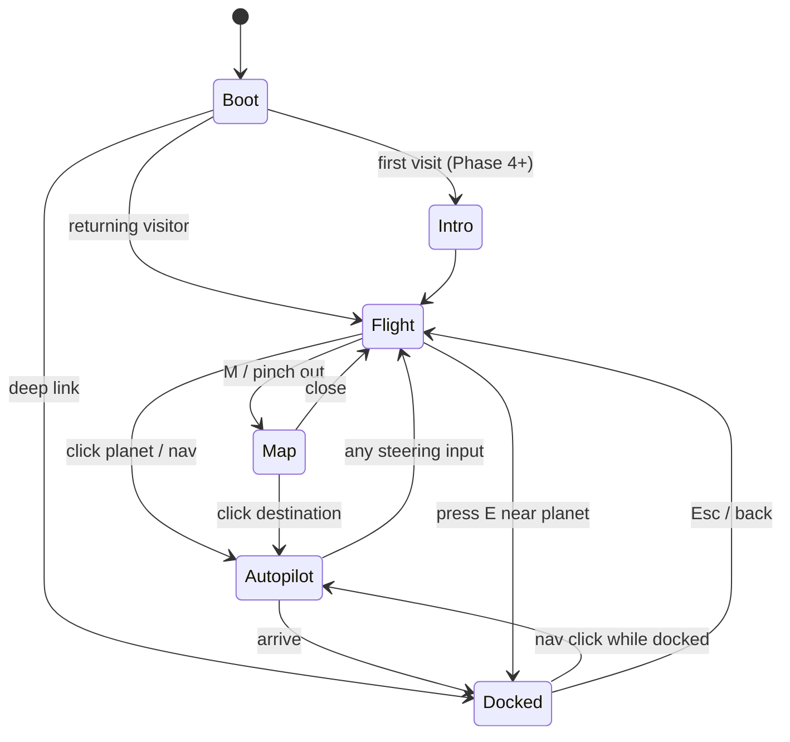

# allenkh.com — Space Portfolio: Master Plan (v2)

> **Status:** approved by Allen on 2026-09-20; supersedes Draft v1. This file is the source of truth: when a decision changes, change it here first. Facts marked **(verify)** were not confirmable during planning and get checked at the step that depends on them.

## Context

Allen wants a three.js animated personal website at **allenkh.com**: a space-travel universe where **solar systems are passions and planets are projects**, with the look of Mini Motorways (muted pastels, flat shading, tidy overhead map, tiny roads and towns) and the cozy piloting feel of [Tiny Skies](https://tinyskies.vercel.app/), "a little more detailed". The repo (github.com/MeagerPotato/Personal-Website, local `C:\Projects\Personal-Website`) is empty apart from the Draft v1 plan.

This plan consolidates everything so far: the 20-question interview, Allen's follow-up answers, research on Allen's resume and GitHub, two architecture reviews (web platform, 3D engine), and a three-way adversarial evaluation of the page shell that Allen asked for ("use whatever is the best option; alternatives should be considered"). Intended outcome: an approved master plan, then implementation starting at Phase 0, shipping a small polished v0.1 fast and growing the universe in public.

## 1. Decisions (locked)

| # | Topic | Decision |
|---|---|---|
| 1 | Navigation | Pilot the rocket freely; clicking any planet or nav item **autopilots** there. |
| 2 | Structure | Galaxy → solar systems (passions) → planets (projects) → moons (sub-projects). |
| 3 | At a planet | Dock → info panel now; landable flagship worlds in a later phase. |
| 4 | Audience | Recruiters/admissions + devs/creative community + friends. |
| 5 | Mini Motorways DNA | Palette & flat shading, overhead map view, **literal roads & tiny towns**, minimal UI. |
| 6 | Camera | Chase cam + pull-out to overhead star map. Steering on a flat plane. |
| 7 | Backdrop | Dark space, pastel planets. |
| 8 | Detail | Planet surfaces, ambient life, the rocket, atmosphere & lighting (phased). |
| 9 | Claude's scope | All code, all site copy (Allen edits for voice), all Astra handoff packets. |
| 10 | Astra | **OpenAI Codex agent ("Astra 6")** with scarce usage. Allen hands off files/prompts manually. |
| 11 | Astra's role | 3–4 prepared, self-contained design passes, **designing directly in code** (no separate mockups). Supersedes v1's "mockups + style guide" deliverables. |
| 12 | Allen's role | Co-developer and product owner. |
| 13 | 3D stack | Vanilla three.js + TypeScript. No react-three-fiber. |
| 14 | Hosting | **Cloudflare Workers static assets** (confirmed; see §5.9). |
| 15 | Mobile | First-class: touch joystick, tap-to-autopilot, real performance budget. |
| 16 | Fast path | HUD nav + plain mode. |
| 17 | Extras | Launch intro, exploration progress, mini-game. Live/social layer: probably never; don't preclude it. |
| 18 | Audio | Music + SFX, muted by default. |
| 19 | Destinations | Home planet (About), Resume station, Contact satellite, Blog ("Captain's Log", working name). **Amended 2026-09-23: the blog lives at `blog.allenkh.com`** (see §9). |
| 20 | Timeline | Ship a small polished slice fast, then grow in public. Gated by exit criteria, not dates. |
| 21 | Page shell | **Astro 7, used thinly, plus our own micro-router** (§5.1; chosen after adversarial evaluation). |
| 22 | v0.1 content | Home system (About/Resume/Contact) + **Code system only**. Model Rocketry and Berkeley arrive in Phase 3. |
| 23 | Fish trilogy | Canadian-Fish-Demo and Fish-Onboarding orbit the FishAI planet as **moons**. |
| 24 | Astra timing | Visual identity pass (A1) happens **before v0.1 goes public**. (Done by Claude, 2026-09-23.) |
| 25 | Identity | Display name **"Allen"**. Tone: **playful framing, technical substance.** **Amended 2026-09-28:** the resume page alone, and so its printout and its PDF, carries the full name (`site.fullName`); everywhere else stays "Allen". |
| 26 | DNS | allenkh.com is registered at Cloudflare (nameservers verified); apex serves nothing yet. **The project sites already on the domain must never be disturbed: `days2meet.allenkh.com` and `fishai.allenkh.com`, both live on Vercel** (the second was found on 2026-09-20 while reading FishAI's README; assume there may be more and check DNS before any DNS-adjacent step). |
| 27 | Personal touches | Rocket name/look, home planet idea, easter eggs: deferred by Allen, again at the Phase 2 kickoff (2026-09-20): "I'll come back to it in a later phase". v0.1 ships a tasteful generic rocket and home planet; checkpoint in §9. |
| 28 | Privacy | No phone number anywhere in the repo or site. The public contact address is `allen@allenkh.com` (named by Allen, 2026-09-20), held in `src/config/site.ts`; no other email address may appear anywhere. `tests/privacy.test.ts` scans the repository for both. |

## 2. Who does what

| | Responsibilities |
|---|---|
| **Allen** | Product owner and co-developer. Raw material for copy, voice edits. Cloudflare dashboard steps (§6 Phase 0 step 8). Playtests on a real phone. PR review. Pastes packets into Astra. CAD exports. Final say on personal touches. |
| **Claude** | All engineering, tests, CI, docs. A **presentable first-pass visual design** (the site must look good even before Astra touches it). Procedural assets. All copy drafts. Astra packets, then integration and nit-fixing of Astra's PRs. Verification. |
| **Astra (Codex)** | Only what it does better and only inside the **design surface** (§5.6): `src/universe/design/**`, `src/styles/**`, `public/models/**`. |

**Planned Astra passes** (one packet = one Codex session = one PR on `astra/NN-…`):

| Pass | When | Scope |
|---|---|---|
| **A1 Visual identity** | End of Phase 2, before launch. **Done 2026-09-23, by Claude** (below) | Palette (dark space + pastel families), typography, spacing/radii, panel/HUD/hint-card/plain-mode styling. Files: `design/tokens.ts`, `src/styles/**`. |
| **A2 Scene art direction** | Phase 3, once map mode + multi-system exist | Materials, shading bands, biome colour bands, starfield/backdrop, post-processing parameters, map-mode look (flatness, lane styling). |
| **A3 UX & motion** | Phase 4 | Easing, durations, transitions, micro-interactions, mobile ergonomics. Punch list + direct fixes. |
| **A4 Hero assets** (optional) | When Allen's rocket/home-planet concept is ready | glTF models following the palette-texture convention, judged in `/lab`. |

**As built, A1 (2026-09-23).** Allen asked Claude (Opus 5.5), not Astra, to carry out the A1 packet, on branch `claude/a1-visual-identity`, with leave to make the small markup and build changes the design needed. Four directions were built and judged; "roadmap" won. What was chosen, one line each (every decision and its numbers: `docs/DESIGN.md`; how it was done: "As built, A1" in §6, Phase 2):
- **Look:** Mini Motorways as a transit map: signage and a legend on flat navy with a faint grid; the route line with its stations is the only ornament.
- **Palette:** the five families re-spread in lightness so none collapse for a colour-blind visitor, each with a glyph (circle, diamond, triangle, square, spark); `ink.low` lifted to 5.3:1 at worst (off the HUD plate, where it is never text).
- **Vocabulary:** butter means "here" (focus, current page, target), the cream face means "on", one solid family fill per view.
- **Type:** one face, Outfit (32 KB, preloaded, with a measured Arial fallback); the four other staged faces are deleted.
- **States:** a butter focus ring outside a navy rim everywhere; hovers only where hover exists; forced colours and `prefers-contrast: more` designed, not left to chance.
- **Plain mode:** project lists as transit lines, the resume as a line of stops with its section names in the margin.
- **Universe:** every control a chip on a navy plate measured over white; the nav as one tray; 13 px names on the map; an opaque hint card that never covers the ship.
- **Pictures:** the favicon, the home-screen icon and the link-preview card drawn from the tokens.

**A2 (scene art direction) and A3 (UX and motion) stay open, and stay Astra's.**

**Packet contents** (`docs/handoffs/NN-title.md`, template in Phase 0): goal and non-goals; edit allow-list plus at most 5 files to read; committed baseline screenshots (desktop + 360 px, both modes); token dump; acceptance checklist (contrast, 44 px touch targets, 360 px width, reduced motion, `npm run verify` green); exact commands; the rule *"no logic edits — write `ASTRA-REQUEST:` in the PR for anything outside the allow-list"*; stop condition. Before each handoff Claude confirms `main` is green, every knob Astra needs already exists as a token, and a `/lab` scene exists. Afterwards Claude fixes lint nits itself rather than bouncing the PR. `docs/DESIGN.md` is the standing brief every packet links to, so packets stay short.

## 3. Experience design

**Universe mapping.** Galaxy = site. Solar system = passion (its sun carries the name and colour family, and is dockable: `/systems/<slug>/`). Planet = project. Moon = sub-project. **Home system** at the galaxy centre: home planet (About), Resume station and Contact satellite orbiting it. Hidden planets = easter eggs.

**Flying.** Flat-plane steering: thrust, turn, brake, boost. Arcade physics, no fail states, you cannot crash (planets cushion and slide you around). A gentle orbit-assist eases you into orbit when coasting and is always escapable. Desktop: WASD/arrows, Shift boost, `E`/click to orbit, `M`/scroll-out for map, `Esc` to leave a panel; hold-mouse-to-steer-toward-cursor is built behind a flag and decided at the Phase 1 playtest. Mobile: floating joystick (left thumb), boost (right thumb), tap a planet to autopilot, pinch-out for map. Soft world bounds: a growing pull home, a hint, an arrow to the nearest sun; no walls, no teleports. First-visit hint cards in the Tiny Skies style.

**Autopilot.** A virtual pilot driving the same flight model (path → motion profile → pure pursuit, the same structure as a VEX auton). Any steering input cancels with continuous velocity. Later it routes along motorway lanes.

**Camera.** One rig, four states, blended in pose space: **Chase** (lag, look-ahead, speed-widened FOV, never rolls), **Orbit** (planet framed in the area not covered by the panel), **Map** (near-orthographic overhead; planets flatten to discs; drag to pan; click to travel), **Cinematic** (autopilot/intro; skippable).

**Arriving.** Enter sphere of influence → quiet prompt → dock → orbit camera → panel slides in (side panel desktop, bottom sheet mobile) → URL is the project's URL; Back undocks. From a HUD/nav click the panel opens **immediately** while the flight plays (recruiter fast path); from an in-world click it opens on arrival.

**HUD.** Wordmark (fly home), nav (About / Projects / Resume / Contact, later Log), sound toggle, plain-mode toggle, minimap/compass, contextual prompt, discovery counter. Mobile collapses nav to one button.

**One URL per thing, two ways to view it.** Every route is a real pre-rendered HTML page with the full content. **Universe mode** boots the 3D world on top and the page's `<main>` *becomes the panel*. **Plain mode** never starts the canvas, never downloads three.js, ships zero framework JavaScript, and lays the same content out as a fast typographic site with a "Launch the universe" button. Content is written once.

**Signature ideas.** *Space motorways:* rounded, colour-coded lanes between related planets (from each project's `related` field, so the traffic network is a graph of how Allen's work connects), tiny instanced cargo traffic, autopilot merges onto them. *Tiny towns:* small procedural settlements on project planets, visible from orbit, later the playable space of landable worlds. *Launch intro:* the loading screen is a launchpad on the home planet; skippable, skipped for deep links and returning visitors.

## 4. Content plan

### 4.1 v0.1 inventory

| Destination | Kind | Route | Source |
|---|---|---|---|
| Home planet | About | `/about/` | Resume + Allen's notes |
| Resume station | Resume | `/resume/` | Resume PDF → `resume.yaml` (Allen says it is slightly outdated → `TODO(copy)` until refreshed) |
| Comms satellite | Contact | `/contact/` | Public email (TBD), GitHub, LinkedIn |
| Code sun | System page | `/systems/code/` | Short "why I build software" blurb |
| **FishAI** | Planet (flagship candidate) | `/projects/fishai/` | github.com/MeagerPotato/FishAI |
| ↳ Canadian Fish Demo | Moon | `/projects/canadian-fish-demo/` | Repo (read at copy time) |
| ↳ Fish Onboarding | Moon | `/projects/fish-onboarding/` | Repo (read at copy time) |
| **Days2Meet** | Planet | `/projects/days2meet/` | github.com/MeagerPotato/days2meet, live at days2meet.allenkh.com |
| Projects index | (no 3D body in v0.1 → Code sun) | `/projects/` | Generated |

Related lane for later: Days2Meet ↔ Berkeley (built for Berkeley clubs).

**Since 2026-09-30: Allen's tree (§9), first half.** The Code system became **Software**, one of
the two suns of **Projects**, a binary star in Code's slot (order 1, sky) with **Hardware**; the
Fish family moved under a planet that is the game itself.

| Destination | Kind | Route |
|---|---|---|
| Projects | Binary star (`systems/projects.md`: name, family, slot, `suns`) | `/projects/` (the index is its page; in the universe it is shown from Software) |
| Software sun | Sun of Projects (primary), sky | `/systems/software/` |
| ↳ CyberPatriot | Planet, completed, no cover | `/projects/cyberpatriot/` |
| ↳ **Canadian Fish** | Planet (was a moon of FishAI) | `/projects/canadian-fish-demo/` |
| ↳ ↳ **FishAI** (flagship), Fish Onboarding | Moons | `/projects/fishai/`, `/projects/fish-onboarding/` |
| ↳ ↳ Fish Online | Moon, planned | `/projects/fish-online/` |
| ↳ Days2Meet | Planet | `/projects/days2meet/` |
| Hardware sun | Sun of Projects, coral (its own family, since 2026-09-30: below) | `/systems/hardware/` |
| ↳ Model Rocketry, Robotics | Planets, completed, no cover | `/projects/model-rocketry/`, `/projects/robotics/` |
| `/systems/code/`, `/systems/code` | 301 to `/systems/software/` (`public/_redirects`) | |

The home planet is called "About Me" (the tree's name; the nav keeps "About").

**Families per sun (2026-09-30, with the emblem worlds, "allocation A").** A sun of a binary may
wear a colour family of its own (`theme` in its file; without one it wears its binary's), and its
planets and moons wear what it wears, in the galaxy (their rings' glow, their orbit lines, their
names' glyphs) and on the pages. The worlds were drawn for one family per sun: Software sky (the
binary's, which the projects index keeps), Hardware coral, Research mint, Hackathons lilac.

**The second half (2026-09-30): Research and Hackathons**, two systems of one sun in slots 2 and 3.

| Destination | Kind | Route |
|---|---|---|
| Research sun | System (mint, `order` 2; lilac until the worlds) | `/systems/research/` |
| ↳ Sports Analysis | Planet, planned | `/projects/sports-analysis/` |
| ↳ ↳ Kalshi | Moon, planned | `/projects/kalshi/` |
| Hackathons sun | System (lilac, `order` 3; coral until the worlds) | `/systems/hackathons/` |
| ↳ Hackathons @ Berkeley | Planet, in progress (logistics director), a lane to Cal Hacks 13.0 | `/projects/hackathons-at-berkeley/` |
| ↳ HackGT 13 | Planet, shipped (HEARSAY, team dh squad) | `/projects/hackgt-13/` |
| ↳ Cal Hacks 13.0 | Planet, in progress (organizing, October 23 to 25, 2026) | `/projects/cal-hacks-13/` |
| ↳ Corgi Hackathon | Planet, planned (RunItBack, 5th of 1,000+; the write-up is to come) | `/projects/corgi/` |

The About page links the new planets where it already names them (Hackathons @ Berkeley, Cal
Hacks 13.0, the Corgi Hackathon). The projects index lists Research last: all its work is
planned, and the first screen should be finished work.

### 4.2 Verified facts for the write-ups (from the repos; re-check at copy time)

- **FishAI.** Three bot lines plus a measurement lab for the 6-player hidden-information team card game Canadian Fish / Literature: *Bass* (frozen, git-tagged), *Monet* (current), *ATHENA* (in progress: GRU + multi-head network trained with PPO, Rust vectorized environment with PyO3 bindings). Core idea: a **constraint solver over deal-time variables** — since every post-deal card movement is public, the only hidden quantity per card is who it was dealt to — propagated to a fixpoint; bots see only a public seat view, enforced by a test. Determinization search was measured in the lab but did not ship in Monet v1.0. README-reported result: Monet v1.0 beats the SESTINA v1.0 reference in **58.38% of 14,400 games** across 12 seeds, up from 27.08% for Bass v2.0; the diagnosed gap was proof speed (9.30 events to prove a set vs 2.92), not declare accuracy. Stack: TypeScript, React 19, Vite, Vitest (86 test files), Supabase Edge Functions, Rust, PyTorch, LaTeX (12 papers). ~536 commits in its first 30 days.
- **Days2Meet.** A better when2meet with no accounts. Differentiators: a **dates-only mode** ("which weekend in October?") alongside the classic time grid; real mobile painting (press-and-hold to paint so swipes still scroll); an Event Planner role (password, no email) that can move dates, change granularity, close responses, export CSV; editing dates **remaps existing answers** with a live "N marks will be dropped" preview; ranked best windows; sane time zones; no 5-second polling. Stack: Next.js 15, React 19, Tailwind 4, Supabase Postgres. Strongest story: deliberate security (RLS enabled with zero policies so only the server's service role can touch data, HMAC-signed cookies, scrypt, sign-in throttling, CSV formula-injection guard, a documented pre-launch audit, `pg_cron` retention).
- **Resume highlights** for About/Resume (as first drafted; since 2026-09-28 the resume follows Allen's resume of 2026-09-23, see §9): UC Berkeley, B.S. Aerospace Engineering (expected 2030). Raytheon systems engineering intern. AFRL Scholars intern (staged-recovery rocket through 11 design iterations, dual-event recovery, fragile payload). YC Startup School attendee; 5th of 1,000+ at a hackathon with *RunItBack* (one photo → interactive 3D environment for dementia reminiscence therapy, built in 12 hours). CyberPatriot national 2nd place and Cisco Networking Challenge 1st. VEX Robotics co-founder/programmer (odometry, sensor fusion, motion profiling, Monte Carlo localization in C++). Troy Preparedness Club founder (Congressional Certificate of Recognition). American Rocketry Challenge team founder/captain.
- **LinkedIn** could not be read (blocked in Claude's browser pane). Allen can paste updates or use LinkedIn's *Save to PDF*.

### 4.3 Later systems

- **Model Rocketry (Phase 3).** Allen supplies CAD and details after scaffolding. Intake checklist per rocket: name, date, purpose (competition / certification / internship), key specs (length, diameter, mass, motor class, apogee), what was novel, outcome, photos/video, flight data if any, CAD export. **CAD pipeline** `scripts/cad-to-glb` **(verify with a real file)**: STEP preferred (assembly structure lets each part take its own palette colour), per-part STL/OBJ acceptable → tessellate → `@gltf-transform/cli` (weld, simplify, palette, meshopt) → `public/models/*.glb`, each ≤ 5 MiB, rendered with the shared flat `toonPalette` material.
- **Berkeley (Phase 3).** "Everything I do at Berkeley": clubs, courses, research, teams. Grows over four years by design.
- **Candidates spotted in GitHub/resume, not in scope until Allen says so:** holdem-odds-engine, dashboard, health-tracker, RunItBack, a Robotics system (VEX; repo `98601A_HighStakes`), Cybersecurity (CyberPatriot), Community (Preparedness Club), Experience (internships).

### 4.4 Copy rules

Claude drafts, Allen edits for voice. Jokes live in headings and microcopy; claims and numbers are precise and come from the repos. Placeholder text is always `TODO(copy)` and **fails the build on `main`**. A site colophon credits the tools (three.js, Astro, Cloudflare, Claude, Codex), in the spirit of Tiny Skies' credits line; how individual project pages describe AI-assisted development is Allen's call at copy time (§9). **Decided 2026-09-28: the colophon only**, one line at the foot of every plain page (the universe has no foot to put it at), and project pages say nothing about it. It names Claude and not Codex, which has written none of the site.

## 5. Architecture

### 5.1 Page shell: Astro 7, used thinly, plus our own micro-router

**Why (adversarial evaluation, 2026-09-20).** Three architects each built the strongest honest case for a rival, scored it against the baseline on the same weighted criteria, and **all three declined to recommend their own option**:

| Option | Score vs Astro | Why it lost |
|---|---|---|
| SvelteKit (adapter-static) | 69.5 vs 80.75 | Best router, but hydration is mandatory: plain mode is no longer zero-JS, every page ships its content twice, the content system must be hand-assembled from pre-1.0 packages, the CSP splits in two, and SvelteKit 3 (breaking) lands within months. |
| React family (React Router 8 best; Next.js static export, TanStack Start lower) | 6.7 vs 8.2 (of 10) | ~100 kB runtime on every page, per-page inline hydration scripts defeat a `_headers` CSP, no built-in image/feeds pipeline. Next's static export also disables its panel-with-URL pattern (intercepting routes), has no built-in image optimisation (the common third-party optimiser documents WebP only), and has an open client-navigation bug in static exports that still reproduces on Windows builds. |
| No framework (Vite + bespoke prerender) | 81.75 vs 83.75 | Viable and durable, but hand-builds the one conventional part of the site (~1,100 extra lines plus its own docs) that a framework's accumulated edge-case handling does best. Kept as the **costed exit plan**. |

The common reason: the defining requirement — one URL whose plain mode ships zero framework JS, content written once, strict CSP on static hosting — is something hydration frameworks cannot meet natively. (Also relevant: the Astro team joined Cloudflare in January 2026.)

**"Thin Astro" rules** (so that leaving later costs 2–3 agent-days, not a rewrite):
- **Use:** `glob()` content collections with zod; markup-only `.astro` files; `astro:assets` `<Picture>`; built-in Markdown + Shiki; official sitemap and RSS integrations; five-line endpoint wrappers.
- **Keep framework-neutral:** schemas as plain zod in `src/site/` (Astro's `image()` injected); validation, manifest and view-model builders as pure functions; all client code; content as plain Markdown (embeds later as custom elements, not MDX).
- **Avoid:** `<ClientRouter/>` (known Safari WebGL-context-loss issue when it swaps the body), islands, scoped `<style>` blocks (one global CSS set), per-page scripts, middleware/actions/adapters/Fonts API, remark/rehype plugin chains, and any `astro:*` import outside `pages/ layouts/ components/` (lint-enforced).
- **Configure:** `output:'static'`, `trailingSlash:'always'`, `build.format:'directory'`, `build.inlineStylesheets:'never'`, `compressHTML:true`; exact version pins; take Astro majors at most once a year.
- **Exit insurance:** contract tests run against `dist/` (so the same suite validates any replacement shell). Key invariant, the **swap contract**: **every page is byte-identical outside `<main>` and `[data-page-head]`**, and has exactly one `<h1>`. One documented exception: `aria-current` on the main nav links, which a no-JS visitor needs and which the router re-derives after every soft navigation with the same pure function the layout uses (`src/site/nav.ts`). The plain-only 404 is exempt: the router never swaps it in (a 404 response falls back to a hard navigation). Enforced by `verify-dist` check 7; what a page holds INSIDE `<main>` has a shape too since 2026-10-03, the cards (§5.4, check 7b).
- **Plan B triggers:** switch the shell to SvelteKit only if the Phase 2 router spike fails on WebKit or the router grows past ~500 lines; exit to the bespoke build only if an Astro major costs more than a day or emitted-HTML drift breaks the swap contract. Engine and Markdown content are portable either way.
- **HUD framework:** none in v0.1 (static HTML + small vanilla controllers). If the HUD exceeds 3–4 interdependent widgets, mount a small UI library (React, which Allen knows, or Preact) **from inside the universe-only shell**, so plain mode stays zero-JS.

### 5.2 Two modes and the load chain

`src/shell/mode.inline.js` (first in `<head>`, unit-tested as shipped) sets `html[data-mode]` before first paint → `boot.ts` (tiny, always loads) → `import('./universe-shell')` (router, panel, prefetch) → `import('../universe/main')` (engine). Base CSS *is* plain mode, so no attribute (no JS) means plain.

Mode precedence: plain-only page (404) → no WebGL2 (tested via `'WebGL2RenderingContext' in window`, not by creating a context) → `?plain` (held in sessionStorage) → `?universe` → saved preference → `prefers-reduced-motion` (plain, with an invitation) → universe. Mode switches are always full navigations; canonical URLs never carry the query. **Watchdog:** engine boot error, or no first frame within 8 s **of frame time**, flips to plain with a notice; the content is already in the DOM. The clock only advances while the browser delivers animation frames (`src/shell/watchdog.ts`), so a background tab or minimised window is never mistaken for a broken engine (found in Phase 0 testing).

### 5.3 Micro-router (`src/shell/router.ts`)

- **Invariant: soft navigation is only an optimisation of hard navigation.** Both must end in the same DOM and engine state; any failure (`!res.ok`, non-HTML, network error, version skew) → `location.assign(url)`.
- **The router owns `history`; the engine never touches it.** The engine emits intents and reconciles to the route. The canvas is never detached: only the children of `<main>` and nodes marked `data-page-head` are swapped.
- **URL = committed destination, never ship position** (pose lives in sessionStorage). `/` means flying/map/intro with the panel collapsed. Dock intents `pushState` **at gesture time** (title set at once from `universe.json`). A new navigation before arrival uses `replaceState`, aborts the previous fetch, bumps a `navId` so stale swaps are dropped, and retargets the autopilot → rapid clicks collapse to one history entry. Cancel/undock calls `history.back()` when our own push created the entry, else pushes `/`. `popstate` runs the same reconcile.
- **Spec borrowed from SvelteKit's documented router behaviour:** latest-navigation-wins; commit order fetch → history → swap → scroll → focus → announce; panel scroll saved per history entry; hover/tap/sphere-of-influence prefetch into a small LRU that respects `saveData`.
- **Accessibility:** on panel open, focus `h1[tabindex=-1]`; one `role=status` announcer ("Flying to X", "Docked at X"); never steal focus on initial load; undock returns focus to the trigger; flight keys ignored while focus is inside `<main>`.
- **Also handled:** link-interception rules (left click, no modifiers, same origin, no `target`/`download`/file extension/`data-router-ignore`, not a same-page hash), bfcache (`pageshow.persisted` → re-check mode, `router.sync()`), version skew (`<meta name="build">` = commit SHA), container-query panel layout, `@media print` forces the plain layout (the resume prints cleanly), no `document.startViewTransition` in universe mode.

**As built, router core (2026-09-20, ahead of the engine work).** Built early on purpose: the router is the most bespoke part of the shell and plan B (§5.1) hinges on it, so it is better to learn now than after the engine depends on it. Three files in `src/shell/`: `navigation.ts` (pure rules: which clicks to take over, which responses to trust, the prefetch cache), `swap.ts` (the DOM work the swap contract allows), `router.ts` (history, races, scroll, focus; about 320 lines, against the 500-line plan B tripwire). What is in: click interception, fetch with fallback to a normal page load on any doubt (failed fetch, non-HTML, redirect off-site, a different `<meta name="build">`, a plain-only page, a `<head>` whose shared nodes differ), latest-navigation-wins with aborted fetches so rapid clicks make one history entry, Back/Forward with per-entry scroll restoration that survives a reload, cross-page anchors, a link to the current URL replacing its entry like a browser does, prefetch on hover intent (80 ms), touch and keyboard focus with Save-Data and 2G respected, the bfcache mode re-check, focus moved to the `<h1>` (which carries `tabindex="-1"` in the markup so that focusing changes no attribute), and `dispose()` when the engine falls back to plain. `onNavigate` is the seam the engine work plugs into. **The head swap replaces the runs between shared elements, whitespace included**, because the first version produced a DOM that differed from a fresh load by the position of whitespace text nodes; shared elements (the stylesheet) are never moved. Router scrolling is `behavior: "instant"`: the stylesheet asks for smooth scrolling, and gliding through a page that was just replaced is motion without meaning. **Verified in Chromium under `wrangler dev`: after soft-navigating through all seven page types in one document, each page's DOM was byte-identical to a fresh load of the same URL**; the canvas element survived every navigation; a broken link arrived at the real plain-only 404 by a normal load. Not in yet: dock intents and `navId`-driven autopilot retargeting (E8-E10), the panel, the status announcer (there is nothing to announce until flights exist), and **Playwright on WebKit and a mobile viewport**, which is what decides plan B.

**As built, the panel (2026-09-20).** `src/shell/panel.ts` plus section 2 of the stylesheet. In universe mode the document never scrolls: the masthead is the HUD's top bar (only its controls take clicks), the footer shrinks to a "Plain version" corner, and `<main>` sits inside `.panel`, a 480 px side panel on wide screens and a bottom sheet (58% of the height, expandable to full) below 768 px. **The panel's state is a function of the URL**: every page but the home page is a destination with an open panel, and Close (or Esc) means leaving, through the new `router.leave()`: `history.back()` when our own push created the entry (history entries now carry a depth), otherwise a push to `/`. So closing FishAI after coming from the projects list returns to the list, like a stack of cards, and a project URL with a hidden panel cannot exist. The home page is the open sky; its welcome text waits behind an "About this site" button, and the page marks itself with `data-home` so that CSS starts it closed before any script runs (no flash). The router now saves and restores the PANEL's scroll position, calls `onNavigate` before it moves focus (a heading inside a panel that is still closed cannot take focus), and leaves focus alone while the panel is closed (the panel hands it to its own button). The type scale inside the panel is pinned to its narrow end through `textNarrow` tokens, because the fluid scale follows the window, not the column. **Found on the way: `swapBlocker` counted the shared `<head>` nodes of the LIVE document, so one browser extension injecting a `<style>` would have turned every soft navigation into a full page load.** The head is now matched by markup, in order, and foreign nodes are never counted, moved or removed. Re-verified in Chromium on the production build: 7 of 7 page types byte-identical to a fresh load after soft navigation, one document, one canvas; Back, Forward, Close and the bottom sheet at 360 px behave; no horizontal overflow.

**As built, the fragment is the reading position (2026-10-03, the second step of the cards).** The plan above left a same-page hash to the browser, which pushes an entry for it: harmless while no page linked to its own parts, but since the cards (§5.4) every section's title does, and after two of them Back would have walked the reader through sections instead of leaving the page, and Close (`leave()`, which goes Back only from an entry the router pushed) would have left a trail. So the fragment is now a reading position, not a page. `samePageAnchor` (`navigation.ts`, pure) names the id a plain click on a same-page link asks for; the router takes that click, **replaces** the fragment in the entry that is showing with the entry's own state (`router.anchor(id | null)`: no new entry, the scroll key and the depth that `leave()` reads are kept), and tells `onAnchor`, whose listener shows the part (`src/shell/cards.ts`; in the panel and the sheet it scrolls there). `onAnchor` also hears Back and Forward between two fragments of one page, and a fragment typed into the address bar: both are a `popstate` and then a `hashchange` by the standard, so the router remembers the fragment it last told and tells each change once. It is not told after `anchor()` (the caller knows) nor when a navigation arrives at a fragment (`onNavigate` says that, and `show()` scrolls there as before). **One thing the spec did not see: "Skip to content"** is a same-page link too, to `<main>` itself, and what it is for is the focus, which only the browser's own fragment navigation moves. So the router takes a same-page link only when its target is a place INSIDE `<main>` (`readingTarget`); the skip link, and an id that names nothing, stay the browser's, exactly as before. And while Back is waiting for its page the address bar is ahead of the content: a same-page link pressed then is swallowed, so that a fragment of the page on its way out never lands in the entry of the page on its way in. Plain mode has no router: there a fragment is the browser's own anchor.

### 5.4 Content model and build-time data

Collections (`src/content.config.ts` wraps plain-zod schemas from `src/site/schemas.ts`; Appendix C): `systems`, `projects` (**moons are projects with a `parent`**: one schema, one URL shape, promotion to planet = deleting a line), `log`, `pages` (about/resume/contact), `resume.yaml`. Images co-located with each project; alt text required.

`src/universe/data/build.ts` `buildUniverse()` is a **pure, Vitest-tested** function: asserts every reference exists, exactly one of `system`/`parent`, moon depth 1, lanes deduped, drafts excluded. `src/universe/data/layout.ts` runs **at build time**: a honeycomb of fixed system slots packed round home (where slot k sits follows from its `order` and three keys alone, `tuning.layout.homeRoom`, `slotRoom` and `clusterAxisDeg`: no body, ring or tripwire moves a system, adding a system never moves one, a test pins orders 1 to 8, and the build refuses rooms that no longer fit the tripwires), orbit index from (date, slug), PRNG seeded **per entity id** so adding a project never moves anything else; from Phase 3 a committed `galaxy.lock.json` pins slugs to slots. Output: static endpoint `src/pages/universe.json.ts` (no prose; plain mode never downloads it; the engine stays free of `astro:content`). `Math.random`, `Date.now`, `document`, `window` are lint-banned under `data/` and `sim/`.

**As built in W1 (2026-09-20).** The manifest is `{ version, systems[], bodies[], lanes[] }`. Body ids are namespaced (`system/code`, `project/fishai`, `page/about`) and every body carries its `href`, so the router maps URL to destination with one lookup. The **home system has no sun**: the home planet (About) sits at its centre, and the Resume station and Contact satellite keep reserved rings, so publishing one never moves the other. Docking radii are computed once, in the manifest, so layout and engine cannot disagree. The stability guarantee, stated honestly: systems never move (their slot is the explicit `order`, which must never be renumbered), angles are seeded by id and never change, and adding a newer project or a new system moves nothing; a back-dated project or a new moon widens the rings from that planet outwards until `galaxy.lock.json` pins even that. Two tripwires fail the build: a system reaching past 380 u (460 u since 2026-09-30: "the one galaxy move", below), and two systems closer than their radii plus 150 u. `TODO(copy)` is enforced on `dist/` (what ships), not on source, so drafts and not-yet-rendered pages may hold it. Pages have no draft flag. The `resume` and `log` collections arrive with W2 and Phase 5.

**As built in W2 (2026-09-20).** Routes: `/`, `/about/`, `/resume/`, `/contact/`, `/projects/`, `/projects/<id>/` (planets and moons alike), `/systems/<id>/`, plus the plain-only 404. `.astro` files hold markup only; everything with a decision in it is a tested plain function in `src/site/`: `view-models.ts` (project tree, cards, breadcrumbs, dates, links), `resume.ts`, `nav.ts`, `seo.ts`. **Lists of projects are ordered flagship first, then newest** (a page is read top-down); orbits stay oldest-innermost. The `resume` collection is `src/content/resume.yaml`, one entry per section, with dates kept as written on paper ("Summer 2025") rather than forced into months; a missing or empty section fails the build. `/resume/` is its own print stylesheet away from paper: light colour scheme, one ink, no navigation, two pages. Images go through `components/Shot.astro`: AVIF with a **WebP** `` fallback at 480/800/1200 px (a PNG fallback of a screenshot came out five times heavier than its source, for browsers that cannot run this site's CSS anyway). Project cards carry a CSS toy planet coloured by `data-biome`, and system pages take their sun's colour family through `data-theme`, both from tokens. Measured: heaviest plain page 9.4 KiB gzipped (HTML + CSS + JS) against a 30 KiB budget; no horizontal overflow at 360 px on any page type.

**As built in W7, first half (2026-09-20).** Every page names a link-preview image and `verify-dist` checks that it is absolute, on this site, and present in `dist/`. Project pages use their cover, cropped from the top to 1200×630 as a JPEG (33–71 KiB). Every other page uses **`/og/default.png`: a small solar system drawn as SVG from the design tokens** (`src/site/og.ts`, pure and tested) and rasterised at build time with `sharp`, so a palette change restyles the card for free. It carries **no text on purpose**: SVG text depends on the fonts a machine has, and the build must be identical on Windows, CI and Workers Builds; the title and description travel as meta tags anyway. Structured data is one `application/ld+json` block per page (a data block, so the CSP and the one-inline-script rule do not apply): `WebSite` + `Person` on the home page, `ProfilePage` on About, `SoftwareSourceCode` or `CreativeWork` plus `BreadcrumbList` on projects, `BreadcrumbList` on systems; "<" is escaped so no string can close the element. The person is described as "Allen" with GitHub and LinkedIn as `sameAs`, and no contact details. `sharp` became a direct dependency (it was already installed through Astro). **Still to do in W7:** the analytics beacon, which needs the Web Analytics token from the Cloudflare runbook. (Done: built and off on 2026-09-21, switched on with Allen's token on 2026-09-29, §5.9.)

**As built, the card contract (2026-10-03, the first step of the cards).** Allen asked for a destination's content to stand round its planet as boxes, not down one side as a list. This step is only the markup that makes that possible, and it moves nothing: inside `<main>` every page but home and the 404 is a list of **cards**, a head (`<div data-card>`: the crumbs, the sign, the one `<h1>`, the lede) and then at most eight sections (`<section data-card aria-labelledby>`), each opening with an `<h2 id>` whose words link to the card's own fragment, so that `/about/#rockets` names a card. `src/site/sections.ts` (`sectionize`) cuts a text's rendered HTML at its top-level `<h2 id>`s with a scanner that counts the open tags: no Markdown plugin (§5.1 stands), and a heading with no id, with markup in it, or inside another element is refused by name. `src/site/cards.ts` says which cards each kind of page has, their ids and titles (ids are API: they are fragments), and refuses a ninth; `components/Card.astro` and `MarkdownCards.astro` are the markup; `verify-dist` check 7b (`scripts/lib/cards.mjs`, pure and tested) holds every built page to the shape. A part of a page that never had a heading (a project's facts, the opening of About, the resume's contact line) gets a **quiet title**: a real heading for a screen reader, clipped away for the eye, shown in the gap above its card while its link has the keyboard's focus, and `display: none` on paper (and left out of the resume's fingerprint), so that the PDF holds no hidden words. Pages print a text as Astro rendered it (`entry.rendered.html`), which is what `render()` prints for a text with no picture; a text with a picture is refused at build time (a project's pictures are its cover and its gallery). A sun's, the resume's and the contact page's text is one card each, so a `##` in one fails the build. **What a visitor can tell:** a section's title is a link to itself (one more tab stop each; in the resume's PDF an internal link), and the projects index has a line under each sun's tagline, "The Software system", the way to the sun's page that its name used to be. Checked by pictures of every kind of page before and after (plain at 1280 and 360 px, the side panel, the phone's sheet, print): only the projects index differs, by that line; the PDF is the same two pages. Heaviest plain page 17.9 → 18.3 KiB gzip of 30; no client JavaScript was added.

**As built, the deck (2026-10-03, the fourth step of the cards).** On a window at least 80rem wide and 36rem tall (1280 by 576 px), universe mode now stands a destination's cards round the docked body: the head and the first sections down a column on the left, the rest down one on the right, the body in the free part between them. Smaller windows keep the side panel, a phone the sheet, and plain mode is untouched. **The stylesheet does the layout, alone** ("the deck" in `global.css`): `<main>` is a column-wrap flex box with one forced break (`main::before`), the left column's cards are the ones four selectors name (box i of M, the head counted, stands left while 2i <= M), and nothing is positioned or measured by script to place a card. A card is a **stub** in the overview (its title row and the start of its text under a fade; the stubs of a column share its height), a **chip** while another card is open (the title row alone), or the **open card** (all of it, 30rem wide, scrolling inside itself when it is longer than its column). Which card is open is the URL's fragment and nothing else: `cards.sync()` reads it and writes `data-card-open`, `data-card-side` and `--deck-mates` on `<html>`; nothing is written inside `<main>`, so a soft navigation still ends in the DOM a hard one builds. The layout stands on three declarations, each marked where it is and held by a test that reads the stylesheet: a `min-height` on every card (a flex item's automatic minimum is its content, and one card that will not shrink pushes its column out of the window), a `- 1px` in the caps of the head and of the open card (a column exactly full, rounded to whole pixels, wraps into a third column), and `overflow: clip` on a stub (nothing may scroll a stub, not even the focus). `src/shell/deck.ts` is the same arithmetic as pure functions, and `deck.test.ts` reads the stylesheet's selectors and holds them to it. **Input.** A press on a stub, a chip or a title opens that card; the head's chip, the open card's own title and Esc go back to the overview (Esc leaves the page only from there: `panel.ts` asks `onEscape` first); none of it adds a step to Back. The wheel is one pure reducer, `wheelStep`: a gesture (events less than 250 ms apart) that begins with the open card at its end steps to the next card once it has turned 80 px, and is the cards' own from then on, so one flick of a trackpad is one card however long it glides, while a mouse wheel kept rolling goes on stepping 400 ms apart; a gesture that begins with something left to scroll only scrolls, wherever the pointer is. The scroll keys do the same through `keyStep` (a held key scrolls and never steps; the arrows are the cards' only while the focus is in the content, else they fly the ship). While a deck is up the wheel never opens the star map (`setDeck`, step three): the map is `M` or its button, which stands top centre of the free part there, as the dock prompt stands at its bottom. After a step the focus moves to the card's title (if it was in the content) or the announcer says "Rockets, section 3 of 8", never both; and the keyboard's focus never rests on something cut off: Tab into a link of a stub opens its card. **What the engine hears.** `panel-inset.ts` measures the cards themselves in the deck (`deckInset`: the head's right edge and the last card's left edge, each with 24 px of air) and is asked again in the same task as every change of card (`refresh()`), which is why nothing in the deck moves by width, height or position; the orbit camera fits the docking ring into what is left (570 px of a 1280 px window in the overview, 397 with a card open), and the names keep to it. **Where this differs from the spec.** (1) Turning the wheel back before the gesture has stepped starts it afresh: at the end of a card, a little too far down and then up again scrolls the card up, where the spec's reducer would have stepped to the card before. (2) Only a keyboard's focus opens a card; a pointer's focus is its click's to answer (a press on a link in a stub follows the link, and must not open the card under it first). (3) A press on a title leaves the focus on that title, which shows in every state, and says nothing; the spec moved the focus to the `<h1>` on closing. (4) `Cards.show(id)` is the router's `onAnchor` (the spec had `sync()` alone, which cannot scroll to a place inside the card it opens). (5) The stubs' text is one size (`sm`) whatever it is in the open card, and the head's lede is `ink.mid`: a column of previews in three sizes read as noise. (6) The Map button and the prompt slide to their new middle (`left`, 480 ms) when a card opens and its column widens; the names measure the button's box every frame, so they keep off it on the way. (7) Close is the word it always was, as a small pill beside the head's first line: `Base.astro` is untouched (invariant 11). **Known limits.** At 1280 by 576 a crowded left column gives its stubs 59 px each, a title and a sliver of text. The primary actions (a project's link keys, the resume's Download) are in the first section card, so a short stub can cut them off until the card is opened. Scroll inside a card is not restored by Back: a card opens at its top. **Checked.** `cards.spec.ts` in Chromium and WebKit: About's eight sections at 1280 by 576, 1280 by 800 and 1920 by 1080, in the overview and with each card open (two column edges, no card over another or outside the window, visual order = DOM order, 44 px chips, the free part where the columns end), and FishAI, the resume, contact and the projects index at 1280 by 576; the wheel there and back, the keys, Esc, Back, a resize across the breakpoint, axe in both states, reduced motion; and the phone still gets its sheet. Every other spec file was run again against the deck: two helpers that put a test's link straight into `<main>` now put it into the page's first card (in the deck only a card takes the pointer), and one that pressed a link inside a stub opens the card first, as a reader does. 29 lines of the shell and the stylesheet were each broken on purpose, and a unit test failed every time. Lazy JavaScript 208.6 → 210.9 KiB gzip of 220; the heaviest plain page (the resume) 18.3 → 19.8 KiB of 30, the deck's CSS.

**The one galaxy move (2026-09-30): room for a binary star.** Allen's tree of solar systems (§9) makes Projects a binary star: Software and Hardware, two suns circling one slot (`data/layout.ts`, `binaryOrbits`), which with the tree's projects reach 401.6 u from their centre, past the 380 u tripwire. So, once, and while Code was still the only system in the galaxy, the tripwire and the two slot keys sized from it went up together: `maxSystemRadius` 380 → **460** (the binary, and room for one more planet or moon under either sun; a second fails the build with a message that names both families), `slotRoom` 911 → **1,071** (2 × 460 + 150 + 1) and `homeRoom` 610 → **690** (the home system's 66.2 u + 460 + 151 needs 677.2; 690 lets the home system grow to 79 u, as before, so a design edit that makes it bigger still moves nothing: `dockMin` 7, a home planet of 16 and a station of 3 reach 75.6 u). Code moved from (−431.34, 431.34) to (−487.90, 487.90), the one value of the served `/universe.json` that changed (the build's byte-for-byte test says so), and `layout.test.ts`'s pinned slots were rewritten on purpose to what the real `honeycomb()` gives: (−487.90, 487.90), (−178.59, −666.49), (666.49, 178.59), (−1,191.76, −319.33), (319.33, 1,191.76), (−1,538.92, 693.84), (−693.84, 1,538.92), (−1,744.86, 1,744.86). The star map frames the galaxy about 8% wider. What it costs in time (`npm run journeys`, same seeds, p90 and slowest, before → after): the real galaxy 3.4 → 3.5 s and 4.3 → 4.4 s; grown to 4 systems 4.0 → 4.2 and 6.2 → 6.4; 6 systems 4.7 → 5.0 and 7.8 → 8.1; 8 systems 5.0 → 5.5 and 7.4 → 7.9; no failures; and the stress test on the real galaxy (every mode; journeys between systems, within one and from the spawn point; `"stop": true`) flew 47,044 flights, none of which touched a shell, grazed or failed to dock. A returning visitor loses nothing but a remembered pose: the move changes the galaxy fingerprint (§5.5, pose memory), and this deploy drops the snapshots written before stamps with it. The next move is Phase 3's `galaxy.lock.json`, which pins each system where it is, and a binary's separation and period too: a binary is the one exception to "adding a project moves nothing" (a planet under one sun moves the other sun's orbit radius, the separation, the binary's reach and the pair's shared period; `layout.ts` names it).

**The Projects binary's content (2026-09-30, the first half of the tree).** `systems/code.md` is gone. `systems/projects.md` is the binary, frontmatter only (name, `sky`, `order` 1, `suns: [software, hardware]`: it has no page, `/projects/` is its page), and its suns are `software.md` (Code's words, and a sentence for CyberPatriot) and `hardware.md`, each a page at `/systems/<id>/`. Canadian Fish became a planet of Software (size m) with FishAI, Fish Onboarding and the planned Fish Online as its moons (FishAI keeps `flagship`); Days2Meet and CyberPatriot orbit Software, Model Rocketry and Robotics orbit Hardware. Canadian Fish wears `bloom` now: it was `terra` like Days2Meet, its new neighbour on Software's rings, and the two read as one planet on the projects index and in "Start here" (biomes stay placeholders for the design round). The three new built planets have no cover (their pages show their planet) and a new status, **`completed`** ("Completed": finished programs that were never products to ship). About's title is "About Me", the tree's name for it; the nav keeps "About". **The one retired URL,** `/systems/code/` (and without its slash), answers **301** to `/systems/software/` from `public/_redirects`, which Workers static assets apply before any asset (checked under `wrangler dev` by `tests/e2e/tree.spec.ts`); `verify-dist` check 3b (`scripts/lib/redirects.mjs`, pure and tested) holds it to one exact path per line, 301 only, a source that is no page and that no page links to, and a destination that is a page of the build. The galaxy as served: Software's sun 133.8 u from the pair's centre and Hardware's 287.8 u (the bigger family sits nearer the centre), one turn in 4,470 s, reach 401.6 u of the 460 allowed; `/projects/` is shown from Software. **Which families the autopilot goes round whole** (`familyReach`, 120 u with the keep-out) is pinned by `tests/families.test.ts`: Hardware (117.8 u), Canadian Fish (77.0) and the home system (70.2) are one disc each, and Software (271.8) is gone round body by body; content that moves a family across the line fails there, with a message that says to run `npm run journeys`. **Journeys** (`npm run journeys`): the real galaxy's 1,014 all dock, in a median 2.5 s and p90 3.4 s, and the slowest (Contact to CyberPatriot) in 5.02 s, the one journey over 5 s; grown to 4, 6 and 8 systems p90 is 4.3, 4.9 and 5.4 s and the slowest 6.5, 8.0 and 8.1 s; no failures, and the gate passes. The stress test on the real galaxy (every mode; journeys between systems, within one and from the spawn point; `"stop": true`) flew 54,081 flights, none of which touched a shell, grazed or failed to dock. **The ship's light across the gap** was measured over the 320 journeys into, out of and across the binary (67,718 frames at up to 430 u/s): with `tuning.world.shipLightTiebreak` at 0.05 the light turned up to 97° in one frame (8 frames over 60°); at **0.2**, now the value, 54° at most (none over 60°, 26 over 30°); 0.5 would bring it to 41°, at the cost that follows. What the tiebreak costs is a lean: on a planet's ring the ship is lit from its own sun, except round Days2Meet (up to 20° off it), Model Rocketry (11°), Fish Online (1°) and **Robotics (57°; 45° even at 0.05, and 105° at 0.5, from beyond its own sun's side)**: the worst anywhere on the ring over a whole turn of the binary, pinned by `tests/ship-light.test.ts`. Robotics is Hardware's outermost planet, and Software's family is more than twice as wide, so on the gap's side of Robotics' ring Software's pull all but matches Hardware's. So `lightAt`'s promise that inside a family the light is its sun's alone held only where no other sun pulls. **Since 2026-09-30 the ship takes the light of the body it is near.** Each body's own light (its sun; the key light round home) claims the ship fully from its docking ring inward and lets go by `tuning.world.shipLightClaimRadii` (2) ring radii, a little past the orbit assist's sphere (`sim/shipLight.ts`, pure and tested); `Galaxy.lightAt` turns the blend above toward the claiming light by that claim, by angle (a slerp), and the blend stands everywhere else. A body nothing docks at (a relay) claims nothing, and inside a family with one sun nothing changes at all (the grown galaxies' six: 1e-6°, the rounding of acos). Why by place and not by the dock (the Navigator's approach and docked, crossfaded in time): a docked ship and one the loose assist holds on the same ring are framed alike and now lit alike; a place needs no new state (nothing to snapshot or crossfade, so a page opened on a planet, a rebuilt engine and a reload are right from their first frame); and a journey that arrives beside the ring slides into its body's light as the dock's springs bring it on (up to 27° off at the moment of docking, 0.02° a second later: before, 55° and then 42° for as long as it stayed), where a switch on the dock would pop and a crossfade in time would turn the light while the camera was still settling. Why angle and two rings: blending two directions as vectors crowds most of a wide turn into the middle of the way (`turnToward` in `sim/shipLight.ts` turns by angle), and from the ring out to 2 rings turned the light least of the reaches tried (1.8, 2, 2.2, 2.4; from 1, 1.1 and 1.2 rings). Why a smoothstep: it starts flat on the ring, where the assist holds a ship about 0.15 u off it, so that ship is lit as its body is (0.02° off at Robotics, where a straight let-go would leave 0.6° and one along √u 6°), and let-goes of other shapes buy back little of what follows (at 81 u/s out of every binary and home ring, every 20 s of a turn: linear 24.5°, (1 − u)² 21.7°, √u 21.5°, smootherstep 26.5°, against the smoothstep's 22.9° and the blend alone's 19.0°). Measured with the real content, before → after: on every ring (all 13 a ship can circle, home and the suns included) the worst angle between the ship's light and the body's own over a whole turn of the binary went from Robotics 57°, Days2Meet 20°, Model Rocketry 11°, Hardware's sun 2°, Contact 1° and Fish Online 1° to **0°** everywhere; over the same 320 journeys the worst turn in one frame is still 54.1° (frames over 30°: 26 → 26; over 60°: none; over 10°: 278 → 287), and over 704 more journeys to and from Robotics, Days2Meet, Model Rocketry and Hardware's sun (8 starts each) still 66.5° (71 frames over 30° and 1 over 60°, before and after: the gap, which the old light crossed the same way). What it costs is where a planet's claim reaches into the gap: Robotics' does, and where it lets go on the gap side the blend is already the gap's key light, 153° off Hardware's (Days2Meet 46°, Model Rocketry 21°, Hardware's sun 11°; `tests/ship-light.test.ts` pins these, and every ring at 0°). So a ship crossing those 15 u straight out or in turns faster than it did, and all of it at Robotics. Straight out of every binary and home ring (48 places round each, radially and 45° either side, to 3 rings, every 10 s of a turn), before → after: at a boosting pilot's 81 u/s the worst turn in a frame is 19.0° → 23.7° and **frames over 20°: none → 213** (none over 30°); at 55 u/s 13.0° → 16.2° (none over 20°); at 120 u/s 27.8° → 34.9° (over 20°: 345 → 1,611; over 30°: none → 104); at 200 u/s 44.8° → 55.3° (over 30°: 442 → 1,486; none over 60°). A review's sweep of the same kind counted 449 frames over 20° at 81 u/s, none before. No journey of the autopilot's gets worse (frames over 20° in the 320: 79 → 83, in the 704: 273 → 273). `tests/ship-light.test.ts` pins how fast it turns, too: the worst frame leaving each ring at boost, Robotics 23° (blending by vectors would make it 34°). The tiebreak stays at 0.2: the rule cannot let it go back down, since the gap lies outside every claim (0.05 still turns 97° in a frame, 0.1 78°), and 0.5 (41°) would light a ship flying free among Hardware's outer planets up to 104° off its sun (57° at 0.2). Left to judge in flight, before this merges: leaving or diving at Robotics on the gap side, at boost.

**Research and Hackathons (2026-09-30, the second half of the tree: §4.1).** Two systems of one sun, in the slots the move made: Research (`research.md`, lilac, `order` 2, at (−178.59, −666.49)) with the planned Sports Analysis and its planned moon Kalshi, reaching 112.2 u; Hackathons (`hackathons.md`, coral, `order` 3, at (666.49, 178.59)) with Hackathons @ Berkeley, HackGT 13, Cal Hacks 13.0 and the planned Corgi Hackathon (undated, so outermost), reaching 190.6 u. Hackathons @ Berkeley and Cal Hacks 13.0 name each other in `related`, one lane between the role and the event it runs (the build draws one lane for the pair, and each page lists the other). Nothing already in the galaxy moved: a new system takes its own slot. **The regime pin** (`tests/families.test.ts`) now reads: Research (116.2 u with the keep-out, 3.8 u under the line: one more moon there flips it), Sports Analysis with Kalshi (37.6), Hardware, Canadian Fish and the home system are gone round as one disc each; Software and Hackathons (194.6) body by body. The ship's light on the new rings leans off its sun by nothing (`tests/ship-light.test.ts`): no other sun is near enough to pull. **Journeys** (`npm run journeys`, whose defaults are now the real galaxy and grown ones of 6 and 8 systems, since the real one IS four): the real galaxy's 2,646 journeys (21 dockable bodies, 6 starts each) all dock, in a median 3.0 s, p90 4.05 s and the slowest 5.90 s (Research's sun to Fish Online, a far corner of the triangle), 18 of them (0.68%) over 5 s; the gate (p90 ≤ 4.2 s, slowest ≤ 6.5 s, at most 1.5% over 5 s, no failures) passes. Grown to 6 and 8 systems p90 is 5.2 and 5.3 s and the slowest 7.8 and 8.3 s, with no failures. The stress test on the real galaxy (every mode; journeys between systems, within one and from the spawn point; `"stop": true`) flew 54,235 flights and stopped 1,788 journeys at full speed, and none touched a shell, grazed or failed to dock; on the grown galaxies (journeys between systems, one galaxy per process) 23,712 and 23,673 flights, none failing. **Seen on the star map, left for the design round:** on a phone, Research sits at the bottom edge of the galaxy, and even zoomed all the way in the names of its planets get room only part of the way round (below them is the screen's edge and the Plain version chip, above them their sun's name). Measured over a whole turn of Sports Analysis (six minutes, from a page load, zoomed all the way in on a Pixel 7): its name shows from about 70 s to 200 s, Kalshi's for a few seconds three times, and for the first minute of a visit neither does; the rest of the time a visitor reaches them through Research's page or the projects index. On a laptop, zoomed in, Sports Analysis's name shows most of the way round, giving way to Kalshi's or Research's twice, for up to 36 s (`tests/e2e/world.spec.ts` flies to whichever of the two shows). At the phone map's first view two of the four systems go unnamed: Software's name gives way to Hardware's and About Me's, and on a 360 px phone Hackathons' own name, long and at the very edge, gives way to one of its planets' (on a 412 px one it shows). The cheap ways out are the design round's: let the map go one name's height further past the galaxy's edge, and keep a sun's name on screen by nudging it inward instead of hiding it. (Done the same day, and more: the next paragraph.)

**Every name on the phone's star map (2026-09-30, a follow-up to the tree).** What hid the names was not the rank (a sun's name already went before a planet's) but that a name had one place, or two: at the phone's first view the ship parked beside home pushes About Me's name above the planet, and there it, Hardware's name and the planets' crowd Software's and Hackathons'; and at the galaxy's bottom edge the map stopped 44 px (its pad) past Research's system, less than a name below a body there needs. **(1) More places, on the map only** (`ui/Labels.ts`, `onMap`; in flight a name still has one place, under its body): below or above, then BESIDE the body (its tag in line with it and 2 px off the disc, `data-side` `left`/`right`, the side towards the middle of the view first), then slid along it (the body over the tag, past its round end); place 0 itself slides in from a screen edge rather than hiding. A place whose tag would lie on another body (`covers`) is taken only where the name has no other. **(2) Declutter with places** (`sim/declutter.ts`, pure, and it allocates nothing: what it keeps from frame to frame and its scratch are in `LabelBoxes`): a name stays where it was while it may, goes back to its first place once that has room to spare, and one with room nowhere may move ONE name already placed to another of its places; the systems' names are placed together, every way tried (at most 4,000 tries a frame: the review below) before one is left out; the target's and the keyboard's are placed before them and never moved. **(3) Steady at rest.** The first version of this change named everything and did not hold still: counted headless over a whole turn of the binary at rest, 60 frames a second (`tests/map-names/`, below), its names changed 4.8, 107 and 270 times a minute at the first view (360x740, 412x839, 1280x800), 278, 7,801 and 18,403 of those within a second of the same name's last change; zoomed in twice, 16, 40 and 96 a minute (324, 2,053 and 4,544). Names hopped between places that were each good for a frame. What holds them still: on the map a name that shows goes before every name of its rank that waits, and the nearer the middle of the view goes first only between two that both show or both wait (`WAITING`), so a name that waits takes only the room that is left; the names that show keep their slots in `labels.max` (`keepSlots`: a newcomer shows once one is free, not by taking another's; since the review below, only while they are young); a name that has just appeared, hidden or moved makes no other change of its own accord for `labels.dwellSec`, 1 s (`young`); a place a name is not at must have `keepPx` room to spare from the view's edges (`slackAt`), so a name whose body drifts across an edge by a pixel does not come and go with it; a name whose place went past the edge moves at once, where one that was hidden and is young stays hidden (`before`); and declutter runs again on its own answer, up to three times a frame, so that a chain of moves lands in one frame. Now 0.38, 0.74 and 7.8 changes a minute at the first view, none within a second of the last, and zoomed in twice 4.4, 5.5 and 15 (0, 0 and 2). Before this change (a name with one place, or two), a headless probe counted 0.47, 0.19 and 2.9 (none within a second) and 1.1, 2.8 and 4.0 (0, 0 and 1): as calm, with half the names. The quick ones left (zoomed in, a name changing again within a second) were looked at one by one: a body taking its name's place past the edge of the view, or a sun's name moving for a more important one and the planets' round it following. While the map is dragged (800 px across and back, then 400 px down and back, at 400 px a second, from six moments of the turn: 36 s), names change within a second of their last change 93, 80 and 38 times at twice the fit and 187, 194 and 52 at four times; before this change 56, 55 and 23, and 135, 134 and 84; the first version 497, 480 and 277, and 743, 743 and 219. **(4) `map.spanMin` from 400 to 200 u** (a phone zooms in about twelve times, not six), which parts the names of close neighbours (Corgi Hackathon's, Canadian Fish's moons'). 300 was tried first: zooming in from the first view in three steps, as a visitor would (the names keep what they had on the way), then left Resume and Hackathons @ Berkeley unnamed at 4.7% of moments on a 360 px phone; at 200, 1.3% at most on a phone (2% for Kalshi on a laptop, named again a second later). **Tried and dropped:** letting a view zoomed in go past the galaxy's edge up and down by a name's height (`pastPx`, which the names reported to the map through main.ts). Measured with the rest in place, it gave only room to drag up and down at twice the fit on a phone (15 and 20 px, against 5 and none) and four Research moments in 895 with both names (below); whether some view names each body came out the same. It coupled the names to the map for that, and went. **Measured** headless with the real StarMap, camera, projection, Labels and declutter on the galaxy the build makes, with the names' sizes, the top bar, the Map button and the footer chip measured in the browser. The first view, every 5 s over a whole turn (4,470 s), each look taken afresh: before this change a system's name was missing at 360x740 for Software 100% of the time, Hackathons 100% and Hardware 81.5%; at a Pixel 7 (412x839) Software 100%, Hackathons 100%, Hardware 42.8%; at 1280x800 Hardware 6.7%. (That was the fresh look. In the browser the names that showed on the way out keep their places a while: before this change, at 412 px it named Hackathons at all five moments sampled and Software at two, where the fresh look named neither.) Now none is missing, at any size, ever (and in the browser at every moment the phone tests and the screenshots of this change look), and the first view names 5.8, 7.2 and 13.7 bodies on average, against 2.7, 4.1 and 6.5. Bodies with a name's tag over them: 3.2, 3.2 and 2.8 on average at the first view (the first version 3.8, 4.1 and 4.7; before, with half the names, 1.3, 3.1 and 5.9). Whether some view within the map's limits (every zoom from the closest out, the body at any of 49 spots of the screen) names a body, every 15 s over the same turn: looked at afresh, before this change 13, 16 and 12 of the 23 bodies had moments with none (the worst, Fish Onboarding, a moon in Software's crowd, 56%, 74% and 89% of the time; Resume 33%, 39% and 55%), and now none has; arriving at that view in three steps, before 16, 16 and 12 bodies (Resume 73%, 54% and 64%), now at most 1.3% for any body (LinkedIn on a Pixel 7; 2% for Kalshi on a laptop, named again a second later). **Research all the way in** (its sun brought to the middle of the map, as far as the map goes, 895 moments of a turn, each looked at afresh): before this change Sports Analysis's and Kalshi's names never showed together, and neither showed most of the time; now both show 68% (360 px), 81% (412 px) and 97% (laptop) of the time, the planet's alone 24%, 16% and 3%, and neither 1.0%, 0.7% and none (without the edges' patience, 71%, 81% and 98% both and never neither: the price of names that do not come and go at an edge). The laptop's keyboard view of world.spec.ts shows both every second of 400 s (before, neither for 23 to 37 s at a time). **Cost:** the desktop's first view is fuller, the 14 names `labels.max` allows 65% of the time (13.5 on average; with no cap at all, 14.1); none touching (judge it in the screenshots of the PR); declutter searches only when a system's name would be left out. The engine writes each name's transform as `translate(body) translate(place)`, one write as before, so the page says where each body is and `tests/e2e/map.spec.ts` measures the map by the bodies (`bodyOf` in `tests/e2e/support.ts`) wherever their names hang. Its phone tests check every system's name at the first view (also at 360 px, at three moments of a visit), bring Research's planned work into view with two fingers and one, count the names that come, go or change sides while a finger drags the map (none twice within a second), and watch every frame of four seconds at rest at a busy moment (none). `tests/map-names/` (a file for each screen, six tests, about 19 s) counted the changes over a whole turn at rest, at the first view and zoomed in twice, and failed the first version by thousands; since the review below, `npm test` runs samples and `npm run map-names` the whole turns.

**The names' review (2026-09-30, a follow-up to the follow-up).** A review of the change above found the names still hopping, and lying on the landmarks, where its harness did not look, and the harness too slow for `verify`. **(1) From arrival.** The map's places, and the dwell, took over the moment the map opened, while its 0.9 s blend still swept the view, so each name held a place it had at some moment of the sweep for a second after: opening with the blend, 54, 33 and 89 changes a minute after the map had arrived (360, 412 and 1280 px), and the last system named up to 1.4 s late. Labels now asks `StarMap.arrived`: on the way up a name keeps its one place under its body, as in flight, and in the frame the map arrives every name takes the place it likes best. Now 0.31, 0 and 4.4 changes a minute after arrival, and every system is named as the map arrives. In the browser (the map opened at eight moments of a turn, the three seconds after each arrival watched): 81, 32 and 52 changes before (1280 px, a Pixel 7, 360 px), with a system missing at all 24 arrivals; now 1, 0 and 0, none missing. As the map closes, a name that showed on it counts as showing in flight. **(2) The landmarks.** What a place lies on has levels (`covers`): nothing, another body, a sun or the home planet (`liesOn`). A planet's or a moon's name is never offered a place on a sun or home; a system's name takes one only as a last resort, and leaves it once it may. A disc counts from a gap off it, and a body level with a tag, just off one of its ends, counts too (there the tag reads as that body's name). Tags on a sun or home per look at the first view: 0.69, 0.97 and 2.27 before (main 0.46, 0.34 and 0.21), now 0.098, 0.07 and 0, every one a system's name; tags that read as a neighbour's, 0.31, 0.23 and 1.13 (main 0.80, 0.38 and 0.28: the laptop's is the one number worse than main). **(3) A young name keeps what it has.** Its slot in `labels.max` only while it is young (`keepSlots`; past that, a planet's name that waits with room takes a moon's slot: a moon's name lay over a planet's that had room 7.6%, 18.3% and 3.9% of a laptop's turn, at the fit and zoomed in once and twice, now 4.8%, 2.2% and 0.9%, with about as many changes), and its room from any name that waits to show, however important (`clearOfYoung`: a pinch pushed a planet's name off, a moon's took its room, and the planet's took it back within the second). **(4) The edge.** A name with no place that has a keep to spare from an edge of the view now takes any place it fits, unless its body is on its way out through that edge: Research at 360 px zoomed in three times, and About Me in a galaxy of six at 1280 px zoomed in four times, went unnamed whenever their discs showed, and now never do (main named both, with fewer names: 3.6 on average against 5.3 there). **(5) The search.** At most 4,000 tries a call of declutter (it had been 4,000 a search, three searches a frame), a way given up once the names left that have room anywhere cannot make up the difference, and ten frames' rest after a search that found no better way. In a galaxy of eight on a 360 px phone it searched in 98.7% of frames, now 9.9% (0.025 ms a frame for the names, against 0.057); zoomed in once, Hackathons went unnamed 86.8% and 86.9% of a turn (360 and 412 px), now 6.8% and 0%. Today's galaxy searches in fewer than one frame in a hundred, 57 tries at most. **(6) The harness** (`tests/map-names/`) watches LOOKS: how the map opens (a cut, or the blend), how far in (up to four presses), dragged with the keys, beside a page, under the fingers (strokes, pinches and a slow drag), and galaxies grown to six and eight systems, everything counted from arrival. `npm test` runs samples of them (22 tests, 2.5 s together; the whole Vitest run went from 20.6 to 4.0 s on the laptop), and `npm run map-names` whole turns of 27 looks in about two minutes, which fails on a breach of each look's rules (CI runs it, not as a required check, like Journeys). `tests/e2e/map.spec.ts` counts from arrival too, and checks that no planet's or moon's tag lies on a sun or home; on the code before, three of its phone tests fail. **Under the fingers** the names change more often than on main, because more of them show: at the first view of a 360 px phone 187 changes a minute with 5.3 names showing, against main's 90 with 3.0, and about as much more at 412 px (1.9 times main), so about 1.2 times as many changes per name shown; zoomed in once, 1.3 times as many in all and 0.75 times as many per name. **Left as they are:** a phone's sheet at 60% leaves a strip too short for every system's name; at 1280 px Hardware's name is missing 6.6% of the time zoomed in twice and Software's 10% zoomed in three times, as on main; and over eight minutes of the laptop dragged down, one flicker (GitHub's name makes way for Contact's, and three frames later Resume's must take that place).

**The names' second look (2026-09-30).** Two re-measures of the review above (a browser's frame-by-frame watch, and the look of the names), and what came of them. **Fixed: a system's name on another system's sun.** The Projects binary's two names lay on each other's suns at 10% of the moments of a 360 px phone's first view ("SOFTWARE ( ) HARDWARE", as on main): the systems' search ran only for a system left out, and one that lay on a sun was left there whenever no single move cleared it. Now the search also runs for a system's name that lies on a sun and may move, and keeps the way that shows the most systems with the fewest on a sun (a tag right on a disc counting far worse than any number a gap off one: `Labels.liesOn` tells the two apart). Over whole turns (`npm run map-names`), tags on a sun a look, before → after: 360 px at the fit 0.098 → 0, 412 px 0.07 → 0, 360 px zoomed in once 0.051 → 0, beside a page on a 360 px phone 1.62 → 0.25, a galaxy of six at 360 px 1.08 → 0.019, of eight at 412 px 0.42 → 0.005; changes a minute 0.40 → 0.35 and 0.71 → 0.87 at the fit, everything else as it was. `tests/e2e/map.spec.ts` now sees a name slide along its body too (more than 10 px from one frame to the next), not only change sides. **Measured and left as they are.** (a) *The laptop at rest* is no less steady than the code reviewed: four browser windows of 98 s gave 9.75 changes a minute against 5.79, but over a whole turn the harness, which matches those four windows (9.18 and 5.82), gives 8.2 against 7.76, and over fifteen windows 8.41 against 8.33, with 12.3 names showing instead of 13.6 and no tag on a sun instead of 2.1 a look; every change at least a second after the same name's last. (b) *The names settle a dwell after the fingers lift* (0.6 to 0.95 s, about one name a gesture). Letting them all settle the moment the map comes to rest (tried with 0, 0.25 and 0.5 s of grace) moved that wave to the lift, but made a name change twice within a second more often under the fingers (244 → 274 at 412 px, 286 → 320 zoomed in once) and failed the e2e drag on every run ("Fish Onboarding: left, then hidden 267 ms later"): a name keeps its second, the rule everywhere else. (c) *A tag level with another body* (the laptop 1.13 a look against main's 0.28, with twice as many names): letting a name leave a place beside a body as it leaves one on a sun made the laptop change 14.3 times a minute instead of 8.2, and read no better (1.19 a look); a place beside a body stays a place a name keeps once it has it.

**The names where a page draws slowly (2026-10-01).** Two of the phone's browser tests failed on CI alone, where Chromium draws in software, ten frames a second with a busy CPU. Both were the tests taking the machine for a fast one, and the look for it found one fault in the engine. **(1) The tests.** *Arrival* was 1.2 s after the map opens by the wall, but the blend runs on the engine's clock, on which a frame counts a tenth of a second at most (`tuning.loop.maxFrameSec`): under ten frames a second the map was still on its way. It is now counted as the engine counts it, frame by frame, and three frames more (`ARRIVAL` in `tests/e2e/map.spec.ts`), and never before the 1.2 s. *"More than 60 frames in four seconds"* now waits for the frames as well as for the seconds. *The drag* held every name to "no second change within a second" while the finger moved the map, which the engine does not promise (under fingers `npm run map-names` counts 115 such pairs in 200 s on this screen, and holds a moving map to no such rule): on a fast machine it passed because the drag comes within the dwell of the pinch before it, every name still young. On CI it comes after, and Days2Meet's name, free again, went above its planet in one frame of the drag and had to leave that room to Software's 600 ms later, the finger still moving, as that sun came into view. The test now holds what holds on every machine: once the map is AT REST (seen from where the names say their bodies are, a dozen frames in a row), no name changes within a second of its last change, the drag's included; and it tells time by the frame's own timestamp, the clock the dwell is counted on. **(2) The engine.** A name with no room to spare takes a place it merely fits, unless its body is on its way out of the view (`leaving`). That was judged from how the body moved ON SCREEN, which under a finger is the finger's way: a moon dragged in from the right edge while its orbit took it out got its name for the drag and lost it half a second after, the map at rest (Canadian Fish, 22 s into a visit at ten frames a second: one of 18 moments tried). `sim/screen.ts` now also says how far each body went BY ITSELF since the frame before, through this frame's camera (`ownX`, `ownY`; `ui/BodiesOnScreen.ts` keeps where they were), and a body is leaving if it is on its way out either way. At rest nothing changes (every look of `npm run map-names` to the last digit); under fingers a few changes fewer (zoomed in three times at 412 px, 171.6 a minute → 166.2, 118 pairs within a second → 115).

**The names beside the emblem worlds (2026-10-01, the merge of the two).** The emblem worlds and the star map's names were built apart, and met badly: with both, `tests/map-names` failed. Three causes, each measured. **(1) A sun was 15 px on the map, not 9.** The emblem worlds made a body's disc its whole solid extent (`solidRadius`: rays, rings and signs, so that the ship, the names and the pointer keep off all of it), but the map's smallest size (`tuning.map.minRadiusPx`) still blew up the BALL to 9 px, and the rays went on from there: Software, Research and Hackathons 15.2, 15.1 and 15.0 px to the edge, Hardware (nearly all ball) 9.3, the home planet 12.6 where 8 was meant. Now the smallest size is the size of everything that is drawn (`world/Galaxy.ts` hands `displayScales` the solid radius, the same one `ui/BodiesOnScreen.ts` measures with): every sun is a 9 px disc, its ball smaller in proportion (5.3 px under Software's rays, 8.7 for Hardware), home 8 (its ball 5.1), a planet 6 (4.3 to 5.6), and a moon's room beside its planet (`clearPx`) is reckoned between the two solid edges. The pointer's smallest target (`tuning.picking`, 12 px for a mouse and 22 for a finger) is larger than any of these and unchanged. **(2) Every tag was 13 px wider** by its family's glyph and the gap after it. On a map narrower than 480 px a SYSTEM's own tag now goes without (`global.css`: its capitals tell it from the rest, and the sun beside it wears the colour); planets and moons keep theirs. **(3) The harness reckoned names narrower than a browser draws them**: a system's name at 6.8 px a letter where its spaced capitals take 10.4 ("Model Rocketry" 21 px short), and no glyph at all. It now carries every name's width as Chromium measured it (`MEASURED` in `harness.ts`), and reckons only a name it has not met. Held to the true widths, the names needed three things of the engine. **Two more places, for a system alone** (`ui/Labels.ts`, `corner`): off the two corners of its body that are towards the middle of the view, where the home planet's name clears the row its neighbour needs. A planet's name gets none: off a corner it reads as its neighbour's (a laptop's first view: 0.56 such tags a look, 1.76 with corners for all). **The systems' search prunes and looks twice** (`sim/declutter.ts`): a place that could not do better than the best way found costs no try (ten places a name within the same 4,000 tries a frame), and where the first look leaves a system out, or right on another's sun, a second sets the names as close together as names that already show may come (`keepPx` closer than the gap). That is where they ended up anyhow one dwell later, three or four hopping at once in the strip beside a phone's sheet: the map now opens on it. **A hidden name's wait holds its place** (`clearOfHeld`): a lesser name no longer shows there for the frames that are left of the wait and goes again when it comes (a flicker a browser's drag found, 4 runs in 6). **As built** (`npm run map-names`, 27 looks, all within their limits, none of which moved; true widths throughout). Changes a minute at the first view, 360 / 412 / 1280 px: 0.46 / 0.68 / 8.46 (the limits 1 / 1 / 9); opened with the blend 0.31 / 0.94 / 4.38; no tag on a sun at any of them, and every system named. Before the merge's fixes, with the same true widths: the blend at 412 px 1.25 a minute, one flicker zoomed in twice at 412 px, and in the grown galaxies Hackathons unnamed 43.9% of a turn (six systems, 360 px, 1.49 tags a look on a sun) and 15.4% (eight, 412 px). Now: six systems at 360 px 0.28 changes a minute, 0.002 tags a look on a sun, none unnamed; eight at 412 px 0.48, none, none; eight at 360 px zoomed in once 0.85 and 0.036. Beside a phone's sheet at 412 px every system is named the whole turn (before: About Me missing 22% of it), 0.05 changes a minute.

### 5.5 Engine (`src/universe/`, vanilla TS + three r186, WebGLRenderer)

- **Layering (lint-enforced):** web layer → `api.ts` only. `main.ts` → `state, ui, fx, camera, ship, world` → `core, sim, design`. **`sim/` is pure math with zero imports** (no three, no DOM) and runs headless in Vitest; `world/ ship/ camera/` are views that step the sim and copy results into Object3Ds. Logic owns parameter contracts (`FlightParams`), `design/tuning.ts` fills values with `satisfies`, so a design edit gets a type error instead of silently breaking logic.
- **Loop:** fixed 60 Hz simulation with render interpolation (identical feel on a 30 fps phone and a 144 Hz laptop; deterministic → golden tests and an intent-replay recorder). Delta clamped, max 5 steps per frame.
- **Lifecycle:** systems implement optional `fixedUpdate/frameUpdate/resize/setQuality` and mandatory `dispose()`; `core/scope.ts` tracks every GPU resource; creator disposes. Commands go down as method calls; ~15 discrete facts go up on a typed event bus; per-frame data is pulled.
- **Public API (`api.ts`):** `createUniverse({mount, overlay, manifest, start?, quality?, reducedMotion?}) → Universe` with `state`, `activeDestination`, `goTo(id, {mode:'fly'|'instant'}) → Promise<'arrived'|'cancelled'>`, `undock()`, `setMapOpen()`, `setPanelInset({right?, bottom?})`, `setPaused()`, `setQuality()`, `on(event, fn)`, `dispose()`. Events: `ready, statechange, soi, docked, undocked, autopilot, quality, firstinput, fatal`. The engine creates (and may replace) its own `<canvas>`.
- **Key decisions:** orbit assist is **vector-field orbit following** (UAV loiter style), not inverse-square gravity (which slingshots and feels grabby); on capture the ship switches to a kinematic orbit parented to the planet. Planets orbit slowly; everything asks the pure `bodyPosition(id, t)`; nothing caches world positions. **No three.js lights:** one small `toonFlat` ShaderMaterial with a per-system sun-position uniform, 2–3 shading bands, tinted (not black) shadows. **`NoToneMapping` + sRGB** so a fully lit facet equals its token hex and 3D matches CSS. Bloom threshold 1.0 so only HDR emissives (sun, flame, beacons) bloom and pastels never wash out. Labels are pooled DOM `<button>`s (free a11y, clicks, CSS theming) with greedy declutter. Framing around the panel uses `camera.setViewOffset` (spheres stay round). Map mode is the same PerspectiveCamera at 12° FOV, not an OrthographicCamera (no pop). Quality tier is chosen **before** renderer creation (anti-aliasing is a context flag); never auto-promote; AIMD dynamic resolution. **Context loss → dispose and rebuild the engine on a fresh canvas from a snapshot, reusing the deep-link boot path.** GLTFLoader is a lazy chunk; meshopt not Draco; no KTX2; v0.1 is 100% procedural (zero asset requests before first frame). Starting constants: Appendix A.

**As built, Phase 1 steps 1 to 7 (2026-09-20).** Where the code departs from Appendix A, the code is right and this is why. (1) **Flight is integrated exactly**, not with semi-implicit Euler: in the ship's frame the model is two linear equations, so each step applies their closed-form solution. Same cost; top speed is exactly A/k_f and no drag value can make it blow up. One consequence worth knowing at the playtest: in a steady turn the ship slides at atan(turn rate / lateral grip), about 27 degrees at cruise, and on screen it drifts to the OUTSIDE of the turn with its nose pointing in, like a car in a power slide. `lateralGrip` is the knob. (2) **The camera's springs are told how fast their targets move** (`sim/spring.ts`), which makes the trail behind the ship exactly 2v/omega at any frame time. Without that the trail depends on the frame time and uneven frames show as judder; a test now holds the ship still in camera space to a thousandth of a unit under wildly uneven frames. (3) Two additions to the chase camera after looking at it: **`maxTrail`** eases the trail into a limit of 5.5 u, and **`fovDolly`** moves the camera in by half of what the speed-widened lens takes away. With the appendix values alone the ship shrank to 40% of its size under boost, a speck; now it keeps about 60%. (4) **The asset store is procedural-only for now.** `acquire()` is synchronous and returns a container plus sockets, which is the part that lets a `.glb` replace a generated model later without touching logic; the `gltf` kind itself arrives with the first real model (Phase 3), when there is something to test it with. Models live in the design surface (`design/models/`), built from a pure `MeshBuilder` so a test can measure them. (5) The engine loop always runs, reduced motion or not: the flag calms what is ambient (twinkle, drift, flicker, bob, the lens widening) and never the flying itself.

**As built, the world (Phase 1 step 10 and Phase 2 E1 together, 2026-09-21).** The content layer was finished before the engine needed it, so there is no `devManifest`: the world is built from the real `/universe.json`, which the shell fetches next to the engine chunk and hands to `createUniverse({ manifest })`. A manifest the engine cannot read (a newer version after a deploy, or an error page) makes it refuse to start, and the shell goes plain. `sim/orbits.ts` flattens the orbits into arrays and gives every position and velocity as a pure function of time, parents before children; views ask for the exact time of their frame, so nothing is interpolated. `sim/planet.ts` is the generator (icosphere, fbm sampled on the sphere, flat seas, terraced land, one colour per facet from the biome's five bands); it is a JavaScript generator that pauses after each of the 20 icosahedron faces, and `core/jobs.ts` runs such jobs inside a per-frame budget. Two levels of detail per planet, not three: the everyday mesh (detail 8) and a close-up (detail 14) that is built when the ship comes within 8 radii and freed 10 s after it leaves. **The galaxy-wide instanced FAR mesh is deferred until the body count needs it** (8 bodies are 19 draw calls; it matters at 50). `decorMoons` are not drawn yet (no content uses them). Suns reuse the generator with no relief, so their colour patches come from the same noise. The ship is lit by the sun whose family it is in (a sun, its planets and their moons), turning toward the distant key light between families, so its shading never pops (and since 2026-09-30, near a body, by that body's own light: §5.4, the Projects binary) (`lightAt` blends directions, never places, so that between two suns the light swings over the top instead of flipping round). A visitor starts by a RULE, not a coordinate (`sim/spawn.ts`): 118 u from home, facing it, on the side away from the nearest system and swung round 17 degrees, so the first view is home with that system's sun beside it, whatever the layout becomes (17 and not more, because a phone held upright sees only 20 degrees to each side). **The chase camera was re-aimed after seeing planets in it:** everything flies on one plane, so every planet sits on the camera's horizon line; with the appendix values that line was 15% from the top, under the HUD, with the lower three quarters of the screen empty. The camera now sits 4.4 u up and looks 14 u ahead, which puts the horizon a third of the way down and the ship at about 70%.

**As built, orbit assist, collisions and bounds (2026-09-21).** Appendix A describes the assist as an ACCELERATION toward a desired velocity. That was written before the flight model existed, and the model that was built is a car more than a spacecraft: a strong sideways grip makes the ship go where its nose points. Pushing such a ship sideways only fights its own grip (14 u/s² of push against a grip of 4/s is 3.5 u/s of drift), so the assist became what the appendix already calls the autopilot: **a virtual pilot flying the ordinary flight model**, with stick and throttle, along the same vector field (along the ring, leaning toward it by 1.2·clamp(e / 0.6·r_orb)). It feeds forward the turn rate of the ring and the slip angle of a turning ship, so it settles 0.15 u from the ring, inside the 0.5 u that docking will need. The real pilot always wins: thrust fades it (the appendix's 1 − 0.85·thrust), the stick replaces its steering, the brake switches it off, fast ships are left alone. The pace on a ring is 14 u/s but never more than 0.55 rad/s, so small moons are circled calmly. Where spheres of influence overlap (the station's reaches the home planet's ring), the strongest claim wins and the body that has the ship keeps it until another pulls 0.15 harder. **Not crashing is mostly steering too:** a ship flying at a surface is swung round it, by time to impact (nothing at 1.5 s, everything at 0.5 s), so at any speed it sweeps past outside the cushion and keeps its speed; the damped cushion (R to R+4) and the hard shell (R+1, restitution 0.2) are for pilots who steer into a planet on purpose. **The edge of the world is computed, not fixed at 3,650 u:** the outermost system plus 500 u, with a pull home of 0.08 u/s² per unit beyond it, which stalls a boosting ship about 800 u out. All of it is one pure function, `flyStep` (`sim/surroundings.ts`), which far from everything is `stepFlight` bit for bit. Docking (E3) is this same virtual pilot with full authority.

**As built, context loss (Phase 1 step 12, done before step 11 because the quality tiers need the same machinery, 2026-09-21).** `api.ts` owns the engine's life. On `webglcontextlost` it takes a `Snapshot` (simulation step count plus the ship's state: everything else follows from the step count), disposes the engine with its canvas, and boots a new one from the snapshot as soon as the tab is visible. The web layer notices nothing: `ready` and `firstinput` fire once per universe, not once per engine. More than three losses in a minute, or a context that cannot be had again, is `fatal` and the shell goes plain. Checked in the browser with `WEBGL_lose_context`: the ship carries on from where it was, one canvas, one set of touch controls. The dispose audit is permanent: in a dev build `Engine.dispose()` warns if any geometry or texture is left, and four rebuilds in a row leave none. Real-device check (iOS Safari after 60 s in the background) is on Allen's playtest list.

**As built, quality tiers and post-processing (Phase 1 step 11, 2026-09-21).** Three deliberate departures from the appendix, all for the download budget and for phones. **(1) No `postprocessing` library.** Tree-shaken it is about 60 KiB gzip, a third of the engine's whole budget, for a bloom, a vignette and SMAA's lookup textures. `fx/PostFX.ts` plus `design/shaders/post.ts` is our own 3 KiB, so it is bundled with the engine instead of being a lazy chunk (a lazy chunk would also have made the first frames pop from jagged to smooth). **(2) Bloom by invitation, not by brightness.** Keying bloom on values above 1 needs a floating-point picture (an extension, twice the bandwidth, and the iOS question the plan already worried about). Instead the picture's alpha channel is a guest list: glowing things write how much they bloom into it, everything else writes 0, see-through things leave it alone. The whole pipeline is then 8 bits per channel, sRGB-encoded by the GPU, which every WebGL2 device can do, and "only emissives bloom" holds by construction. The blur is the 13-tap downsample and tent upsample from Call of Duty: Advanced Warfare, the same family the library uses. **(3) MSAA instead of SMAA** on MEDIUM and HIGH (2 and 4 samples on the post-processing target): flat facets have only geometric edges, which is what MSAA is for, and it needs no lookup textures. LOW goes straight to the canvas with the canvas's own anti-aliasing and is held to 30 fps on touch devices. One trap found on the way: three.js always gives the canvas an alpha channel, so on LOW the shaders write alpha 1 (a shared `uBloomMask` switch), or the page shines through. **Tier changes reuse the context-loss path:** whether a canvas is anti-aliased is fixed when its context is created, so the probe's one demotion (warm-up 1.5 s, probe 2 s, below 42 fps, not display-capped) takes a snapshot and boots a new engine one tier down; the shell remembers the tier for a week (`shell/quality-memory.ts`), so a visit is probed once and not on every hard navigation, and a laptop that was busy that one time gets another chance; within a visit nothing ever promotes. After the probe the governor (`core/quality/governor.ts`, pure, unit-tested) runs the appendix's dynamic resolution, and treats a rock-steady 33 ms with little work of our own as a 30 Hz display rather than a slow GPU. Two things a CPU throttled 45x taught it: an average leaves out the slowest tenth of its frames (a hitch is not a slow GPU), but no frame is ignored for being long, or a device that manages 4 fps is never helped at all; and mesh generation (`core/jobs.ts`) now gets a quarter of the last frame's time, between 4 and 16 ms, instead of a flat 4 ms, which at 4 fps would have taken minutes to build the world. `?q=` forces a tier. **Still to be judged on real phones (Allen's playtest):** whether MEDIUM should keep 2x MSAA, and the 30 fps cap on LOW.

**As built, the lab and the architecture guide (Phase 1 step 13, 2026-09-21).** `/lab/` exists under `npm run dev` only. Its page is `src/pages/_lab.astro`: the underscore keeps it out of file-based routing and so out of every build, and a five-line integration in `astro.config.ts` injects the route for the dev server alone. It is started by the same `boot.ts` as every page, behind `import.meta.env.DEV`, so "no per-page scripts" still holds, and it reaches the engine through `api.ts` (`createLab`) like everything else in the web layer. `verify-dist` now also fails a build that contains the lab's scene or its stylesheet. The lab shows one subject on a turntable (planet, moon, sun, rocket with flame, station, satellite) with the real sky, light, tiers and post-processing, and sliders for the tuning blocks that shape what it shows. `docs/ARCHITECTURE.md` is the guide the plan asked for: two modes, Markdown to pixels, the layers, the life of a frame and of a visit, conventions, where state lives, how it is tested, and the tools for looking inside; the copy-paste recipes stay in `AGENTS.md`.

**As built, the state machine and docking (Phase 2, E2 and E3, 2026-09-21).** The appendix describes a dock request as the assist with more authority and an acceleration cap; as built, the assist is a virtual pilot, so an approach is simply that pilot with the controls to itself (`sim/docking.ts`), hurrying in proportion to how far off the ring it still is (the worst of 60 seeded starts round five kinds of body docks in 4.8 s; the plan asked for 6). Within half a unit of the ring the ship stops being flown and is carried: a kinematic orbit in the body's own frame, which cannot drift (ten minutes round a moon of a moving planet: under a millionth of a unit). What is left over at the hand-over (off the ring, nose off the tangent, the wrong pace) settles on critically damped springs that start with the ship's own velocities, so position, velocity, heading and spin are all continuous; headings stay unwrapped through it. **Only fresh steering leaves**: a pilot who asks to dock with the throttle still held down means "dock", so held controls only count once they have been let go of. Braking ends an approach and does nothing to a docked ship. An approach that cannot finish is captured where it is after 12 s. **Who follows whom:** the plan has the engine emit intents and wait for the router. As built both sides act and both are idempotent: docking from inside the world docks at once and reports `statechange`/`docked`, leaving reports `undocked` with `by: 'pilot'` (the web layer should follow) or `by: 'asked'` (it already knows), and `goTo`/`undock` for where the ship already is are never errors. Nothing can deadlock waiting for the other side, and the dev harness needs no router. `state/Navigator.ts` owns all of it and delivers events with the frame, never mid-step; the dock is a field of the snapshot, so a lost context while docked comes back docked (checked in the browser). Until E6 brings the autopilot, `goTo(id)` for a body out of reach cuts there; until E10 the router does not follow the ship.

**As built, the orbit camera, live blending and the panel inset (Phase 2, E4, 2026-09-21).** As planned, with four things worth knowing. **(1) A pose is what the camera looks AT** (focus, distance, turn, lens), and modes blend in that form, so halfway between the chase view and the orbit view is a sensible view of something between the ship and the planet, never the inside of a planet. Blends are live (both cameras keep following while one runs), reversible halfway without a jump (the easing is symmetric, so turning back is the same blend the other way), and a third mode cutting in starts from the picture as it is. A camera that comes back after a while away is told so and starts fresh instead of swooping in from where it last looked. **(2) The fit is a sphere, not a box:** 1.15 docking-ring radii must fit inside the smaller half-angle of the FREE rectangle, so the circling ship stays in the picture from any side and on any screen (checked by projecting a ball through the real camera for a 1280×800 window with a 496 px column and a 390×844 phone with a 490 px sheet). **(3) The inset slides the window, not the camera** (`setViewOffset`), eased by a critically damped spring and cut on the first layout of a page, after a rebuild and under reduced motion; the panel may never claim more than 80% of the view. The same inset goes to the stylesheet as two custom properties, because the first phone check showed the dock prompt hiding under the bottom sheet: the engine's overlay now keeps to the free part of the viewport as well, and hides while the sheet is pulled all the way up. **(4) Reduced motion cuts** between the chase and the orbit view; flying is motion the visitor asked for, a camera sweeping round a planet is a flourish. The director that chooses the view is a few lines in `main.ts`, after the galaxy, because the camera must see this frame's planets as well as this frame's ship. A bug worth remembering: three's `slerpQuaternions(a, b, t)` overwrites its target with `a` first, so mixing a pose in place silently returned the OLD turn for the whole blend; `mixPose` now goes through a scratch quaternion and a test writes over both of its inputs.

**As built, a view that is free in the middle (2026-10-03, the third step of the cards).** The cards (§5.4) will stand on BOTH sides of the body, so what the page leaves free can no longer be "everything left of the panel": it gets a left edge. This step teaches the engine that and changes nothing on screen, since nothing sends a left inset or a deck yet. **(1) The free part has four sides.** `PanelInset` has a `left` (0 from every layout there is: the panel is on the right, the sheet at the bottom), mirrored as `--panel-inset-left`, and `setPanelInset({ left })` reaches `CameraRig`, which slides the window by half of `right - left` and reports `ViewShape.freeLeft` beside `freeWidth`: the free part runs across from the one to the other. `OrbitCam` fits the ring to that width, wherever in the view it lies; `Labels` keeps the names out from under the left as from under the right, and takes "towards the middle" from the middle of what is free; the star map frames the galaxy in it and zooms about the pointer measured from its middle; and the dock prompt stands in its middle (`left: calc(50% + var(--panel-inset-left) / 2)`: the overlay already ends where a side panel begins, so only the left moves it). **(2) The 80% rule is for the two sides together.** Each is held to 80% of the width as before, and when both are there and together claim more, they give way in proportion. With a left of 0 that is the old arithmetic bit for bit, which is what "nothing changes" rests on. **(3) `api.setDeck(deck | null)` is the web layer's word on the page's cards** (the body they stand round, where each card's title row is, which one is open). Like the inset it is kept in `api.ts` (a copy: the caller measures again into the same objects) and told again to a rebuilt engine; it is no snapshot field and no part of `galaxyKey`, because the page's layout says it afresh on every load. For now the engine does one thing with it: while a deck is set the wheel is the page's (`StarMap`'s `wheelOpens`), so scrolling out does not open the map, and what was scrolled meanwhile is not counted towards it afterwards; M and the Map button open it all the same, and over the open map the wheel is the map's. **Checked.** Twenty lines of the rig, the fit, the names, the map, the inset, the stylesheet and `api.ts` were each broken on purpose and a unit test failed every time (`api.test.ts` holds the re-telling with a stand-in for the engine, the repo's first module mock). `main.ts`'s three lines of wiring have no unit test: the built engine chunk was driven on a page of its own, through a real lost context (the wheel left to the page before and after the rebuild, M still opening the map, the wheel opening it again once the deck was taken away). And the build before this step and the build after it were photographed under a stopped clock in eleven scenes (laptop, wide, phone; the map open; reduced motion; the three tiers): the world is the same pixel for pixel in all eleven, every name and the prompt stand where they stood, and the one thing a page says differently of itself is `--panel-inset-left: 0px` on `<html>`.

**As built, deep links, pose memory, and the route and the ship following each other (Phase 2, E9 and E10, 2026-09-21).** `createUniverse` takes `start: { at, snapshot }`. **`at`** is the body whose page is open; the ship is placed in orbit round it before the first simulation step, so a deep link never passes through `flight`, nothing flies, and the camera cuts (the plan's "deep link reaches Docked without passing through Flight", now a test). **`snapshot`** is what `Universe.snapshot()` returned earlier in this tab: the shell saves it to sessionStorage on `pagehide` and when the tab goes hidden, and the engine checks every field of what comes back. So a reload in open sky resumes where the ship was, and a hard navigation (the router's fallback for anything unusual) lands in the same world at the same time: soft navigation really is only an optimisation of hard navigation, engine state included. When snapshot and URL disagree the URL wins (a snapshot docked at A under the URL of B starts in orbit round B; under `/` it flies free from where it was). **Following** is `shell/follow.ts`, forty lines with no state about the ship: a route with a body means `goTo`, any other route means `undock`; `docked` opens the body's page unless the page showing is already shown from that body; `undocked by pilot` leaves the page. Three decisions worth knowing: **(1) In-world docking pushes the URL on arrival, not at the gesture** (the plan said gesture time): the page is prefetched when the ship comes within reach (`soi`), so it opens within a frame of the capture anyway, and an approach the pilot abandons never touches history. **(2) `router.leave` is Back only when Back is the open sky** (each pushed entry remembers the path it was pushed from). Before, Close meant Back, which was fine while pages were only reached from the sky; now that a page can follow another page, Close or flying away must never OPEN the page before this one, so it pushes `/` instead. **(3) The projects index is shown from the sun of the first system** (`alsoAt` in the manifest, built from `projectsHref`), as §4.1 planned; a body's own page always wins, and docking at that sun still opens the system's own page. Until the autopilot (E6) a `goTo` beyond reach cuts. **A galaxy fingerprint (2026-09-30, before the galaxy first moves for the tree of solar systems):** a tab can outlive a deploy that moves the galaxy, and a snapshot from before it would put the ship where it was in the OLD galaxy (inside a planet, say) or dock it on a ring that has gone elsewhere. So the engine stamps every snapshot with `galaxyKey(manifest)` (`manifest.ts`: a 32-bit hash of every system's centre and reach and every body's place in the tree, size, ring and orbit; titles, hrefs and looks stay out, so a copy edit never costs a visitor their place), and `startingFrom` drops a snapshot stamped with another galaxy: the visit starts in orbit round `at` or at the spawn point. A snapshot with no stamp (written before this) was taken as before, but only until the key first changed: from here on no engine writes one (the type of what `boot` returns demands the stamp), so after the first deploy that changes the key an unstamped snapshot can only be from an older galaxy. That deploy is the galaxy's first move (2026-09-30, §5.4, "the one galaxy move"), and **it drops those too** (`saved.galaxy !== galaxy` in `startingFrom`, with a test and an end-to-end test). A rebuild within the tab never asks, since it reads the same manifest. And a snapshot docked at a body the manifest no longer has is now a Stop, like a journey to one (`Navigator.restore`); before, the ship was let go of at the ring's speed.

**As built, the autopilot (Phase 2, E6, 2026-09-21).** The structure is the plan's (path → profile → pursuit, a virtual pilot on the ordinary flight model, fresh steering or the brake takes the ship back with exactly the velocity it has), and `goTo` beyond reach now flies instead of cutting (reduced motion still cuts). Nearly every detail of Appendix A's autopilot paragraph changed on contact with a galaxy whose bodies MOVE and crowd each other; the code and its tests are right, and this is why. **(1) A journey is a phase of the dock** (`cruise` → `approach` → `docked` in `sim/docking.ts`), not a system of its own: there is no `ship/AutopilotSystem.ts`, and no `camera/FollowCam.ts` either (the chase camera already widens its lens with speed; a cinematic camera is Phase 4's to decide). Events, snapshot and cancelling came for free: a lost context mid-journey resumes the journey. **(2) The path is a visibility graph with A*** (`sim/path.ts`), not a Hermite curve with via-points, which could not thread a system with moons: twelve ring corners round every keep-out disc, legs that must stay outside, a centripetal Catmull-Rom curve through the corners with a repair loop, sampled every 4 u. Keep-outs are the docking ring plus 4 u, and every disc is placed where its body WILL BE when the ship passes it (pass times come from the previous plan's profile), the target where it will be on arrival. A moon and its planet are one family: far away they are one disc, close by they are separate. **(3) It plans again every second, and stays steady:** the planner remembers on which side it passed each body (a wall from the body away from the path) and only changes sides when that is MUCH shorter, the way round the target (spin) is chosen by journey length and then kept, and planning again from a point on the path gives the rest of the same path (a test). A moving ship's path begins with a run-up the way it is going (half a second of travel, shortened or dropped when a body is ahead), so a ship going the wrong way gets a hairpin to brake in rather than a path it cannot fly. **(4) Crowded places:** only the leg FROM the start or TO the goal may cut a keep-out the ship starts or ends inside (every other leg respects every disc whole, or a corridor that exists only because of where the ship happens to be shuts a second later), and two discs that leave less than 6 u between them both give way in proportion, down to 60%, so that no gap is ever planned shut and open again as moons drift. **(5) The profile knows the brake is a drag:** `decel` is not available at low speed, so the backward pass also limits how much speed a unit of path can shed (`brakeRate`); it respects the ship's turn rate as well as sideways push; and a continuous ceiling holds 25 u/s inside and beside keep-outs and opens up by 2 u/s per unit of room (280 u/s between systems, 70 inside one, chosen once per journey by its length). **(6) The pursuit is careful:** it looks a second ahead (6 to 220 u), less where the path swings aside, never at a point it can only see ACROSS a keep-out; progress is the nearest piece of path ahead, never backwards; sideways slip is fed forward; and the throttle waits until the nose points the way the path runs (full within 15°, none beyond 40°). Arrival needs both the distance (1.3 ring radii, then the ring's own pilot takes over, the same way round) and a pace the approach can take. **Measured** over 1,000 seeded journeys (five seeds; from docks and from mid-flight at any heading and speed up to boost; suns, planets, moons, the station and the satellite): all dock, none touches a body, worst clearance 3.7 u, off the path by 1.3 u median and 9.6 u at most, mean 13 s, longest 24 s (about 2,500 u); 200 of them are a test. In the browser a nav click between systems is docked about 13 s later, with the page open from the first frame. **(7) History: no in-transit `replaceState`** (departs from §5.3 and from "three rapid clicks produce one history entry" in §7). The panel shows the page AT ONCE on a nav click, so every committed click is a page the visitor saw, and Back returns to it as on any website; replacing entries because a ship had not arrived yet would make Back skip pages that were on screen. Clicks faster than a fetch already collapse (latest-navigation-wins drops what was never shown), and the autopilot simply retargets: three quick clicks end docked at the last one. **For the playtest:** `tuning.cruise` is in the `?tweak` panel; whether 13 s between systems is right is a feel call (speeds, `keepOutSpeed`, the 1,000 u between systems), and the layout packs moons and the station closer together than the autopilot's keep-outs (the corridor rule copes, spacing is a taste call).

**As built, the cluster (2026-09-23).** Allen's answer of 2026-09-23: systems close together, at most about 5 s from any body to any other, a hop that still reads as a journey, and a star map that never zooms out into empty space or unreadable names.

- **(1) Layout:** systems sit on a honeycomb of fixed slots round home (`data/layout.ts`, `slotPosition`), growing round a hub in mirror pairs about `tuning.layout.clusterAxisDeg`. Every system is at least `homeRoom` (610 u) from home and `slotRoom` (911 u) from any other, centre to centre: as tight as the tripwires allowed when they were chosen (a 380 u system 150 u clear of a full-size neighbour, and of home as it is). Those three keys and a system's `order` are ALL that place it: no body size, ring, `dockMin` or home radius moves a system (checked: `dockMin` 6 → 7 and `home.planetRadius` 14 → 16 move nothing), a test pins orders 1 to 8 (`layout.test.ts`, until `galaxy.lock.json` does), and the build refuses rooms that no longer fit the tripwires (the home system may grow to 79 u before `homeRoom` must). Farthest pair of centres: 610 / 1,057 / 1,814 / 1,965 u with 2 / 4 / 6 / 8 systems (the spiral had 2,935 u at 4 and 4,749 u at 8). **Moved once, on 2026-09-30,** to make room for a binary star (§5.4, "the one galaxy move"): 690 u and 1,071 u for systems of up to 460 u, farthest centres 690 / 1,195 / 2,137 / 2,265 u.
- **(2) The autopilot's own drive** (`tuning.cruise.flight`) is far stronger than the pilot's: 800 u/s² of thrust, a brake of 6/s, turns of 7 rad/s slow and 4 at speed, a grip of 12/s. Profiles to match: `near` 200 u/s, `far` 700 u/s, blended by the journey's length between 150 and 600 u. The ceiling holds 50 u/s where the path heads straight at a keep-out and opens by 5 u/s per unit of room, counting only the speed TOWARD a keep-out (at least 30% of it) and nothing going away (`passingLimit`); the profile counts on the drive turning faster when slow (`bendSpeed`).
- **(3) Steadier at speed:** plans twice a second, and a ship on its way keeps to the next half second of its last plan (`keepStretch`): a plan that began straight ahead every half second straightened the bend the ship was halfway round, and the throttle and the brake took turns. The throttle's feed-forward reads the profile 0.1 s ahead, not one sample.
- **(4) Arrival:** a journey no longer hands over to an approach. It arrives beside the ring, along it, at up to 2.5 times the approach pace, and is taken into orbit there (`sim/docking.ts`, `arrive`; `capture` now also comes straight out of `autopilot`), and the springs (`settleOmega` 5) bring it onto the ring.
- **(5) A journey reads as a journey:** none is quicker than `cruise.minJourneySec` (1.5 s): the profile is stretched and arrival waits; a body within reach is approached with a hold as long; the pilot's own "dock here" is not held.
- **(6) The star map** zooms out no further than the view that shows everything (the galaxy, and the ship if it is out beyond it: `zoomOutPastFit`), fits it snugly (`fitMargin` 1.05, plus `fitPadPx` 44 for the names at the edge) and never lets the galaxy be dragged off: zoomed in, the view stays on it; further out, all of it stays in view. Names on the map are 13 px (`0.8125rem`), as in flight, since A1, and `ui/Labels.ts` measures them (and the target's tag) again whenever the map opens or closes, in case a later stylesheet sizes them apart. On a phone the names cover much of the map, so a finger that goes down on one and moves drags the map, a second finger on one pinches, and only a tap presses it.
- **(7) Hardening, before it went live:** a journey handed back at speed drops out of warp: what the pilot's own drive could never make drains at `cruise.dropOutPerSec` 5/s, so from 700 u/s the ship is back to its own top speed within 160 u and 0.72 s (what it does after that is (8) and (9)), where before it coasted on for some 875 u. The chase camera looks ahead no further than `chaseCam.lookAheadMax` 60 u (at 700 u/s it looked 140 u ahead and the view lay flat along the plane), and the dust slides past no faster than `dust.maxFieldSpeed` 300 u/s (it strobed). The hold of (5) is `DockState.holdSec`, and what is left of it survives a rebuilt engine (a snapshot field); a journey picked up from a snapshot under reduced motion is a cut, not a flight at 700 u/s. An approach gives way to every other body inside its ring (it skimmed the moon it left to 0.74 u of its shell; now 4.5 u or more) and is taken into orbit only once it goes round at no more than 2.5 times its pace (the pilot's E beside a small moon at 50 u/s was braked by the springs at 380 u/s²). The arrival itself was measured and left alone: taken into orbit up to 19 u off the ring, the ship overshoots it by 0.4 u at most, and its acceleration in the first second (under 400 u/s², at 60 and at 30 frames a second) is well below the autopilot's own braking just before (up to 1,100). In a sample of 200 random journeys swept step by step, the closest pass to a shell was 0.63 u (a moon passed at 250 u/s just after a replan whose first stretch lay 19° off the ship's course); with (8) it is 3.1 u, and nothing passes through one.
- **(8) The first review (2026-09-23)** flew the cluster the way a visitor would try to break it, and found three ways to meet a body that the measurements above never tried.
  - *A change of mind at speed:* a new destination chosen at 700 u/s, behind the ship or across its course, was planned as if the ship already went the new way, so it coasted on along its old course for half a second, into whatever lay there. Now the plan starts from what the ship really does along the new path (`alongPath`: none of its speed when the path begins behind it); a ship faster than its profile brakes by what it takes to be down to the profile's speed where the profile will be (the catch-up); and **the reflex** (`sim/reflex.ts`) holds every ship, on a journey or an approach, to `openSpaceGain` times the way left before a body that its course or its nose runs at (3 u off the surface, plus 0.05 s of travel for an approach, which has no plan to keep it off). On the path it asks for nothing. A plan found at a replan could ask for more braking at once than its own profile (a jolt of 2,200 u/s²), so the plan's braking is held to `cruise.comfortDecel` (700 u/s²) and only the reflex brakes harder.
  - *A body within reach, asked for at cruise speed,* goes to the approach, which now brakes off what it does not want as the autopilot would (up to 1,000 u/s²: at 700 a crafted case grazed a sun to 1.1 u) with the reflex on top: of 66 such flights in the unit test the hardest is 1,336 u/s² for a moment, and the closest pass 2.7 u.
  - *Stop* no longer drops out of warp and slides: it lets go of the journey and brakes to rest where the ship is (`DockState.halting`, a snapshot field, so a rebuilt engine goes on braking), within 155 u from anywhere on a journey. It brakes at up to 5,000 u/s² for a moment (the drop out of warp it replaced was 3,500): from 700 u/s the ship is down to the pilot's own top speed in about 0.4 s, and at rest in about 2 s.
  - *Feel:* the ship leans at most `bankRad`, whoever turns it (the autopilot's 7 rad/s drew 2.7 times as much, a ship on its side at every bend), and springs to it at `ship.bankOmega`; the lens widens and the camera's look-ahead grows on a spring (`chaseCam.fovOmega` 5, under 0.4° a frame) instead of in the one step in which the autopilot takes off; the star map keeps at most a sixth of the frame on each side for the names (on a phone with a page open the map is a strip about 150 px high: the names took 88 px of it and left the galaxy some 72, where before the cluster it had 116; now it has about 100).
- **(9) The second review (2026-09-23)** found two more ways to meet a body (and its own harness a third), and one to make a visitor dizzy.
  - *Taking the controls back with a key* instead of the prompt's Stop: a tap of the brake, an arrow or the throttle near the end of a journey handed the ship back coasting at up to the pilot's own 81 u/s, among the target's moons, more than a cushion stops (59 of 17,160 such taps met a shell, at up to 53 u/s). Now the brake is a Stop (`pilotLeaves`: it brakes to rest), and a turn or the throttle is the pilot flying again with the reflex still on, braking with the pilot's own brake for whatever lies on the ship's course, until the ship is slower than 25 u/s or the throttle is pressed afresh (since (10): only with nothing left to guard) (`guardInput`, `DockState.guarding`, a snapshot field). Steering out of a Stop while still fast is guarded the same way. In open space it is the pilot's input exactly. The reviewer's own sweep, run again: 0 of 22,880 taps and Stops, and 0 of 19,200 brakes held 67 to 500 ms, meet a shell (closest 2.3 u).
  - *A ship sliding backward* at a body (flown there by hand, then asked somewhere else with its nose already round) was neither thrust nor braked: the reflex compared its limit with the speed along the nose. It now brakes on the speed along the nose either way (in the reproduction, an impact at 29.6 u/s becomes a pass 0.5 u above the shell).
  - *An approach diving at its own body,* found by the harness's new `reachBack` (1 flight in 10,466 with 4 systems): a body raced past, then the journey's own target asked for again a third of a second later, by then within reach, so the approach began with the ship closing on that body at 44 u/s from 8 u above, and the reflex left out the body the approach was for: its shell was met at 14 u/s. The approach now counts its own body too, with the plain 3 u berth (no lead at any speed: a ring is `dockMin`, 6 u or more, above the surface, so the way onto it is never braked) and the full brake past it (`ownLimits` in `sim/reflex.ts`, `WishPace.brakeAt`). Of 216 dives at a body from 5 to 16 u above at 30 to 81 u/s (`sim/takeover.test.ts`), 54 met the shell before and 17 now, all from nearer than the brake could stop in. The full brake past every body's limit was tried and dropped: beside a moon it passes at 440 u/s it is a wall of 2,600 u/s².
  - *The view:* the autopilot and the approach snap round at 7 rad/s, and the chase camera followed at up to 380°/s (main: 146). It now swings no faster than `chaseCam.maxYawRate` (3.4 rad/s, about 195°/s), and under reduced motion no faster than the pilot's own turn (`flight.yawRateSlow`, 149°/s), which is what an approach or an E press shows them (371°/s before, 149 now); the ship turns in the frame, and the view comes round after it. It costs no journey any time.
  - *The prompt* hid its Stop too while the map was a strip above a phone's page: now only its offers ("Orbit ...", "Leave orbit") stand aside.
  - *The harness* gained the stress modes `tap`, `reachBack` (a body raced past, then back), `chain` (4 to 8 names in a row) and `rebuild` (the engine rebuilt from its snapshot mid-journey), a `kinds` option (journeys within a system and from the spawn point), and a column for the closest pass to any shell, the target's included.
- **Measured** (`npm run journeys` on the final code: every pair of bodies, from docks at a seeded time, "docked" meaning the page is open; 2 is the real galaxy, 4 to 8 add typical future systems): median / p90 / max seconds 2.4 / 3.4 / 4.3 with 2 systems, 3.0 / 4.0 / 6.2 with 4, 3.3 / 4.7 / 7.8 with 6 and 3.5 / 5.0 / 7.4 with 8; never under 1.5 s; no journey fails, touches a shell or passes through one between two steps, none comes nearer the surface of a body it passes than 5.6 u (every step swept, not only where it ends), and none brakes or turns harder than 910 u/s². With 6 and 8 systems the tail is journeys that cross a third system on the way. **With 4 systems the slowest is 6.15 s** (Rocketry's Arc Team to Berkeley Lab), just past the work list's "about 6 s". Before the first review the slowest were 5.6 / 7.3 / 7.3 s with 4 / 6 / 8: a plan that starts from what the ship really does and brakes no harder than `comfortDecel` costs the longest crossings up to 0.6 s, the price of changing one's mind at speed without meeting anything (without (8)'s catch-up the slowest with 4 systems is 6.0 s, and 25 of the stress harness's changes of mind fail, 3 of them on a shell); raising `comfortDecel` to 900 wins none of it back.
- **The envelope measured**, in the unit tests (`sim/autopilot.test.ts`, `sim/takeover.test.ts`) and in the harness (`npm run journeys` with `"stop": true, "stress": true`, on every galaxy): 42,297 flights of the stress harness (9,428 / 10,466 / 10,851 / 11,552 with 2 / 4 / 6 / 8 systems), and not one fails, touches a shell, grazes or tunnels. The closest any comes to a shell is 1.3 u short of it (a tap of the throttle, 8 systems), and to the surface of a body it only passes 2.3 u. After a Stop the ship slides at most 155 u, after a tap 290 u; stopped at full speed it is back to the pilot's own top speed within 94 u and 0.38 s, and at rest within 117 u. The hardest braking is Stop's, up to 5,040 u/s² for a moment; a change of mind brakes at up to 2,450 u/s² and an approach from cruise speed at up to 1,300. An engine rebuilt from its snapshot mid-journey docks at most 1.6 s later than the same journey undisturbed (p90 0.6 s). In the unit tests, 1,492 taps of every control at every moment of 8 journeys in the live galaxy (at up to 573 u/s) meet nothing, where 20 met a shell before (9), and so do the dives of (9). With `"kinds": ["within", "spawn"]` as well, 49,990 more flights (journeys within a system and from the spawn point, every mode, every galaxy) and none fails: the closest to a shell is 1.25 u short of it, and a rebuilt engine docks at most 2.1 s later. The second review's own starts from inside a keep-out or a cushion (889, a body asked for at once) no longer meet a shell harder than letting go would: the reviewer counted 11 in about 1,780 before (9), these 889 had 4 after its first fixes, and none with the approach counting its own body.
- **Left for the polish pass and the playtest:**
  - the tails over "like 5 seconds": 6.15 s with 4 systems, 7.8 and 7.4 s (p90 4.7 and 5.0 s; 6% and 11% of all journeys over 5 s) with 6 and 8. A lead, not yet stress-tested: `keepOutSpeed` 60 with `openSpaceGain` 6 and `assist.orbitSpeed` 20 (the example's "faster ends") takes the 4-system slowest to 5.6 s;
  - journeys that brake almost to a stop and surge again (a dip of 150 u/s or more in 7% / 20% / 32% / 32% of the journeys between systems with 2 / 4 / 6 / 8; the harness's `valleys` column): try a wider line past the destination's sun, or no fresh thrust once the last braking has begun unless it gains more than about 80 u/s;
  - the arrival: taken into orbit up to 19 u off a sun's ring, up to about 400 u/s² in its first second (main: 32). If it reads as a yank, hand over closer to big rings (cap the offset at some 6 u) rather than soften `settleOmega`;
  - an approach begun at speed brakes at up to some 1,300 u/s² (`FAR_DECEL` in `sim/assist.ts`), and a reduced-motion visitor who points at a body while flying by hand feels up to 240; `FAR_DECEL` and `CAPTURE_PACE` could become `tuning.dock` keys;
  - the pirouette of a ship that sets out with its tail to its destination (now the ship turns in the frame, and the view follows at its limit);
  - zooming the map with the keys about the middle of the view rather than the ship; a journey that begins inside a cushion (§9); and the stress harness flies at 60 frames a second only (the second review's own rigs at 30 and 144 were clean).
- **For A1**, whose stylesheet it is:
  - Allen's "text too small" is still open where it matters most on a phone: with a page open, the map is a strip between the bar and the sheet (about 150 px high on a 360×740 phone and 120 on a 375×667 one), the galaxy some 96 px of it at 7.3 u/px, and one name shows (FishAI's: Code's is under the target's box, About's under the bottom pad, a sixth of the strip against a 44 px box). Whether the sheet drops to its peek while `html[data-map]` is set is Allen's decision and A1's CSS; shorter name boxes on the map would help too;
  - the map's names keep 44 px boxes and collide on a phone (lowering `map.spanMin` from 400 to about 250 would let a phone zoom in far enough to part them); done 2026-09-30: `spanMin` 200, and names with places beside their bodies (§5.4, "Every name on the phone's star map");
  - done at the merge: `.body-labels { touch-action: none }` is in the stylesheet, and `ui/Labels.ts` no longer sets it inline. Always, not only under `html[data-map]`: the names are part of the world, as the canvas is, and a finger on one never scrolls or zooms the page;
  - the map's names need no font-size transition, and A1 set them in one size in both views (13 px). Labels still measures them again as the map opens and closes: one read of layout, in case a later stylesheet sizes them apart.
- **Merged with A1** (#41, 2026-09-24), keeping both sides. The prompt has A1's `.dock-prompt__lead` (hushed in a phone's Map button row) and this change's `stop()` and `quiet`. A1's stylesheet hid the whole prompt while the map was open over a phone's sheet, Stop included; that rule went, and the engine's `quiet` puts only the offers away, since there Stop is the only way to stop. `requestDock`, `haltingInput`, `guardDock`, `guardInput` and `pilotLeaves` use A1's shared `isSteering` (`sim/flight.ts`): boost alone is neither steering nor a throttle, so a bare Shift (half of Shift+Tab) never takes a journey back, ends a Stop or ends a guard (`sim/takeover.test.ts`), as it never leaves an orbit (`sim/docking.test.ts`). The chase camera keeps A1's strip fit (`fitDegrees`, `maxFitWiden`) and this change's `lookAheadMax`, `fovOmega` and `maxYawRate`; the boost pad is put away outside free flight (A1) and the snapshot carries `halting` and `guarding` (this change). Verify, `npm run journeys` with stress and the e2e suite were run again on the merge.
- **(10) The review of the merge (2026-09-24)** found two more ways to hand a journey back at speed, a collision the merge itself made, and a few loose ends.
  - *The web layer letting go:* a route that moved to a page with no body while a journey was under way (the wordmark, Close, Escape or Back to the sky: `shell/follow.ts` then calls `undock()`) let go of the ship with neither a halt nor a guard, and it coasted on at the pilot's own top speed into whatever lay ahead (in the reviewer's probe 25 of 2,509 flights in today's galaxy, and 9 of 2,298 with 4 systems, met a shell or grazed one: a first-time visitor who clicks Resume and closes the panel within a second grazed the station). `Navigator.release` is now a Stop on the way somewhere (`cruise` or `approach`: it brakes to rest, and the snapshot's `halting` carries that through a rebuild); out of an orbit it only lets go, as Leave orbit always did. The harness's new `undock` stress mode lets go that way at every moment Stop is pressed.
  - *A double tap:* the guard of (9) ended at any fresh press of the throttle, so W, a few frames off, W again and hands off ended it while the ship still carried the autopilot's speed (70 to 260 u/s), and a second later it met a shell (1.3% of such double taps in today's galaxy, at up to 41 u/s; up to 51 u/s with 8 systems; main's simulation never did). A fresh press now ends the guard only when there is nothing left to guard: at a speed the pilot's own drive gives (`thrustAccel / forwardDrag`, 42.5 u/s, and 5% over: `OWN_PACE_SHARE` in `sim/docking.ts`), and where the ship, let go of there, would coast to rest short of everything on its course (the reflex's rule with the drag for its gain). Otherwise it stays on until the ship is slower than 25 u/s. (With the speed alone, the harness's double taps still found a second press at 40 u/s beside a moon that, hands off, grazed its cushion: 6 of 15,054 in today's galaxy, 4 and 7 with 4 and 6 systems, none touching a shell.) That also keeps it through a rebuild with the throttle held (the snapshot keeps `guarding` but not `armed`; 5 touches in some 3,000 such rebuilds before). The harness's new `doubleTap` mode: the throttle twice, an arrow then the throttle, a thumb lifted off the stick and put back, 3 steps each and 2 to 30 steps apart, at every moment Stop is pressed. `sim/takeover.test.ts` pins a reproduction from today's galaxy.
  - *The phone's Map row with the map up:* the merge kept a journey's "Name | Stop" in that row while the map is open over a phone's sheet (A1 hid it), but the row still made room for the 68 px "Map" and not the 105 px "Close map": at 320 px the two overlapped by 17 px, at 360 px they were 3 px apart. With `html[data-map]` the row now makes room for "Close map" (`--map-chip` 6.75rem for a finger, 8.75rem with the M key cap), so the name gives way ("Fish Onb… | Stop"): 19 to 20 px stay clear at 320, 336 and 360 px wide, with a finger or with a mouse. `tests/e2e/map.spec.ts` checks the gap at 320 px and presses Stop there with a real finger.
  - *Loose ends:* a Stop or a Leave orbit pressed in the frame before the WebGL context went (or the tier was lowered) was lost with the old engine, so the journey's promise never settled and the page it left stayed open: what the navigator has queued is now delivered before the snapshot is taken (`api.ts`). `Labels.remeasure` measures the target's tag again too, not only the names. The handover after Leave orbit, which frames the planet for 0.3 to 0.5 s before the ship is in view, was checked and left: `ChaseCam.enter` snaps behind the ship, so `maxYawRate` and `fovOmega` play no part in it; it is the rig's blend (`cameraRig.dockBlendSec`), which this change does not touch.
  - *Tuning keys removed by this change* (keys are API), and what replaced them: `map.spanMax` (the map zooms out no further than the view that shows everything: `map.zoomOutPastFit`, with `map.fitPadPx` and a snugger `fitMargin`); `layout.slotDistance`, `layout.goldenAngleDeg` and `layout.slotJitter` (the sunflower spiral, now the honeycomb: `layout.homeRoom`, `layout.slotRoom`, `layout.clusterAxisDeg`). Nothing reads the old keys but the harness's `OLD_SPIRAL`, kept to compare against.
  - *Measured again* on the final code (`npm run journeys` with `"stop": true` and stress in every mode, `"kinds": ["between", "within", "spawn"]`, on every galaxy): 164,814 flights of the stress harness (39,954 / 36,569 / 41,148 / 47,143 with 2 / 4 / 6 / 8 systems), 62,166 of them double taps and 10,361 let go by the web layer, and not one fails, touches a shell, grazes or tunnels; the closest any comes to a shell is 1.25 u clear of it (a single tap, today's galaxy). Let go by the web layer, a ship brakes exactly as after Stop, and slides at most 155 u. Journey times are what they were: 2.4 / 3.4 / 4.3 s (median / p90 / max) with 2 systems, 3.0 / 4.0 / 6.2 with 4, 3.3 / 4.7 / 7.8 with 6 and 3.5 / 5.0 / 7.4 with 8. The review's own double-tap sweep, run again on this code: 0 of 34,344 double taps (every 0.1 s of journeys in the real, 4- and 8-system galaxies) meet a shell.
  - *Left for the polish pass* (on top of the list above): on the map at fit Days2Meet, a flagship, is never named, as on main (`Labels.sideOf` puts a name below whenever edges and obstacles allow, without looking at other names, and declutter then drops it under Code's, where above is free: try the other side before a name is dropped); a phone held sideways with a page open and the map up shows 1 name of 8 and "Leave orbit" lies over the map (hush the offers whenever the map's free view is small, not only under a sheet, and fit the map clear of the footer chip); with a page open on a phone and the map up, the target's tag lies on the Code sun and the system names are the ones dropped; on a 360×740 phone with the sheet up the ship's tail is 0 px above the sheet at 300 u/s and faster (not the look-ahead, measured in (11): a camera for a strip, A1's values); in the Map row the hushed lead leaves "About | Stop" right under the nav's "About", the whole chip being Stop (A1's design, now seen more often: show only "Stop" as what is pressed, or a visible "To About"); turning back to the body just left from 550 u/s takes up to 5.12 s today and 6.45 s with 4 systems; two requests in one frame deliver the older `docked` after the newer request (cosmetic: nobody clicks twice in a frame, and `shell/follow.ts` copes; the older `undocked` is dropped since (11)); and after a page opens the focus is on its heading, where M does nothing (Escape does), a line for the keyboard story.
- **(11) The second review of the merge (2026-09-24)** found one more way to hand a journey back at speed, and a few loose ends.
  - *A page load on the way somewhere:* a journey pointed at in the world flies with the URL on a page with no body (the sky, Projects), so a reload in the middle of it, a phone that threw the tab away, or the router's full page load (every navigation after a deploy) started the next engine with no `at`; `startingFrom` dropped the journey and kept the ship's speed, with neither a halt nor a guard, and it coasted on into whatever lay ahead. A journey `startingFrom` does not take up is now a Stop (`halting`), and so is one `Navigator.restore` cannot take up (a body the manifest no longer has). So is an orbit it lets go of in its first half second, while the springs still carry the ship round faster than the cushions stop (`GUARD_SPEED`, the same line `onJourney` draws for a key or a link); a settled orbit is simply let go, as before. The harness's new `reload` stress mode loads a page with no body at every moment Stop is pressed: 31 of 2,509 flights in today's galaxy and 20 of 2,961 with 8 systems met or grazed a shell before, none after. The reviewer's own probe, a page load at every frame of 30 in-world journeys at 30, 60 and 144 frames a second, in today's galaxy and with 8 systems: 216 of 40,548 before, none after.
  - *An orbit only just arrived in:* the dock's springs take a journey's arrival onto the ring over the first half second in orbit, at up to 71 u/s, and Close or Leave orbit then only let go, and steering off was not guarded. While the orbit still carries more than 25 u/s against its body the ship is still on the journey (`onJourney` in `sim/docking.ts`): let go of, it is a Stop, and steered off, it is guarded. The harness's `undock` and `tap` modes now also let go and steer off 1 to 60 steps into the orbit (before, the gate only ever acted while the autopilot flew).
  - *A boosted pilot:* the fresh press of (10) held a boosting pilot to the unboosted top speed, so after a tap, W and Shift held kept the guard on for as long as they flew (more than 30 s in 29 of 30 runs) and braked some at the first body they flew at. The press is now measured against the top speed it gives, 81 u/s with boost: in the reviewer's probe the guard lasts at most 0.7 s for them, and their dense double taps (38,829, boosted presses included, at 30, 60 and 144 frames a second) meet no shell; the only grazes, as before, are a second press held 300 ms, the pilot flying at a body on purpose.
  - *A Stop beside a moving body:* a Stop ended only at rest in space (0.5 u/s), and a ship stopped in a moving body's cushion is pushed along at that body's pace: its brake stayed held, and the orbit assist off, for about 30 s. It now also ends at rest beside the nearest body (`atRest`): in the reviewer's probe, 28,080 Stops in the last 1.5 s of journeys brake for at most 4.0 s (6.9 before), and the half-minute case from an approach ends within 1.5 s.
  - *Two requests in one frame:* pointing at a planet, at another, and then a link back to the first, all between two frames, delivered "left the first" after the link, which cancelled the link's own journey (`api.ts`) and sent the page it had just opened home (`shell/follow.ts`). The navigator now drops news that the ship left a body it is headed for again before anyone heard it (`headedFor`).
  - *The announcer* said "Stopped." when an arrow or the throttle had taken a journey back and the ship flew on. `undocked` now says whether the ship brakes to rest (`halting`), and then it says "Flying by hand." (the words are Allen's to edit).
  - *The Map row with a mouse:* beside a phone-shaped sheet the Map button keeps its M key cap with a mouse, so with the map up at 320 px the name had 128 px and read "Fi… | Stop". The cap now steps aside there, as for a finger ("Fish O… | Stop", 12 px clear of "Close map"; a finger's row is unchanged, 20 px clear).
  - *Loose ends:* `tests/e2e/rebuild.spec.ts` presses Stop and loses the context in the same task, and checks that "Stopped." is said and the page closes (the delivery of (10)); AGENTS.md's status says where the cluster is and what its gate is.
  - *Measured again* on the final code (`npm run journeys` with `"stop": true` and stress in every mode, `"kinds": ["between", "within", "spawn"]`, on every galaxy): 190,007 flights of the stress harness (46,327 / 42,179 / 47,413 / 54,088 with 2 / 4 / 6 / 8 systems), and not one fails, touches a shell, grazes or tunnels. Let go by a page load, a ship brakes as after Stop (the slides agree within a unit) and slides at most 155.9 u. Journey times are what they were: 2.4 / 3.4 / 4.3 s (median / p90 / max) with 2 systems, 3.0 / 4.0 / 6.2 with 4, 3.3 / 4.7 / 7.8 with 6 and 3.5 / 5.0 / 7.4 with 8.
  - *Checked and left:* on a 360×740 phone with the sheet up the ship's tail reaches the sheet's edge (the feel review's measure over today's 384 journeys: 0.96 of the half strip below its middle at the median, 1.03 at worst). The look-ahead is not the lever: the tail is at 0.93 even at rest, because the lens is already as wide as `maxFitWiden` lets it be there, and a look-ahead cap shortened by as much as the lens fell short (47 u there) moved the worst case by less than 0.01, so it was not kept. The lever is the camera for a strip (`fitDegrees`, `maxFitWiden`, or the camera's height), A1's values, for the design pass. Nor does the gate yet act during an approach (a Stop, a tap or a page load a few steps after a body raced past was pointed at): the reviewer's 89,000 such runs met no shell, and a few came to rest 1.78 to 1.99 u from a surface, just inside the harness's graze line of half a cushion (2 u), at 2.6 to 18.5 u/s. What the gate should count there (the body being approached included or not) is for the polish pass.

**As built, picking (Phase 2, E5, 2026-09-21).** Pointing at a body flies there. The pure part is `sim/screen.ts` rather than `core/picking.ts` (pure maths lives in `sim/`): it projects every body through the camera's sixteen numbers into CSS pixels with an apparent radius, once a frame (`ui/BodiesOnScreen.ts`), which is also what the labels of E7 need; no raycaster and no scene traversal. The rules: a point ON a disc beats a point near one, the nearer disc wins, of two near misses the closer edge wins, a small body can be hit within 12 px (mouse) or 22 px (finger, the usual 44 px across), and a body that looks smaller than 1.5 px cannot be picked, so nobody flies to something they cannot see. A pick is a press that travelled at most 10 px and lasted at most 0.4 s: anything else is the thumb stick. **A pick is the pilot's doing**, so it behaves like the controls and not like a link: the open page closes (`undocked by pilot`, the router goes home), the ship flies, and the new page opens on arrival, as §3 planned. That needed one rule in `shell/follow.ts`: a route that went home only BECAUSE the ship left must not `undock()`, or it would call off the journey the pilot had just begun. **The prompt now covers journeys:** "Flying to FishAI | Stop" during an autopilot flight or an approach (before, an approach showed nothing), because a visitor who got there by a tap cannot know that steering takes the ship back. On touch screens the prompt steps over the boost pad while the world has the whole screen (long names ran into it). A mouse over something pickable sets `data-pick` on the canvas and CSS turns the cursor; fingers get no hint until the labels arrive. Under reduced motion a pick is an approach when within reach and otherwise a cut, the same as a link. Checked in headless Edge on the dev server (hover, click from open sky, click from a dock, a tap on a 390 px phone).

**As built, labels (Phase 2, E7, 2026-09-21).** As planned: DOM `<button>`s in the overlay, one per body, with a greedy declutter (`sim/declutter.ts`, pure and allocation-free). They are not pooled: v0.1 has ten bodies and the whole galaxy will have a few dozen, so every body simply owns its button, which keeps tab order and screen-reader order stable. **What shows:** a body in front of the camera that looks at least 1.5 px big, whose whole name fits in the part of the view the panel leaves free and below the top bar; in order of importance (where the ship is going, then whatever has keyboard focus, then suns and the home planet, then planets, the station and the satellite, then moons; nearer first within a rank); never touching (4 px apart), at most 14 at once. **Steady:** a name that shows keeps showing until it overlaps by more than 4 px (8 px of slack against the gap), and a hidden one only appears with the full gap, so names do not flicker while a moon drifts past its planet; importance always beats slack. The body the ship is docked at gets no name (its page is open), and the name of a journey's destination carries a dot. Far systems show as their sun's name, which is the system's name ("CODE"); planets and moons appear as the ship gets close enough for their names to separate, which falls out of the declutter with no distance rule. A label's box is a 44 px touch target with the text at its top. **Cost:** arithmetic for every body and one `transform` write per visible name per frame, skipped when it has not moved a tenth of a pixel; layout is read once per measure (start, resize, fonts ready). **Found on the way:** the ring of a ringed planet reached out to 2.15 radii, past the docking orbit at 1.9, so a docked ship flew through it and the chase camera beside FishAI saw a wall of pale blue; the ring is now 1.35 to 1.8 radii (`tuning.world`), and how a ring should look from the chase camera is a question for Astra's A2.

**As built, the HUD for v0.1 (Phase 2, W5, 2026-09-21).** §3 lists the whole HUD; v0.1 has the parts that have something to do yet. **There already:** the wordmark, the nav, the plain-mode link, the welcome toggle (W3, W4), the contextual prompt (E3, E5) and the names (E7). **Added here: the hint card** (`shell/hints.ts`, markup in the layout, shipped `hidden`): keys on a desktop, thumbs on a phone, and "click a planet, or its name". It shows to a first-time visitor while the world has the whole screen, and goes for good (localStorage) once they have steered, set out for somewhere from open sky, or pressed "Got it"; a journey begun by a link does not count, because that visitor was reading a page and has learned nothing about flying. One card, not a sequence: docking teaches itself through the prompt. **Deliberately not built:** *the collapsed mobile nav*: four links fit one row with 44 px targets down to 320 px wide (measured), so there is nothing to collapse until the Log adds a fifth (Phase 5). *"Fly home" on the wordmark*: the wordmark goes to `/`, which is the open sky with the panel closed, wherever the ship is; "About" flies to the home planet, the edge of the world pulls a lost ship back, and a journey to a POINT rather than a body would be new machinery for a button that already has a neighbour doing the job. *Sound toggle, minimap, discovery counter*: Phases 3 and 4, with the things they control.


```mermaid
stateDiagram-v2
    [*] --> Boot
    Boot --> Intro: first visit (Phase 4+)
    Boot --> Flight: returning visitor
    Boot --> Docked: deep link
    Intro --> Flight
    Flight --> Autopilot: click planet / nav
    Docked --> Autopilot: nav click while docked
    Autopilot --> Flight: any steering input
    Autopilot --> Docked: arrive
    Flight --> Docked: press E near planet
    Docked --> Flight: Esc / back
    Flight --> Map: M / pinch out
    Map --> Autopilot: click destination
    Map --> Flight: close
```

("Plain" is not an engine state: in plain mode the engine never loads.)

### 5.6 Design surface (Astra's territory)

`src/universe/design/`: `tokens.ts` (palette, biome bands, type scale, spacing, radii, easing, durations; pure data, no imports, mirrored to CSS custom properties by `tokensToCss()` so 3D and DOM always match), `materials.ts`, `shaders/`, `assets.ts` (**asset manifest**: logical id → `{kind:'procedural', generator}` or `{kind:'gltf', url}`; `acquire()` is synchronous and swaps placeholder → model when loaded, so swapping art never touches logic), `tuning.ts`. Plus `src/styles/**` and `public/models/**`. glTF conventions: `.glb` only, meshopt, ≤ 5 MiB, kebab-case names, +Z forward, +Y up, 1 unit = 1 u, named sockets, one shared palette texture (NearestFilter, no mipmaps). A dev-only **`/lab`** page shows any asset/material/biome in isolation with lil-gui (its `save()` output pastes straight into `tuning.ts`); a test asserts `/lab` is absent from `dist`.

### 5.7 Repo layout

```
src/
  content/            systems/  projects/<slug>/index.md (+images)  log/  pages/  resume.yaml
  content.config.ts   thin Astro wrapper around src/site/schemas.ts
  site/               framework-neutral build logic: schemas.ts, routes.ts (all hrefs), seo.ts
  pages/ layouts/ components/    markup-only .astro (only place astro:* imports are allowed)
  shell/              mode.inline.js, boot.ts, universe-shell.ts, router.ts, panel.ts, prefetch.ts, hud.ts
  universe/           api.ts main.ts manifest.ts  data/ sim/ core/ state/ world/ ship/ camera/ fx/ ui/ lab/  design/
  styles/             one global CSS set
  config/site.ts      site constants (name, socials, analytics token)
config/headers.template     → dist/_headers at postbuild
scripts/              check-assets.mjs  postbuild.mjs  verify-dist.mjs  (Phase 3: cad-to-glb)
tests/                dist-contract tests; e2e/ (Playwright, from Phase 2)
public/               models/ audio/ fonts/ (self-hosted)
docs/                 PLAN.md ARCHITECTURE.md DESIGN.md handoffs/ runbooks/cloudflare-setup.md
AGENTS.md  CLAUDE.md (contains only @AGENTS.md)  wrangler.jsonc  astro.config.ts  .node-version
```

### 5.8 Toolchain pins (verified 2026-09-20) — "newer than your training data"

Node 24 (`.node-version` is `24`, so CI, Workers Builds (default 24.18.0) and local (24.19.0) each take their latest 24.x; `engines: >=24.16 <25`). `astro ^7.3.3` (Vite 8; Rust compiler only — invalid HTML is a build error; new default Markdown processor "Sätteri" → **no Markdown plugins in v0.1**; content config at `src/content.config.ts`; `entry.id` not `slug`; `render(entry)`; Zod 4 via `astro/zod`). `three ~0.186.0` + `@types/three ~0.186.0` (types are not bundled; **pinned because `postprocessing` 6.39.x peers `three <0.187`**). **`typescript ~6.0.3`** (TS 7 is unsupported by `@astrojs/check` and typescript-eslint). ESLint 10 flat config + `eslint-plugin-astro ^3.2` + `eslint-plugin-jsx-a11y-x`. Prettier 3.9 + astro plugin. Vitest 5 + happy-dom. `wrangler ^4.135`. lil-gui (dev only). This list goes into `AGENTS.md` because both agents' training data predates much of it.

### 5.9 Hosting and delivery (Cloudflare Workers static assets)

**Workers vs Pages, answering Allen's "unless there's a negative implication":** none that affects this project. Cloudflare's docs say to start new projects on Workers; static asset requests are free and unlimited; git-push deploys, per-commit and per-branch preview URLs, and PR comments are supported; `_headers` and `_redirects` work. The real gaps are (a) domains outside Cloudflare — n/a, allenkh.com is on Cloudflare; (b) coarser branch-deploy controls; (c) `_headers` do not apply to Worker-code responses — n/a until a Worker script exists; (d) `.glb` is not in Cloudflare's default compression list → we compress inside the file with meshopt. Limits: 20,000 files, 25 MiB per file (we enforce 5 MiB), 3,000 build minutes/month, 1 concurrent build.

- `wrangler.jsonc`, headers/CSP template, scripts: Appendix B. CSP inline-script hashes are **computed from `dist` at postbuild**, never maintained by hand. HSTS **without** `includeSubDomains` (it would bind days2meet). Preview hostnames get `X-Robots-Tag: noindex`.
- Custom domain is added as a **Custom Domain on the Worker, never a wildcard Route** (a wildcard could capture days2meet). `www` → apex via Redirect Rule.
- Cloudflare Web Analytics (free, cookie-less), manual beacon injected only when `location.hostname === 'allenkh.com'`; it tracks soft navigations by itself. **As built (2026-09-21): in place and OFF.** `src/shell/analytics.ts`, called from `boot.ts` on every page in both modes, adds Cloudflare's own script (the CSP already names its host) only with a token, only on `allenkh.com` (no preview, no localhost, no other subdomain), and not for a visitor whose browser sends Global Privacy Control or Do Not Track (nothing requires that for cookie-less counting; it is polite, and one line to remove). The token is one constant, `ANALYTICS_TOKEN` in `src/config/analytics.ts`, empty until Allen has added the site in the dashboard. Cost: 0.2 KiB on a plain page. Still to check once it is live: exactly one POST per soft navigation (§7). **On since 2026-09-29:** Allen added the site in manual mode (Cloudflare's current snippet loads the beacon as `type="module"`; the beacon is an ordinary script that finds its settings through `document.currentScript` or else `script[data-cf-beacon]`, so this site's classic loader needs no change, and the CSP already names both of its hosts).
- `npm run preview` = `wrangler dev`, the only local server that applies `_headers`, the 404 page and slash rules.

### 5.10 Working together

`main` always deployable; short-lived branches `claude/…`, `astra/NN-…`, `allen/…` (≤ 40 lowercase chars: the preview alias must fit a DNS label) → PR → CI `verify` + Cloudflare preview URL → squash merge. Branch protection on `main`: required `verify` check, linear history, no force pushes, applies to admins too (agents run on Allen's token); Allen can relax this any time. **`AGENTS.md`** (Codex reads it natively; `CLAUDE.md` imports it): purpose and invariants; the §5.8 list; commands (`npm run verify` before every commit); repo map and ownership table; a **Never** list (per-page scripts, `history.*` outside the router, hex colours outside `tokens.ts`, `Math.random` in `data/`/`sim/`, `.gltf` or files > 5 MiB, DNS/zone changes, local `wrangler deploy`, unmentioned new dependencies); copy-paste recipes (add a project / moon / system / token / asset / log post); the Astra protocol.

## 6. Roadmap

| Phase | Ships | Exit criteria |
|---|---|---|
| **0 Foundations** | Repo, toolchain, CI, conventions docs, deploy pipeline, "under construction" starfield on allenkh.com built as a miniature of the real architecture | Push to `main` updates allenkh.com; PRs get preview URLs; plain mode transfers zero three.js bytes; days2meet untouched |
| **1 Flight slice** | Engine loop, starfield + space dust, procedural rocket, keyboard + touch flight, chase cam, one procedural system, soft collisions/bounds, quality tiers, context-loss rebuild, `/lab`, `ARCHITECTURE.md` | **Flying feels good on a laptop and a real phone** (playtest gate) |
| **2 Content slice = v0.1** | Content layer, pages + plain mode, router + panel, HUD, docking, orbit cam, autopilot, labels, deep links, copy, SEO, analytics, Playwright, **A1** (done by Claude at Allen's request, 2026-09-23) | A recruiter reaches resume/projects in < 10 s on any device; an explorer can fly, dock, and go Back. **Go public.** |
| **3 The galaxy** | Model Rocketry + Berkeley systems, `galaxy.lock.json`, map mode, minimap, motorways + traffic + route planner, per-system theming, CAD → GLB pipeline, **Astra A2** | Whole body of work is in; map mode reads like Mini Motorways |
| **4 Life & delight** | Ambient life, tiny towns, launch intro, audio, exploration progress + hidden planets + reward, Allen's personal touches, **Astra A3** (A4 optional) | The universe feels alive when idle |
| **5 Captain's Log** | Blog at **blog.allenkh.com** (decided 2026-09-23; **amended 2026-09-29:** built in `sites/blog`, planned in sites/docs/PLAN.md): posts written in the browser, feeds, its own pages; in the universe a station whose link leads there | First post published (Allen writes it) |
| **6 Landable worlds + mini-game** | Surface flight on flagship planets, landmarks that reveal content, a time-trial or asteroid run | One flagship planet fully landable |
| *Someday* | Live/social layer via Worker + D1 | Not precluded; nothing more |

### Phase 0 steps — (A) agent can do, (H) needs Allen

1. (A) Baseline the do-not-disturb constraint: record `nslookup` and `curl.exe -sI` output for `days2meet.allenkh.com` in PR #1.
2. (A) `git init -b main`; `.gitattributes` (`* text=auto eol=lf`, binaries marked), `.gitignore`, `.editorconfig`, `.npmrc` (`engine-strict=true`), `.node-version`; commit this plan as `docs/PLAN.md`; add remote; push `main`. **No Git LFS** (undocumented on Workers Builds; risk of deploying pointer files) — `scripts/check-assets.mjs` enforces 5 MiB, kebab-case, and rejects LFS pointers.
3. (A) On `claude/phase-0-scaffold`, scaffold by hand (`create astro` prompts in a non-empty directory); install per Appendix B; add scripts `dev, build, preview, check, lint, format, format:check, test, verify`.
4. (A) Configs: `astro.config.ts`, `tsconfig.json` (astro strictest, `exactOptionalPropertyTypes:false`), `eslint.config.js` with the boundary rules, `.prettierrc.mjs` (ignores `src/content/**` so copy edits never fail formatting), `vitest.config.ts` (plain `vitest/config`, proving engine logic has no Astro dependency), `wrangler.jsonc`, `config/headers.template` + `scripts/postbuild.mjs`, `.github/workflows/ci.yml` (one job `verify`).
5. (A) Placeholder site as a miniature of the real thing: `Base.astro`, `Head.astro`, `index.astro`, `404.astro` (plain-only), `mode.inline.js` (+ unit test), `boot.ts`, a starfield in `src/universe/main.ts`, tokens mirrored via `tokensToCss()`.
6. (A) Docs: `AGENTS.md`, `CLAUDE.md`, `docs/handoffs/TEMPLATE.md`, `docs/runbooks/cloudflare-setup.md`, PR template, `docs/DESIGN.md` skeleton.
7. (A) `npm run verify` → PR #1 → green → squash-merge → repo settings (squash only, delete branch on merge) → branch protection via `gh api` (Appendix B).
8. (H, ~10 min, following the runbook) Cloudflare dashboard: Workers & Pages → Import repository (GitHub App for this repo only); Worker name `allenkh-com`; build `npm run build`, deploy `npx wrangler deploy`, non-production deploy `npx wrangler versions upload`; enable non-production branch builds; add `allenkh.com` as a **Custom Domain**; `www` proxied placeholder record + Redirect Rule to apex; Rocket Loader and Email Obfuscation off; add the site in Web Analytics (manual snippet; automatic injection off).
9. (A) Follow-up PR: `workers_dev:false`, analytics token; run the Phase 0 checks (§7).

**As built, Phase 0 steps 8 and 9 (2026-09-23).** Allen connected the Worker to allenkh.com (step 8); every merge to `main` now deploys the live site. Checked read-only from outside: the CSP, `nosniff`, the referrer and permissions policies, HSTS without `includeSubDomains`, `immutable` on `/_astro/*`, a real 404 on `/nope/`, `/index.html` → 307, `www` → 301 to the apex with path and query kept; days2meet and fishai still resolve to their Vercel CNAMEs and answer 200 from Vercel. Two things were wrong. **`http://` served the site (200) instead of redirecting**: the zone's "Always Use HTTPS" is off, a dashboard setting (Allen's; now in the runbook, §4). **`<meta name="build">` said `main`, not a commit**: Workers Builds is documented to inject the commit hash, but the first, dashboard-triggered build got the branch name, and a stamp that every deploy shares would blind the router's version-skew check. The stamp is now a pure function (`src/site/build-stamp.ts`): a commit hash when it is one, otherwise the build's own id. Step 9: `workers_dev` is off (the Custom Domain is the one public address; preview URLs are a separate setting and stay on). The analytics token has not arrived, so counting stays off. (It arrived on 2026-09-29: counting is on, §5.9.)

### Phase 1 steps (≈ one PR each; trivial ones may be batched)

1. `core/{loop,events,scope}.ts` + tests (identical end state at 30/60/144 Hz; 5 s stall clamps).
2. `core/{Engine,viewport}.ts`, `main.ts`, `api.ts` stub (engine-owned canvas, ResizeObserver, DPR and megapixel caps, visibility pause, HMR dispose; 20 hot reloads with no context warning; read three's real bundle size).
3. `design/{tokens,tuning,materials}.ts`, `shaders/toonFlat` (eyedropper on a lit facet equals token hex within 2/255; confirm `flat varying` compiles **(verify)**).
4. `world/{Starfield,SpaceDust,Backdrop}.ts` (8k stars at 60 fps; no gradient banding).
5. `sim/{types,flight}.ts` + tests; `core/input/{intents,KeyboardInput,InputSystem}.ts`.
6. `core/AssetStore.ts`, `design/assets.ts`, procedural rocket, `ship/{Rocket,ShipSystem,EngineFlame}.ts` (no judder at 144 Hz).
7. `sim/spring.ts` + test; `camera/{CameraRig,ChaseCam}.ts` (smooth under 6× CPU throttle; portrait FOV rule).
8. `core/debug/{TweakPanel,PerfHud,IntentRecorder}.ts` (production build contains no lil-gui).
9. `core/input/{TouchJoystick,PointerSteer}.ts` (real phone: multi-touch, no page scroll/zoom, safe areas).
10. World: `sim/{rng,noise,orbits,assist}.ts` + tests, `core/jobs.ts` (time-sliced generation), planet generator, `world/{Planet,Sun,OrbitRings,SolarSystem,FarBodies,devManifest}.ts`, soft collision + bounds (generation never > 8 ms in a frame; GPU memory flat after 5 min).
11. `core/quality/{tiers,detect,DynamicResolution}.ts` + tests; `fx/PostFX.ts` as a lazy chunk (`?q=` forces a tier; phone holds 30+ fps for 10 min).
12. Context-loss rebuild (`core/snapshot.ts`) + dispose audit (iOS Safari recovers after 60 s backgrounded).
13. `lab/LabScene.ts`, `docs/ARCHITECTURE.md` (layers, life of a frame, unit and sign conventions, recipes).
14. **Playtest + tuning-only PR** (laptop + two phones; decides pointer-steer). Phase 1 exit gate. **Accepted 2026-09-28:** Allen did some of the playtesting and found "everything is okay for now"; no tuning PR was needed, the real-device checks stay on the launch checklist (§3 of docs/runbooks/launch-checklist.md), and the feel is polished later (the polish list: §5.5, the cluster, and §9, the inter-system distance). Pointer-steer stays behind its flag.

### Phase 2 steps

**Web (W)** — W1 Content layer: schemas, collections, seed content with `TODO(copy)`, `data/{build,layout}.ts` + tests, `universe.json.ts`, `site/routes.ts`. W2 Pages + plain mode: layouts with `data-page-head`, all v0.1 routes, resume from YAML + print CSS, `<Picture>`, dist-contract test. W3 Shell boot: mode precedence tests, `universe-shell.ts`, watchdog, mode toggles. W4 Router + panel (spec from SvelteKit's router behaviour; Vitest + **Playwright on Chromium, WebKit and a mobile viewport**, including "canvas identity and GL context survive 50 soft navigations"). W5 HUD + hint cards + prompt. W6 Copy (Allen edits). W7 SEO + analytics (sitemap, robots, 1200 px JPEG OG images, JSON-LD `Person`, beacon). W8 **Astra A1** packet → PR → integrate → launch checklist (A1 done by Claude, 2026-09-23).

**Engine (E)** — E1 `manifest.ts`, `world/Galaxy.ts` (after W1). E2 `state/appMachine.ts` + tests. E3 `sim/docking.ts` + tests, `ship/DockingSystem.ts`, `ui/Prompt.ts` (capture from any angle/speed; no drift after 10 min docked). E4 `camera/OrbitCam.ts`, live blend, `setPanelInset` (planet centred in the free area and round, with a 480 px side panel and a 55% bottom sheet). E5 `core/picking.ts` + tests. E6 `sim/{path,profile,autopilot}.ts` + tests, `ship/AutopilotSystem.ts`, `camera/FollowCam.ts` (click while facing away / beside the sun / mid-boost; cancel has no velocity jump). E7 `ui/Labels.ts`, `sim/declutter.ts` + tests (50 labels < 1 ms/frame on a phone). E8 Complete `api.ts` + dev harness page (**before W4**). E9 `state/boot.ts` deep-link boot + instant `goTo`. E10 Router support, reduced-motion profile, budget pass (W4 + E9 + E10 land together).

**Where Phase 2 stands (2026-09-21).** Done and merged: W1 to W5 and the first half of W7 (link previews, sitemap, robots, JSON-LD); E1 to E7, E9 and E10. **E8 (complete API, dev harness)** needed no step of its own. The API grew with the steps that used it and is complete for v0.1: `on`, `state` (whose `target` is the plan's `activeDestination`), `goTo`, `undock`, `snapshot`, `setPanelInset`, `setPaused`, `dispose`, and the events `ready`, `firstinput`, `quality`, `statechange` (which carries the plan's `autopilot` event: it is a mode), `soi`, `docked`, `undocked`, `fatal`. Two planned members are deliberately absent: `setQuality` (a tier decides what kind of canvas there is, so a new tier is a new engine: `?q=` and the demotion probe cover it) and `setMapOpen` (Phase 3, with the map). There is no harness PAGE: both sides being idempotent meant the router could be built against the real engine, and the real site under `?perf` driven by headless-browser scenarios turned out to be the harness. **E10's two reviews.** *Reduced motion:* a visitor who prefers less of it and still chose the universe gets no journeys (links and picks cut, or approach when within reach), no camera blends (cuts), no lens widening with speed, no orbit-camera drift, no ship bob, no planet spin, no star drift or twinkle, no sliding view when the panel opens, and no DOM animation (prompt, names, hint card, panel); flying itself is motion they asked for. *Budget:* lazy JS is 169.7 of 180 KiB gzip. three.js alone was 129 KiB in Phase 0, so everything written since (the whole engine, the shell, the router) is about 40 KiB; nothing build-time ships (checked: `data/build.ts` and `data/layout.ts` are not in the chunk), lil-gui and the lab are dropped, and there is no fat left to trim that is worth the risk. **That leaves about 10 KiB, and Phase 3 (map, lanes, traffic, a glTF loader) will not fit in it: raising the budget, or choosing what to leave out, is Allen's decision (§9).** Still open in Phase 2, and all of it waits for Allen: W6's voice edit and `TODO(copy)` items, the analytics TOKEN (the beacon is built and off, §5.9), Phase 0 step 8 (the Cloudflare dashboard), and W8: handing the A1 packet to Astra (since done by Claude instead, below), then the launch checklist, which is now a runbook of its own (`docs/runbooks/launch-checklist.md`: what must be merged first, what machines already hold on every PR, what to check against the live site, and what only hands and real devices can do). (Playwright is done: next paragraph.) **The A1 packet is written** (`docs/handoffs/01-visual-identity.md`, with twelve baseline screenshots of both modes at 1280×800 and 360×740): it was Allen's to hand to Astra (it went to Claude instead, below). To keep that scarce session off the network and out of the logic, five candidate typefaces are staged in `public/fonts/` (Nunito, Rubik, Outfit, Inter, JetBrains Mono; variable, Latin subset, OFL, 195 KB together, licences beside them) with an `@font-face` each, and a new token `font.display` carries headings and the wordmark. Nothing names them yet, so nothing is downloaded and nothing looks different; adopting a face is one edit to a stack in `tokens.ts`, and what A1 does not choose is deleted afterwards. `/fonts/*` is cached for a year, so a font file never changes under the same name. Since then (2026-09-23) the packet has not gone to Astra: Claude carried out A1 at Allen's request, chose Outfit and deleted the other four faces ("As built, A1", below).

**As built, the browser tests (W4's other half, 2026-09-21).** `npm run e2e`: Playwright drives the real build behind `wrangler dev` (its own server on its own port, so the headers and the CSP are under test) in three projects: Chromium, WebKit, and a Pixel 7 sized Chromium with touch. 44 tests each; what they hold is listed in `docs/ARCHITECTURE.md` §8. **The plan B trigger (§5.1) did not fire: the router behaves on WebKit exactly as on Chromium**, including fifty soft navigations on one canvas and one GL context, and a DOM after every soft navigation that equals a fresh load of the same URL. Three things had to be learned. (1) **HTTPS, even locally:** the CSP says `upgrade-insecure-requests`, WebKit honours it on a loopback address too, and over plain HTTP no stylesheet or script loads; wrangler's self-signed certificate and `ignoreHTTPSErrors` solve it without touching the policy. (2) **No GPU is needed and no test hook exists:** Playwright's Chromium draws WebGL on the CPU (SwiftShader) and the engine accepts it there, WebKit brings its own; `?q=low` keeps it cheap. Production code has no test-only switch; the one test that needs a broken GPU breaks `getContext` from the outside. (3) **A planet's name never holds still**, so Playwright's own click (which waits for that) cannot press one: the tests point with a real mouse or finger at where the name is, which also proves nothing lies on top of it. **It paid for itself at once, with three bugs that no unit test could have seen** (each fixed in a PR of its own, each with the test that catches it): on a phone a name could lie on the nav bar's links (the bar is two rows there, and 84 px was a desktop constant) or on the prompt that says where the ship is going; with reduced motion the new page's heading never got focus (a 0.01 ms transition is still a transition, and kept the panel `hidden` for one more frame); and pressing Close just as the ship arrived brought the page straight back (after Back the URL is ahead of the page, and a ship that docked in that gap opened its page again: the router now says when it is `busy`). **Not in `verify`:** the required check stays fast and deterministic; `.github/workflows/e2e.yml` is a second job, not required, and it uploads the report and traces. Not automated, and still on the launch checklist: NVDA, a real iPhone, bfcache, the analytics POST, link-preview cards. **Lighthouse, measured ahead of launch (2026-09-21, the production build behind `wrangler dev`, Lighthouse's phone emulation with its slow-4G throttle; before A1 added a preloaded 31.5 KiB font to every page, so the launch checklist measures again):** plain mode scores 100 / 100 / 100 / 100 (performance, accessibility, best practices, SEO) on the home page, About, FishAI and the resume, with LCP 0.9 to 1.1 s, CLS 0 and no blocking time, against §7's targets of 95 / 100 / 100 / 100, 1.5 s and 0.02. Its one suggestion is the render-blocking stylesheet (about 150 ms), which is the price of `inlineStylesheets: 'never'` and a CSP without inline styles from the build, and stays. Universe mode, for the record: 93 on the phone profile (LCP 2.5 s: the engine is 170 KiB and draws at once) and 100 on the desktop profile, 100 for the other three on both. To be repeated against allenkh.com itself once it is live.

**As built, A1 (the visual identity, 2026-09-23).** Allen asked Claude, not Astra, to do the packet (`docs/handoffs/01-visual-identity.md`). Four directions were built on branches and judged by four reviewers; "roadmap" won (Mini Motorways drawn as a transit map: navy ground with a faint grid, lists of projects as route lines with stations, moons on dotted spurs, every family a colour AND a glyph), then five reviewers went over it three times. What changed for the next agent: **one typeface, Outfit**, preloaded by every page, with an Arial fallback whose metrics were measured from the real file so the swap moves very little (a single line stays put; a paragraph right at a line break can gain or lose one); the four other staged faces and their licences are deleted, and `verify-dist` now budgets preloaded fonts on a line of their own (40 KiB; Outfit is 31.5). The favicon, `/apple-touch-icon.png` and the link-preview card are drawn from the tokens (`src/site/favicon.ts`, `src/site/og.ts`). Two layout changes reach past the stylesheet: on a phone held upright with the sheet up, the top bar is solid, so the shell reports a covered top band (`frameTop`, `src/shell/panel-inset.ts`) and the orbit camera frames the docked body between the Map button's row and the sheet (`CameraMode.avoidsTop`), while the chase camera widens its lens to fit the ship and the planet ahead into that strip (`tuning.chaseCam.fitDegrees`; the home page's welcome sheet rests lower to give it room); the map ignores the band; and a phone held sideways keeps a side panel (the sheet's query and the shell's `NARROW` now both require a height of more than 30rem). Every decision, and why: `docs/DESIGN.md`.

### Phase 3 steps

**As built, map mode (Phase 3's first step, 2026-09-21).** Built ahead of the rest of Phase 3 because it needs nothing from Allen, and because A2 cannot art-direct a map that does not exist. **The map is another way of LOOKING, not a state.** §5.5's diagram draws `Flight → Map → Autopilot`; as built the navigator does not know about the map, so a journey, an approach or a docked ship carries on underneath it, the URL and the panel are untouched, and the app machine has exactly the states it had. The map composes with everything instead of multiplying it. **Controls.** `M`, a Map button (top right under the bar, a real button, 44 px) or scrolling out opens it; `M`, the button or `Esc` closes it, and `Esc` closes the map before it closes the panel. While it is open the flight controls are off: arrows and WASD pan, `+` and `-` zoom, a drag pans 1:1, the wheel and a two-finger pinch zoom about where they are, and the thumb stick and the boost pad are put away. Pointing at a body or its name flies there and closes the map; a nav link leaves it open, so that journey is watched from above. **Camera.** The same PerspectiveCamera through a 12° lens, straight down, north up. The blend out (0.9 s) mixes distance by ratio, keeps the ship in the picture all the way, and turns like a tripod (round and down separately), so §3's "never rolls" now holds for EVERY blend: the slerp it replaces tipped the horizon on the way, chase to orbit included. The depth range follows the camera out. **Sizes.** Every body is drawn at least `tuning.map.minRadiusPx[kind]` big, and a body whose disc would touch its parent's is not drawn until zooming in makes room (pure: `sim/mapView.ts`); the picker and the names measure by the same numbers, so what is drawn, named and pickable always agree. **Look (first pass; A2's to decide).** Shading flattens, stars dim to 30% and hold still, dust goes, the ship is a marker. **Against Appendix A:** the span is 400 to 7,000 u, not 800 (a system is about 380 u across and deserves a close look); stars 30%, not 25%; picking uses the picker's own targets (`tuning.picking`) instead of a separate 24 px. **The API** gained what §5.5 promised: `setMapOpen(open)`, `mapOpen` and a `map` event; whether the map is open survives a rebuild. **Deliberately not built:** *pinch-to-open* (while flying, a second finger is the boost pad's; the button is one tap away); *closing by zooming in* (a map that shuts under a scrolling hand is a trap: at the closest zoom the wheel does nothing); *panning from a drag that starts on a name* (names are buttons); *the minimap and compass* (next, with the budget). **Cost: about 3.6 KiB of lazy JS, which is now 173.8 of 180 KiB.** About 6 KiB are left, so the budget decision in §9 now stands in front of everything else in Phase 3 that ships code: lanes, traffic, the minimap, a glTF loader. Tests: `sim/mapView.test.ts`, `ui/starmap.test.ts`, the rig's, the galaxy's and the input's own, and `tests/e2e/map.spec.ts` in three browsers, with real multi-touch through CDP on the phone. For the playtest: the feel of the way out (`tuning.map.blendSec`, and the sweep round to north from a ship flying south), how far the wheel must turn to open the map (`wheelOpenPx`), the zoom limits and the sizes; on a phone with a page open the map is a strip between the bar and the sheet.

**As built, the announcer (§5.3's `role=status`, 2026-09-21).** Found missing while the launch checklist was written: §5.3 promises "Flying to X" and "Docked at X" for someone who cannot see the ship, and nothing said them (the dock prompt shows the words, but a button that changes is silent). `shell/announcer.ts` is one polite live region, in the layout from the start and empty, since a screen reader only listens to regions it found when the page loaded. It says "Flying to FishAI.", then "Docked at FishAI." or "Stopped.", and "Star map open." / "Star map closed." It says nothing when a ship is PUT somewhere (a deep link, a cut under reduced motion) or leaves: a page opens or closes there, the focus moves, and the heading says it better than a status could. The words are Allen's to edit, like all copy. The hint card gained one line, "M for the map". Cost: 0.2 KiB of lazy JS (174.0 of 180).

## 7. Verification

**Always:** `npm run verify` (format check → lint → `astro check` → Vitest → build → `verify-dist`: internal links resolve, `/lab` absent, asset rules, inline-script count ≤ 6, three.js unreachable without a dynamic import, gzip weight budgets of 30 KiB per plain page and 180 KiB of lazy JS; measured in Phase 0: 5.2 KiB and 129 KiB) locally before every commit and in CI on every PR.

**Phase 0:** `npm run preview` shows zero CSP console errors. `curl.exe -sI` shows the CSP on `/`, `immutable` on `/_astro/*`, a 404 status with the custom body on `/nope`. `?plain` loads no three.js chunk and stays plain across navigations. JavaScript disabled → full content readable. Reduced motion emulated → invitation appears. A PR shows the `verify` check and Cloudflare's comment; the preview URL sends `X-Robots-Tag` and loads no beacon. After merge, `<meta name="build">` equals the commit SHA. `www` and `http` → 301; `/index.html` → 307. **days2meet and fishai snapshots match the baseline.** securityheaders.com grade A. Lighthouse mobile, plain mode: Performance ≥ 95, Accessibility/Best Practices/SEO 100, LCP < 1.5 s, CLS < 0.02.

**Phase 1:** the per-step checks above, plus the playtest gate on real devices. Most valuable unit tests: terminal speed within 1% of A/k_f and a seeded 10k-step fuzz stays finite and in bounds; full radial thrust from the orbit ring escapes within 3 s and a dock request converges within 6 s around a moving planet; over 200 seeded start/target pairs the autopilot respects curvature and acceleration limits, avoids the sun disc, arrives, and an injected steer keeps velocity continuous; adding a system or project leaves every existing position deep-equal; a deep link reaches Docked without passing through Flight.

**Phase 2:** curl every route for content without JS. Deep link boots docked with no fetch and no focus steal. Back/forward matrix (dock A → HUD to B → Back ×2 → Forward ×2; steering cancel; three rapid clicks end at the last one (as built: each click that showed a page keeps its entry, see §5.5 E6); Back during a flight). Modifier/middle-click, PDF, mailto and hash links behave natively. Head sync correct after soft navigation. Keyboard-only pass and an NVDA pass; axe: 0 serious issues in both modes. bfcache test. Version-skew drill (deploy mid-session). Exactly one analytics POST per soft navigation. LinkedIn Post Inspector and opengraph.xyz show correct cards. iPhone Safari: 20 soft navigations with no context loss; background and rotate.

## 8. Risks

| Risk | Mitigation |
|---|---|
| **Scope** (Allen selected every feature) | Phases with exit criteria; nothing from a later phase starts early; v0.1 is deliberately small. |
| **Flight feel** is the heart of the site and subjective | Spike first, deterministic sim, live tuning GUI, real-device playtest as the Phase 1 gate. |
| **Bespoke router** | Hard-navigation invariant, spec borrowed from a production router, Vitest + Playwright incl. WebKit, plan B triggers (§5.1). |
| **Mobile performance** | Pixels are the budget: DPR + megapixel caps, tiers chosen before context creation, AIMD resolution, no lights, instancing, real-phone testing from Phase 1. |
| **Three contributors colliding** | Design surface, lint-enforced boundaries, `satisfies` contracts, small PRs, previews, `AGENTS.md`. |
| **Astra's scarce usage** | Claude ships a presentable baseline; 3–4 packets, each self-contained and pre-checked. |
| **Tooling newer than the agents' training data** | §5.8 list in `AGENTS.md`; exact pins; docs MCP servers; `npm run verify` as the arbiter. |
| **Astro churn** (5→6→7 in ~18 months) | Thin usage, exact pins, majors at most yearly, dist-contract tests, costed exit plan. |
| **Collateral damage to days2meet or fishai** | Baseline snapshot of both, Custom Domain not Route, no `includeSubDomains`, re-check after every DNS-adjacent step. |
| **Content bottleneck** | v0.1 needs only what Claude can already draft from the repos and resume. |

**Resolved in Phase 0:** the a11y config key is `astro.configs['jsx-a11y-recommended']`; `_headers` rules do apply to 404 responses (checked under `wrangler dev`); `wrangler dev` must be restarted after every rebuild (its asset manifest goes stale); the lockfile generated on Windows carries the Linux binaries CI needs.

**Verify-as-we-go:** Astro `reference()` existence checks (we assert anyway); `.node-version` handling on Workers Builds (the file says `24`; fallback is a `NODE_VERSION` build variable); Cloudflare's check name and the exact PR preview-URL behaviour (the feature's beta limitations were not fully readable); whether Rocket Loader/Email Obfuscation rewrite Worker-served HTML; `flat varying` under three's GLSL3; iOS half-float render targets (fallback: LOW tier); SMAA cost on mid-range phones; DOM label cost; OpenRocket/STEP conversion path.

## 9. Open items (non-blocking) and checkpoints

- **Phase 2 kickoff checkpoint: answered 2026-09-20.** LinkedIn arrived as a PDF export; the refreshed resume has not arrived yet, so the site follows the old one, with LinkedIn's newer numbers where the two differ; the public contact address is `allen@allenkh.com` (decision 28); rocket and home planet stay deferred (decision 27). **Revisit the personal touches at the Phase 4 kickoff.** Suggestion to consider then: the pilotable ship could be one of Allen's real rockets, built from the CAD files.
- **Resume and About: answered 2026-09-28.** A newer resume (dated 2026-09-23) had appeared since, and Allen chose it as the source wherever it and LinkedIn disagree, with one exception: CyberPatriot's second place at the National Finals and first in the Cisco Networking Challenge came TWICE, in 2025 and 2026, as LinkedIn says (the resume, short of room, names one). So (1) AFRL Scholars Intern, and the rocket reached 3,200 ft and deployed its parachute; (2) Troy Preparedness Club, July 2023; (3) VEX from July 2023, a 7-team program of about 60 students with 9 national appearances and $11K raised; (4) Systems Engineering Intern; (6) TypeScript stays in the skills; (7) the resume page carries the full name (decision 25, amended); (8) at Berkeley: Cal Aero SAE (avionics) and Hackathons @ Berkeley (logistics director, Cal Hacks 13.0), now on the resume and the About page; also OpenRocket in the skills, and "Hacker & Attendee" at YC's Startup School. Allen also asked for **a PDF of the resume**: `npm run resume-pdf` prints `/resume/` through the print stylesheet into `public/allen-hsieh-resume.pdf` (two Letter pages, tagged), rather than a copy of Allen's own file, which carries a phone number and a private address and would drift from the page; `verify-dist` fails any build whose resume changed since the PDF was printed. The questions as they stood before: (1) the summer of 2024: the resume says AFRL Scholars intern with a staged-recovery rocket through 11 iterations, LinkedIn says workshop/museum assistant at Explora Science Center and Kirtland AFB with a "personal rocketry project"; which framing is right, and may the site say "AFRL Scholars"? (2) the preparedness initiative: LinkedIn says founded 2022 under "Fullerton CERT, Volunteer", the resume says Troy Preparedness Club from July 2023; (3) VEX: start May 2023 (LinkedIn, used) or July 2023 (resume); 14 teams and 90+ students, budgets of about $15K growing to about $80K, and about $12K raised (LinkedIn, used) against 7 teams, ~60 students and $11K (resume); (4) Raytheon title: "Systems Engineering Intern" (resume, used) or "Engineer Intern" (LinkedIn); (5) SAT and GPA are left off the site on purpose; (6) TypeScript was added to the skills list, since both shipped projects are written in it; (7) whether the resume page should carry Allen's full name: decision 25 says the site says "Allen", but a printed resume headed only "Allen" is unusual; (8) anything new at Berkeley.
- **The solar systems, reorganized: answered 2026-09-30, the tree arrived and is built.** Four
  systems round home (§4.1 and §5.4): Projects, a binary star (Software and Hardware) with
  CyberPatriot, Model Rocketry, Robotics and the planned Fish Online; Research (the planned Sports
  Analysis, and Kalshi under it); and Hackathons (Hackathons @ Berkeley, HackGT 13, Cal Hacks 13.0
  and the planned Corgi Hackathon). The journey times with four systems meet the gate (§5.4: p90
  4.05 s, the slowest 5.90 s, 0.68% over 5 s), which stays at p90 ≤ 4.2 s and the slowest ≤ 6.5 s;
  "about 5 s at most" remains the polish pass's target, not yet met by the far corners of the
  triangle. Taken as recommended, for Allen to reverse in the copy edit: the moon `fish-online`
  "Fish Online", the moon `kalshi` "Kalshi", the status "Completed" for finished programs, the
  title "About Me", and the Corgi Hackathon as planned (as Allen asked) with its result in its one
  line. Cal Hacks 13.0's dates, October 23 to 25, 2026, come from Allen's own CalHacks_Technical
  repository (`lib/event.ts`, checked there against calhacks.io on 2026-09-11), and the site has
  him on its organizing side (logistics, through Hackathons @ Berkeley) rather than competing, as
  the tree's facts gave it on 2026-09-30. **Confirmed by Allen** (in chat, 2026-09-30): he
  started at Hackathons @ Berkeley in September 2026, as Logistics Director, and at HackGT 13 he
  was a Hacker on team dh squad (no placing is claimed; the HEARSAY README gives none). What
  stood before: Asked whether the Code system should keep its name, Allen answered that neither "Code" nor "Software" is how the site should be organized, and that a complete tree of the solar systems is coming (for example About Me, Personal Projects, Hackathons). Until then the Code system's name and words stay as they are, and so does the layout's `order`; the tree is the first input of Phase 3, before `galaxy.lock.json` freezes where systems sit. Claude reminds Allen until it arrives.
- **The copy's voice edit:** the step by step and the list of every piece of copy on the site are in docs/runbooks/copy-edit.md (2026-09-28), for whenever Allen has the time.
- **Copy time (W6):** how to frame FishAI's results (resolved 2026-09-20: SESTINA v1.0 is a third-party bot that runs in FishLab, someone else's engine; FishAI's README is the source for every number); how project pages describe AI-assisted development (answered 2026-09-28: the colophon only, §4.4); display name for the Code system (superseded by the tree of systems, above); whether to host a resume PDF (answered 2026-09-28: yes, printed from the page itself, above).
- **Phase 3 intake:** rocketry checklist and CAD exports (§4.3); Berkeley activities list; which rockets become planets. **2026-09-23: the CAD files are on hold** while Allen locates them; Claude reminds Allen until they arrive.
- **The lazy-JS budget: answered 2026-09-23, raised from 180 to 220 KiB (gzip).** At the time 174.0 KiB were used, three.js 129 of them, and the rest of Phase 3 (lanes, traffic, the minimap, a glTF loader) needs roughly 20 to 35 KiB. What it costs: plain mode never downloads any of it (its own budget stays 30 KiB a page); a universe visitor on Lighthouse's slow-4G profile (1.6 Mbit/s) waits about 0.2 s longer per extra 40 KiB, on ordinary 4G or wifi a few hundredths of a second, plus a little more parsing on a mid-range phone; files are cached for a year, so a second visit costs nothing. It is a tripwire, not a target: every KiB still has to earn its place, and the next raise is Allen's decision again.
- **Inter-system distance: answered 2026-09-23** (before `galaxy.lock.json` freezes positions): systems must not sit far apart, **a journey between any two should take about 5 seconds at most**, and the star map must not zoom out so far that the galaxy drowns in empty space or its names become too small to read. Implemented in its own PR; to be polished after the visual identity pass. **As built** (§5.5, "the cluster"; measured with `npm run journeys`, the harness that flies every pair of bodies headless): with today's 2 systems every journey is docked within 4.3 s (p90 3.4 s); with 4 systems p90 is 4.0 s and the slowest 6.15 s (3 long crossings of 350 over 5 s), against the work list's bar of p90 about 4 s and the slowest about 6 s: p90 is met, the slowest is 0.15 s over. **Not yet met:** with 6 and 8 systems the slowest journeys take 7.8 and 7.4 s (p90 4.7 and 5.0 s; 73 and 234 journeys over 5 s), which is over "about 5 seconds". Those are crossings of the whole cluster that go round a third system on the way; they are left to the polish pass (faster cruising, a straighter way past a system, or a tighter honeycomb once real systems show how big they grow). The first review's safety fixes (§5.5, the cluster, (8)) cost those crossings up to 0.6 s; the second review's ((9): taps, a ship sliding backward, an approach diving at its own body, the camera's swing) cost none, measured again on every galaxy, and 42,297 stress flights meet nothing. The review of the merge ((10)) changed no journey's time either, and 164,814 stress flights, every way of handing a journey back included, meet nothing; nor did its second review ((11): a page load on the way somewhere, an orbit only just arrived in), and 190,007 stress flights meet nothing. One more for that pass: a journey that begins inside a cushion takes longer still. With 8 systems, from 2.5 u above rocketry's avionics moon, nose at it and drifting in, to music's recital across the cluster takes 8.5 s (1,080 such starts: none fails or touches anything); in today's galaxy the slowest of 720 is 4.4 s. **Since the galaxy's one move** (2026-09-30, room for a binary star: §5.4), the real galaxy's journeys all dock within 4.4 s (p90 3.5 s), and grown to 4, 6 and 8 systems p90 is 4.2, 5.0 and 5.5 s and the slowest 6.4, 8.1 and 7.9 s (grown galaxies are made of typical future systems; the tree's four real ones are measured when their content lands). **With the Projects binary's content** (2026-09-30, §5.4), the real galaxy's 1,014 journeys all dock, p90 3.4 s and the slowest 5.02 s (the one journey over 5 s), and grown to 4, 6 and 8 systems p90 is 4.3, 4.9 and 5.4 s and the slowest 6.5, 8.0 and 8.1 s. **With the whole tree** (2026-09-30: Research and Hackathons, four real systems, §5.4), the real galaxy's 2,646 journeys all dock, median 3.0 s, p90 4.05 s and the slowest 5.90 s (Research's sun to Fish Online, corner to corner), 18 of them (0.68%) over 5 s: the gate (p90 ≤ 4.2 s, the slowest ≤ 6.5 s, at most 1.5% over 5 s) passes. The harness now grows galaxies of 6 and 8 (a grown 4 would fly the real galaxy's shape twice): p90 5.2 and 5.3 s, the slowest 7.8 and 8.3 s, every journey docked. "About 5 seconds" is met by the median and not by the far corners; that stays with the polish pass.
- **The blog: decided 2026-09-23, at `blog.allenkh.com`**, which has nothing on it yet; Allen writes the first post later (Claude reminds). What changes for Phase 5: the blog is a site of its own on its own hostname instead of `/log/` pages inside this one, so this site drops the `log` collection and its routes, and the universe's Log station and the nav's future "Log" link lead there with an ordinary link (the router leaves other origins alone). Its build and hosting are decided at Phase 5; the likely shape is a second small Astro project in this repo, deployed as a second Worker with `blog.allenkh.com` as its Custom Domain, sharing `tokens.ts` and the stylesheet so it looks like one site. Its DNS record and Custom Domain are Allen's (dashboard). It gets its own CSP and headers; HSTS without `includeSubDomains` already leaves it free; analytics would count it as a second site. **Amended 2026-09-29:** Allen asked for the blog and a private journal (`journal.allenkh.com`) together. Both live in `sites/`, an npm workspace of their own with their own plan (sites/docs/PLAN.md) and rules (sites/AGENTS.md). The blog is written in a studio in the browser rather than in Markdown files, looks like Notion in this site's colours (`sites/packages/design` imports `tokens.ts`, never copies it), and is an Astro 7 site rendered by its Worker. What Phase 5 still asks of this site is unchanged: the Log station and the nav's link lead there.
- **The intellectual property: answered 2026-09-23.** This site (code, copy, design) stays all rights reserved, Allen's. FishAI's own repository stays MIT-licensed; that is FishAI's business, not this site's.
- **Single-letter shortcuts (WCAG 2.1.4): decided 2026-09-23.** W, A, S, D, E and M (and `+`/`-` on the map) are one-key shortcuts. WCAG 2.1.4 asks that such shortcuts can be turned off, remapped, or only work while one control has the focus, mainly for people who drive a computer by voice, whose dictated words can arrive as keystrokes. Here they never act inside the page's text (the panel) or a form field, nothing they do is destructive or hard to undo (the ship moves, the map opens, a dock can be left again), and plain mode, one link away on every page and chosen once for the whole visit, is a complete version of every page with no shortcuts at all: WCAG's "conforming alternate version". So no settings screen is added. Recorded in docs/DESIGN.md (accessibility bar).

## 10. First actions after approval

1. Commit this plan to the repo as `docs/PLAN.md` (v2), replacing Draft v1, as part of Phase 0 step 2.
2. Update Claude's project memory: Astra is OpenAI Codex with scarce usage and pasted-packet handoffs; this plan is the source of truth.
3. Execute Phase 0 steps 1–7, then hand Allen the Cloudflare runbook for step 8.

---

## Appendix A — Engine starting constants (all live in `design/tuning.ts`)

- **Scale.** 1 u ≈ 1 m at toy scale; XZ plane, Y up; heading ψ counter-clockwise from above, forward = (sin ψ, cos ψ) (matches glTF +Z forward). Rocket 2 u. Planet radii S 5 / M 8 / L 12; moons 1.2–2.5; sun 20. Docking orbit r_orb = R + max(6, 0.9R); sphere of influence 1.8·r_orb (exit at 1.15×). Planet orbits start at 60 u, spaced ≈ r_orb,k + r_orb,k+1 + 8; system radius ≤ 460 u (380 until 2026-09-30, §5.4). Systems on a honeycomb of slots round home, as tight as system radius ≤ 460 u and a gap ≥ 150 u between full-size systems allow (`tuning.layout.homeRoom` 690 u from home, `slotRoom` 1,071 u between systems, 610 and 911 before; farthest centres 690 / 1,195 / 2,137 / 2,265 u with 2 / 4 / 6 / 8 systems); home = slot 0; the world ends 500 u past the outermost system; float32 is fine (no floating origin).
- **Flight** (60 Hz, semi-implicit Euler). `a = f(A·thrust·(boost?B:1) − k_f·v_f − k_b·brake·v_f) − l·k_s·v_s + a_assist + a_bound`; `ω' = (turn·ω_max(|v|) − ω)/τ`. A = 34 u/s², k_f = 0.8/s (top speed 42.5 u/s), B = 1.9 (~81 u/s), k_b = 2.5/s, k_s = 4/s (lateral grip), ω_max = lerp(2.6 → 1.5 rad/s over |v| 0 → 80), τ = 0.12 s. No reverse; unlimited boost. Visual only, on a child node: bank −0.6 rad·(ω/2.6)·smoothstep(0,15,|v|); pitch +5° boost / −4° brake; bob 0.25 u at 0.4 Hz. The camera never rolls.
- **Orbit assist.** `e = d − r_orb`; `v_des = v_orb·normalize(t̂ − 1.2·clamp(e/(0.6·r_orb), −1, 1)·r̂) + v_planet`; `a_assist = w·k_a·(v_des − v)` capped at 14 u/s² (41% of thrust: always escapable); `w = 0.35·(1 − smoothstep(1.2·r_orb, r_soi, d))·(1 − 0.85·thrust)·(1 − smoothstep(30, 55, |v_rel|))`; v_orb 14 u/s, k_a 2.5/s; t̂ follows current angular momentum. Dock request: w = 1, cap 40 u/s², thrust ignored; when |e| < 0.5 u switch to a kinematic orbit parented to the planet, easing to 0.35 rad/s. Collision cushion from R to R+4; hard-project to R+1; restitution 0.2.
- **Autopilot.** Hermite path to the tangent point of the target's orbit ring; keep-out discs (sun R+25, planets r_orb+4) → via-points + centripetal Catmull-Rom (≤ 2 passes); sampled every 4 u. Trapezoid profile, forward + backward pass: v ≤ √(a_lat/κ), a_lat 40, accel 50, decel 40 u/s²; cruise 70 u/s in-system; legs > 600 u: 280 u/s at 120 u/s² (1,500 u ≈ 8 s); v_end = v_orb; v_ref low-passed τ = 0.25 s. Pure pursuit: L = clamp(0.5|v|, 10, 90); yawRate = |v|·2 sin α / L; accel = a_ref + k_f·v + 2.0·(v_ref − v). Predict the moving target at ETA; hand off to docking at d < 1.3·r_orb; cancel on input above the dead zone (joystick > 0.25).
- **Camera.** Pose = {focus, quaternion, distance, fov, near, far, viewOffset}; blends: chase↔orbit 1.2 s, ↔map 0.9 s, ↔cinematic 0.8 s, deep link 0. Chase: 11 u back, 5.5 u up; focus = ship + f·(4 + 0.18|v|); critically damped closed-form springs ω_n 14 (position), 12 (yaw); FOV 55° + 13°·smoothstep(35, 80, |v|). **Portrait:** hold horizontal FOV ≥ 40°, distance ×1.3. Orbit: FOV 40°, elevation 25°, azimuth sunward + 35°, fit 1.15·r_orb into the free rectangle, drift 0.03 rad/s. Map: FOV 12°, top-down, span 800–7,000 u, `uFlatness` → 1, stars fade to 25%, ray–plane picking with 24 px minimum targets.
- **Planets and LOD.** Non-indexed `IcosahedronGeometry`; 4-octave simplex fbm at 6–10% of R; 60% terracing; flat oceans; per-face colour from `tokens.biomes[b].bands` ± 3% seeded jitter, written as **linear** floats. FAR: one galaxy-wide InstancedMesh (detail 2, 180 tris). MID (active system): detail 8 (1,620 tris). NEAR (< 8R or docked): detail 14 (4,500 tris) + atmosphere shell (+ towns later). Generation time-sliced at 4 ms/frame; dispose NEAR after 10 s, MID after 20 s. Orbital period T = 240 s·(r/60)^1.5.
- **Quality tiers.**

| | LOW | MEDIUM | HIGH |
|---|---|---|---|
| DPR cap / max pixels | 1.25 / 1.0 MP | 1.5 / 2.2 MP | 2.0 / 4 MP |
| Draw calls / triangles | 60 / 60k | 100 / 150k | 150 / 300k |
| Post-processing | none (context MSAA) | bloom + vignette + SMAA | composer MSAA 4×, + tilt-shift in map |
| Pacing | locked 30 fps on phones | 60, floor 30 | 60 |

  Phones start MEDIUM, desktops HIGH; a 2 s probe demotes once; never auto-promote; a steady 33 ms cadence with low JS time is a 30 Hz display (iOS low-power), not a slow GPU. Dynamic resolution: −0.1 when average frame time > 1.15× target (floor 0.6), +0.05 after 5 s clean, ≥ 2 s between changes.

## Appendix B — Config snippets

```
npm i astro@^7.3.3 three@~0.186.0 @astrojs/sitemap@^3.7
npm i -D typescript@~6.0.3 @astrojs/check@^0.9.10 @types/three@~0.186.0 @types/node@^24 eslint@^10 @eslint/js@^10 typescript-eslint@^8.70 eslint-plugin-astro@^3.2 eslint-plugin-jsx-a11y-x@^0.2 eslint-config-prettier@^10 globals prettier@^3.9 prettier-plugin-astro@^1.0 vitest@^5 happy-dom@^20 wrangler@^4.135
```

```jsonc
// wrangler.jsonc
{ "name": "allenkh-com", "compatibility_date": "2026-09-20", "workers_dev": false, "preview_urls": true,
  "assets": { "directory": "./dist", "not_found_handling": "404-page", "html_handling": "auto-trailing-slash" } }
```

```
# config/headers.template  ->  dist/_headers (postbuild fills __INLINE_HASHES__ from dist/**/*.html)
/*
  Content-Security-Policy: default-src 'self'; script-src 'self' 'wasm-unsafe-eval' https://static.cloudflareinsights.com __INLINE_HASHES__; style-src 'self' 'unsafe-inline'; img-src 'self' data: blob:; font-src 'self'; connect-src 'self' blob: https://cloudflareinsights.com; media-src 'self' blob:; worker-src 'self' blob:; frame-src 'none'; object-src 'none'; base-uri 'self'; form-action 'self'; frame-ancestors 'none'; upgrade-insecure-requests
  X-Content-Type-Options: nosniff
  Referrer-Policy: strict-origin-when-cross-origin
  Strict-Transport-Security: max-age=31536000
  Permissions-Policy: camera=(), microphone=(), geolocation=(), payment=()
/_astro/*
  Cache-Control: public, max-age=31536000, immutable
https://:version.:subdomain.workers.dev/*
  X-Robots-Tag: noindex
```

Scripts: `build` = `node scripts/check-assets.mjs && astro build && node scripts/postbuild.mjs`; `preview` = `wrangler dev`; `verify` = format:check → lint → check → test → build → `node scripts/verify-dist.mjs`. npm scripts run in cmd.exe on Windows: Node scripts only, no `VAR=x` prefixes.

```json
// branch protection body for: gh api -X PUT repos/MeagerPotato/Personal-Website/branches/main/protection --input -
{"required_status_checks":{"strict":false,"contexts":["verify"]},"enforce_admins":true,"required_pull_request_reviews":{"required_approving_review_count":0},"restrictions":null,"required_linear_history":true,"allow_force_pushes":false,"allow_deletions":false}
```

## Appendix C — Content schema sketch (`src/site/schemas.ts`, Zod 4)

```ts
const ym = z.string().regex(/^\d{4}-(0[1-9]|1[0-2])$/);        // quote it in YAML
const https = z.url({ protocol: /^https$/ });                    // omit empty links; "" fails validation
systems:  z.strictObject({ name: z.string().max(32), tagline: z.string().max(120), theme: z.enum(THEME_KEYS),
            order: z.number().int(), position: z.union([z.literal('auto'), z.tuple([z.number(), z.number()])]).default('auto') })
projects: z.strictObject({ title: z.string().max(60), summary: z.string().max(160),
            system: reference('systems').optional(), parent: reference('projects').optional(),   // exactly one (asserted in buildUniverse)
            date: ym, dateEnd: ym.optional(), status: z.enum(['shipped','in-progress','archived']),
            role: z.string().max(80), stack: z.array(z.string()).max(12).default([]),
            links: z.strictObject({ repo: https.optional(), demo: https.optional(), video: https.optional() }).default({}),
            cover: z.strictObject({ src: image(), alt: z.string().min(1) }),
            gallery: z.array(z.strictObject({ src: image(), alt: z.string().min(1), caption: z.string().optional() })).max(8).default([]),
            planet: z.strictObject({ size: z.enum(['s','m','l']).default('m'), biome: z.enum(BIOME_KEYS),
              rings: z.boolean().default(false), decorMoons: z.number().int().min(0).max(3).default(0), seed: z.string().optional() }),
            flagship: z.boolean().default(false), related: z.array(reference('projects')).default([]), draft: z.boolean().default(false) })
log:      title, summary, date, updated?, tags[], cover?, draft
pages:    title, summary, dock: z.enum(['home','station','satellite'])      // about | resume | contact
resume:   file('src/content/resume.yaml'), discriminated union on `section`
```

Zod 4 gotchas: `z` only from `astro/zod`; an object with `.default({})` skips inner defaults (use `.prefault`); a frontmatter key named `slug` overrides the entry id.
